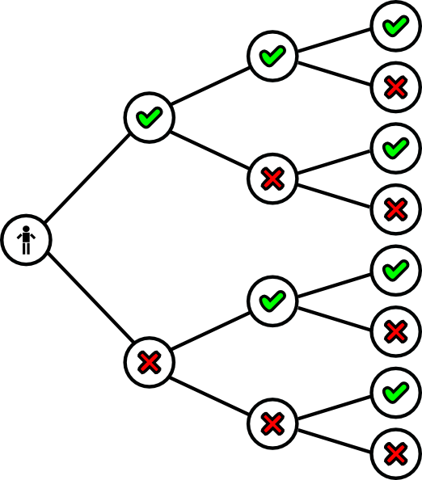

<!-- fontawesome CDN -->
<link href="https://maxcdn.bootstrapcdn.com/font-awesome/4.7.0/css/font-awesome.min.css" rel="stylesheet">

<!-- logo -->
<div class="logo">
  <a href="http://www.icjia.state.il.us/"></img></a>
</div>


```{r setup, include=FALSE}
library(knitr)
opts_chunk$set(echo = TRUE)
```

This page contains the notes for **the first part of R Workshop Module 2: R basics**, which is part of the R Workshop series prepared by ICJIA Research Analyst [Bobae Kang](http://www.icjia.state.il.us/biographies/bobae-kang) to enable and encourage ICJIA researchers to take advantage of R, a statistical programming language that is one of the most powerful modern research tools.

### Links
Click [**here**](../index.html) to go to the workshop **home page**.

Click [**here**](../modules.html) to go to the workshop **Modules page**.

Click [**here**](../slides/module2_slides1.html) to view the accompanying **slides for Module 2, Part 1**.

Navigate to the other workshop materials:

<button class="btn" data-toggle="collapse" data-target="#collapse-navigate" aria-expanded="false" aria-controls="collapse-navigate">**SEE MORE**</button>

<div class="collapse mt-1" id="collapse-navigate">
<div style="padding:20px;">

* **Module 1: Introduction to R** ([**slides**](../slides/module1_slides.html),
[**note**](module1_notes.html))
* **Module 2: R basics**
    * Part 2 ([**slides**](../slides/module2_slides2.html), [**note**](module2_notes2.html))
* **Module 3: Data analysis with R**
    * Part 1 ([**slides**](../slides/module3_slides1.html), [**note**](module3_notes1.html))
    * Part 2 ([**slides**](../slides/module3_slides2.html), [**note**](module3_notes2.html))
* **Module 4: Data visualization with R**
    * Part 1 ([**slides**](../slides/module4_slides1.html), [**note**](module4_notes1.html))
    * Part 2 ([**slides**](../slides/module4_slides2.html), [**note**](module4_notes2.html))
* **Module 5: Statistical modeling with R**
    * Part 1 ([**slides**](../slides/module5_slides1.html), [**note**](module5_notes1.html))
    * Part 2 ([**slides**](../slides/module5_slides2.html), [**note**](module5_notes2.html))
* **Module 6: "To Infinity and Beyond"**
    * Part 1 ([**slides**](../slides/module6_slides1.html), [**note**](module6_notes1.html))
    * Part 2 ([**slides**](../slides/module6_slides2.html), [**note**](module6_notes2.html))

</div>
</div>


***


# R Basics (1): Fundamentals of R Programming

## Key concepts

* Obejcts
* Expressions
* Functions
* Environments


***


# R Objects
```{r echo=FALSE, out.width="30%", out.extra='style="display: block; margin: auto; box-shadow: none;"'}
include_graphics("../images/object.png")
```
<p style="font-size:0.5em; text-align: center; color: #777;">
Source: <a href="https://commons.wikimedia.org/wiki/File:Antu_object-group-calligra.svg">Wikimedia Commons</a>
</p>

## Key object types

R has various object "types". Some of the key object types include:

* Vectors (`c()`)
* Lists (`list()`)
* Factors (`factor()`)
* Data frame (`data.frame()`)

In the following, we will take a deeper look at vectors (a.k.a. atomic vectors) and lists.

## "Atomic" vectors

Vector is the most fundamental data type in R, which roughly corresponds to array in other programming languages. Almost everything else in R is built on top of vectors with few exceptions like `NULL`. In fact, technically, even a single value is a vector of length 1 (this can be verified using the `is.vector()` function with a single character or number as its input). In that sense, vectors in R are also known as "atomic" vectors.

### Basic vector types

Vectors come in different types. Here are the basic vector types:

* `logical`: Boolean values of `TRUE` and `FALSE`
* `double`: floating-point numbers representing real numbers
* `integer`: integers
* `complex`: complex numbers
* `character`: string of alphanumeric letters

Let's take a look at some examples of these vector types. A vector is created using the `c()` function. We may think that the "c" means "concatenate". Note that the `class()` function returns the vector type for the given object, instead of simply returning `vector`.

```{r}
# this is a logical vector
logical_vector <- c(TRUE, FALSE, T, F)

is.logical(logical_vector)
class(logical_vector)
```

```{r}
# this is a double (numeric)  vector
double_vector <- c(1, 2, 3)

is.double(double_vector)
class(double_vector)

# this is an integer (numeric) vector
integer_vector <- c(1L, 2L ,3L)

is.integer(integer_vector)
class(integer_vector)
```

```{r}
# this is a character vector
character_vector <- c("a", "b", "c")

is.character(character_vector)
class(character_vector)

```

```{r}
# an object with a single element is also a vector!
x <- 1
y <- "Am I a vector?"

is.vector(x)
is.vector(y)
```

### Accessing vector elements

A vector often comes as a series of multiple values or elements--this is probably why it is called a "vector", like a mathematical vector.

To access a particular element in a vecgtor, we can use the index of an element with `[]`:

```{r}
fruits <- c("apple", "banana", "clementine")
first_fruit <- fruits[1]

print(first_fruit)
```
```{r}
second_fruit <- fruits[2]

print(second_fruit)
```

We can also assign a new value to the accessed vector element:

```{r}
# giving a new value to an existing element
fruits[1] <- "apricot"

print(fruits)
```

Or create a new element:

```{r}
# creating a new element
fruits[4] <- "dried mango"

fruits
```

Multiple elements can be accessed in two ways. First, we can use a vector of indices:

```{r}
first_and_third_fruits <- fruits[c(1, 3)]

print(first_and_third_fruits)
```

Second, we can use the colon operator for a sequence (we will come back to the colon operator):

```{r}
first_thru_third_fruits <- fruits[1:3]

print(first_thru_third_fruits)
```

Vector elements can be accessed conditionally as well:

```{r}
my_vector <- c(1, 2, 3, 4, 5)

# print only elements less than 3 
print(my_vector[my_vector < 3])

# assign 0 to such elements
my_vector[my_vector < 3] <- 0

print(my_vector)
```

## Lists

An R vector cannot consist of elements of different vector types. Considering that a single element is in fact a vector of length 1, we can see how such an idea is a simple impossibility. 

In contrast, an R list, created by `list()` function, can contain elements of different types. A list is, in fact, a list of vectors:

```{r}
my_list <- list("abc", 125, FALSE, c("Hello", "World"))

print(my_list)
```

Note that an element of a list can be a vector of length greater than 1. In fact, a list can have a nested structure, where an element of a list is also a list itself.

### Naming list elements

```{r}
names(my_list) <- c("character", "numeric", "logical", "character vector")

my_list
```


### Accessing list elements

Elements in a list can be accessed using their indices or names:

```{r}
# using index (this returns a list element, NOT the actual content)
my_list[4]
```

```{r}
# using name (this returns the content itself)
my_list$`character vector`
```


In order to access the content of a list element using the index approach, we must use `[[]]` instead:

```{r}
my_list[[1]]
```

```{r}
# the result is the same with accessing an element using name
identical(my_list[[1]], my_list$character)
```

```{r}
# in contrast:
identical(my_list[1], my_list$character)
```


### Lists to vector

A list can be "unlisted", i.e., converted into a vector. This is achieved by the `unlist()` function:

```{r}
new_list <- list(1:5)
to_vector <- unlist(new_list)

# this is a list
print(new_list)

# this is a vector
print(to_vector)
```


***


# R Expressions
```{r echo=FALSE, out.width="30%", out.extra='style="display: block; margin: auto; box-shadow: none;"'}

```
<p style="font-size:0.5em; text-align: center; color: #777;">
Source: <a href="http://www.clker.com/clipart-16340.html">clker.com</a>
</p>

## What are expressions

A program can be seen as a collection of expressions, which are executable pieces of code. In R, an expression consists of the following:

  * objects
  * operators
  * control structures, and
  * functions

We have already seen objects. We will now take a closer look at the rest of them.
    
## Operators

* Arithmetic operators
* Logical operators
* Relational operators
* Assignment operators
* Miscellaneous operators
* Others
    * User-defined operators
    * From third-party pacakges

### Arithmetic operators
```{r echo=FALSE}
kable(
  data.frame(
    Operator = c('`+`', '`-`', '`*`', '`/`', '`^` or `**`', '`%%`', '`%/%`'),
    Description = c(
      'Addition',
      'Substraction',
      'Multiplication',
      'Division',
      'Exponentiation',
      'Modulus',
      'Integer division'
    ),
    Example = c(
      '`1 + 1`    (returns 2)',
      '`3 - 2`  (returns 1)',
      '`3 * 4`  (returns 12)',
      '`5 / 2`  (returns 2.5)',
      '`2**4`  (returns 16)',
      '`5 %% 2`  (returns 1)',
      '`5 %/% 2`  (returns 2)'
    )
  )
)
```

### Logical operators
```{r echo=FALSE}
kable(
  data.frame(
    Operator = c('`&`', '|', '`!`', '`&&`', '||'),
    Description = c(
      'Element-wise logical AND',
      'Element-wise logical OR',
      'Logical NOT',
      'Logical AND<br>(considers the first element only)',
      'Logical OR<br>(considers the first element only)'
    ),
    Example = c(
      '`c(TRUE, TRUE) & c(TRUE, FALSE)`<br>returns `TRUE` `FALSE`',
      '`c(TRUE, FALSE)` | `c(FALSE, FALSE)`<br>returns `TRUE` `FALSE`',
      '`!c(TRUE, FALSE)`<br>returns `TRUE`',
      '`c(TRUE, TRUE) && c(FALSE, TRUE)`<br>returns `FALSE`',
      '`c(TRUE, TRUE)` || `c(FALSE, TRUE)`<br>returns `TRUE`'
    )
  )
)
```

### Relational operators
```{r echo=FALSE}
kable(
  data.frame(
    Operator = c('`>`', '`<`', '`==`', '`>=`', '`<=`', '`!=`'),
    Description = c(
      'Greater than',
      'Less than',
      'Equal to',
      'Greater than or equal to',
      'Less than or equal to',
      'Not equal to'
    ),
    Example = c(
      '`3 > 1` returns `TRUE`',
      '`3 < 1` returns `FALSE`',
      '`2 == 2` returns `TRUE`',
      '`3 >= 4` returns `FALSE`',
      '`4 <= 4` returns `TRUE`',
      '`2 != 3` returns `TRUE`'
    )
  )
)
```

### Assignment operators
```{r echo=FALSE}
kable(
  data.frame(
    Operator = c('`<-` or `=`', '`->`', '`<<-`', '`->>`'),
    Description = c(
      'Left assignment',
      'Right assignment',
      'Left scoping assignment',
      'Right scoping assignment'
    ),
    Example = c(
      '`a <- "Hello"` assigns `"Hello"` to the object `a`',
      'The use of `->` is mostly discouraged',
      'Search for the variable in the parent<br>environments takes place before assignment',
      'Ditto'
    )
  )
)
```

### Miscellaneous operators
```{r echo=FALSE}
kable(
  data.frame(
    Operator = c('`:`', '`?`', '`$`', '`%in%`', '`%*%`'),
    Description = c(
      'Colon operator to generate sequences',
      'Help function to see documentation',
      'List subset',
      '"In" operator',
      'Matrix multiplication'
    ),
    Example = c(
      '`1:10` generates a vector of integer sequence from 1 to 10',
      '`?my_function` is equivalent to `help(my_function)`',
      '`my_list$a` will access the subset `a` in the list',
      '`1 %in% c(1,2,3)` returns `TRUE`',
      ''
    )
  )
)
```

### Other operators

In practice, using R operators is no different from a function call. Accordingly, it is also possible to define new operators. In fact, some third party packages offer custom operators. One such example is the "pipe" operator (`%>%`) from `magrittr` package, which is also available through `dplyr` pacakge.
    

## Flow control

By default, R runs statements in a sequential manner, from top to bottom. There are however ways to break from this using contronl structures. Here we call it "flow control".

In the following, we will take a look at two basic flow control methods: conditionals and loops.

### Conditionals

Using conditionals means creating a desired "flow" of evaluating statements based on certain conditions: i.e. if A, then B.

R offers `if` statement to acheieve this. The basic `if` statement structure is given as follows:

* `if ( condition ) { expression }`

Let's try an example:

```{r}
a <- TRUE

if (a) {
  print("Hello World!")
}
```

Here, the variable a is a condition to be tested. If the value of the condition is boolean `TRUE`, than the statements between curly braces `{}` are executed. If the condition value is `FALSE`, R jumps ahead the statemetns between `{}`.

### Multiple conditions

It is possible to create more elaborate flow control structures. R provides `else` statement for the statements to run only if the preceding `if` condition is `FALSE`. Then, we can chain multiple `if`-`else`s to incorporate multiple conditions.

The following code block presents an example of chained `if`-`else` statement with three conditions: (1) `a` is greater than `b`, (2) `a` is not greater but is less than `b`, (3) `a` is neither greater or less than `b`. R evaluates these conditions in a sequential manner, and when the condition evaluates as `TRUE`, executes the relevant statements.

```{r}
a <- 1
b <- 2

if (a > b) {
  print("a is larger than b.")
} else if (a < b) {
  print("a is smaller than b.")
} else {
  print("a and b are equal!")
}
```


### `ifelse` function
```{r eval=FALSE}
ifelse(test_expression, true_value, false_value)
```

R also offers `ifelse` function, which is to try the condition for each element of a multi-element object. That is, `ifelse()` is an element-wise if-else conditional. Here, the given condition (`test_expression`) is tested for each and every element of a vector and the output is a vector of the same length with relevant values. 

In the following example, `ifelse` will return a vector of 4, which equals to the length of input vector `a`, and the each element of the output vector is the result of testing whether the input element is less than 3.

```{r}
a <- c(1,2,3,4)
ifelse(a < 3, "Less than 3", "Not less than 3")
```


### Loops

R offers looping statements for tasks that involve some repetitions. Here we will take a look at two commonly used looping methods: `while` and `for`. 

* `while` loops

```{r eval=FALSE}
while ( condition ) {
  expression
}
```

* `for` loops

```{r eval=FALSE}
for (element in iterable_object) {
  expression
}
```

### `while` loop
```{r echo=FALSE, out.width="25%", out.extra='style="display: block; margin: auto; box-shadow: none;"'}
include_graphics("../images/while_loop.jpg")
```
<p style="font-size:0.5em; text-align: center; color: #777;">
Source: <a href="https://www.datamentor.io/r-programming/while-loop">DataMentor</a>
</p>

A `while` loop consists of a condition and a group of statments (expression) to be executed.

```{r eval=FALSE}
while (condition) {
  expression
}
```

`while` statement goes through the following steps:

1. If the given `condition` is satisfied (i.e. evaluates as `TRUE`), then the following `expression` is executed.
2. Once the `expression` is executed, the `condition` is re-evaluated.
3. The `expression` is repetitively executed as long as the `condition` is satisfied.

This means that, if the condition is always `TRUE`, we will be stuck in an infinite loop!

The folloing example uses `while` statement to print a number from 0 to 4. Because we add 1 to count at each loop, we can be rest assured that the condition will return `FALSE` at one point, and the loop will terminate.

```{r}
count <- 0

while (count < 5) {
  print(count)
  count = count + 1  # increase count by 1 at each iteration
}
```

### `for` loop

```{r echo=FALSE, out.width="25%", out.extra='style="display: block; margin: auto; box-shadow: none;"'}
include_graphics("../images/for_loop.jpg")
```
<p style="font-size:0.5em; text-align: center; color: #777;">
Source: <a href="https://www.datamentor.io/r-programming/for-loop">DataMentor</a>
</p>

A `for` loop is similar to `while` loop, except that it takes an iterable object (vector or list) rather than a condition.

```{r eval=FALSE}
for (element in iterable_object) {
  expression
}
```

Intead of checking for a condition, `for` loop iterates over all elements of the given object in order. The loop terminates when we reach the final element of the iterable object. At each step of iteration, we can use the given element for the `expression` if appropriate.

Let's try couple examples.

In the first example, we directly iterate over the elements of `fruits` vector. At each step, the value of `fruit` changes and made available between the curly braces as a variable.

```{r}
fruits <- c("apple", "banana", "clementine")

# iterate over elements directly
for (fruit in fruits) {
  print(paste("I love ", fruit, "!", sep=""))
}
```

In the second example, we indirectly iterate over the `flavors` vector using indices.

```{r}
flavors <- c("chocolate", "vanilla", "cookie dough")

# iterate over elements indirectly
for (i in 1:length(flavors)) {
  flavor <- flavors[i]
  print(paste("Do you want some", flavor, "ice cream?"))
}
```

### `break` statement
```{r echo=FALSE, out.width="35%", out.extra='style="display: block; margin: auto; box-shadow: none;"'}
include_graphics("../images/break_loop.jpg")
```
<p style="font-size:0.5em; text-align: center; color: #777;">
Source: <a href="https://www.datamentor.io/r-programming/break-next">DataMentor</a>
</p>

By combining conditionals and loops, we can generate a more complex flow control structure. Here we introduce two additional statements, `break` and `next`, which support creating advanced control structure.

```{r eval=FALSE}
# with for loop
for (element in iterable_object) {
  if (break_condition) {
    break
  }
  expression
}

# with while loop
while (loop_condition) {
  if (break_condition) {
    break
  }
  expression
}
```

`break` statment is used to "break out "of the loop when certain condition is met.


### `next` statement
```{r echo=FALSE, out.width="35%", out.extra='style="display: block; margin: auto; box-shadow: none;"'}
include_graphics("../images/next_loop.png")
```
<p style="font-size:0.5em; text-align: center; color: #777;">
Source: <a href="https://www.datamentor.io/r-programming/break-next">DataMentor</a>
</p>

```{r eval=FALSE}
# with for loop
for (element in iterable_object) {
  if (next_condition) {
    next
  }
  expression
}

# with while loop
while (loop_condition) {
  if (next_condition) {
    next
  }
  expression
}
```

`next` statement can be used to skip a step in a loop when a certain condition is met. 


***


# R Functions
```{r echo=FALSE, out.width="35%", out.extra='style="display: block; margin: auto; box-shadow: none;"'}
include_graphics("../images/function-machine.png")
```
<p style="font-size:0.5em; text-align:center; color: #777;">
Source: <a href="https://www.wikimedia.org">Wikimedia Commons</a>
</p>

## What are functions

In R, functions are special objects that are "call-able". In other words, a function can be called or invoked by following `()`. Meanwhile, a function can be manipulated just in the same way as any other object.

There are three elements of a function (or function closure):

1. an argument list (a.k.a. parameters; optional)
2. body
3. function environment

## Why use functions

A key function of a function (pun intended :)) is to encapsulate repeated operations so that we can:

* Simplify code (clearner and more concise)
* Avoid unintended bugs/errors
* Enhance reproducibility
    
In other words, if you find yourself copying and pasting the same code chunk over and over, you should wrap it into a function.

### Creating a new function
```{r eval=FALSE}
# creating a new function
name <- function(arg1, arg2) {
  
  # body exist in a local environment
  body expression1
  body expression2
  body expression3

}
```

Just as we assign some values to a symbol (or a variable) to create an object, we assign a `function() {}` to a symbol to create a function. We put a number of arguments, or parameters, into the `()`, and a set of operations in `{}`, where the parameters can be used to represent actual inputs.

It must be noted that the expressions inside `{}` are living in a "function environment" that is "closed" off of the global environment. We will talk more about environments later. For now, we should only remember the following key points:

* Objects created in a function environment are *not accessible* from its parent environment
* Objects existing in the parent environment are *accessible* from the the function environment
* Each function call creates a *separate* environment (or an instance of the function environment)

Now, let's take a look at some examples to explore how we can create a function.

### A custom function for adding two numbers

```{r}
# example: a custom function for adding two numbers
add_nums <- function(num1, num2) {
  return(num1 + num2)
}

add_output <- add_nums(3, 5) # assign the function output to a variable

print(add_output)
```

In this example, we create a function `add_nums`, which takes two numbers as arguments and returns the sum of the two numbers. The output value that the function returns can be assigned to create an object.

### A function without arguments

```{r}
# example: a custom function without arguments
print_hello_world <- function() {
  print("Hello world")
}

print_hello_world()
```

Here, we create a function `print_hello_world`, which has no argument input. That is, we are not required to have arguments to create a function. In fact, the function also has no real output--it just prints a phrase. Calling the function will print the phrase.

### A function with arguments having default values

```{r}
add_nums_2 <- function(num1, num2 = 5) {
  num1 + num2
}

add_nums_2(3) # call a function using the default value for num2
```

A function can be given default values to its arguments. If the argument value is not given when the function is called, the default value is used for that argument. It is a good practice to make default values something that are expected to be used most often when calling the function. 


***


# R Environments
```{r echo=FALSE, out.width="45%", out.extra='style="display: block; margin: auto; box-shadow: none;"'}
knitr::include_graphics("../images/environments_bindings.png")
```
<p style="font-size:0.5em; text-align: center; color: #777;">
Source: Hadley Wickham, 2017, <a href="http://adv-r.had.co.nz/Environments.html"><span style="font-style: italic">Advanced R</span></a>
</p>

## What are environments

Environment is a tricky concept to grasp. Simply put, an environment is a place to store variables. That is, all variables (as bindings of symbols and objects) exist in a specific environment. More precisely, *objects* live in memory outside all environment; it is the *symbols* and the *associations* of the symbols (variable names) and objects to which the symbols point/refer that an environment contains.

As we will see shortly, environments can have nested structure.

## Nesting of environments

There are two simple rules to know about the nesting of environments:

* Variables in a parent environment are accessible in a child environment
* Variables in a child environment are *NOT* accessible in a parent environment

```{r echo=FALSE, out.width="45%", out.extra='style="display: block; margin: auto; box-shadow: none;"'}
knitr::include_graphics("http://adv-r.had.co.nz/diagrams/environments.png/parents.png")
```
<p style="font-size:0.5em; text-align: center; color: #777;">
Source: Hadley Wickham, 2017, <a href="http://adv-r.had.co.nz/Environments.html"><span style="font-style: italic">Advanced R</span></a>
</p>

In this picture, the box on the left represents a parent environment and the box on the right is a child environment. Variables `a`, `b`, and `c` are stored in the parent environment while `d` and `e` are in the child environment. According to the two basic rules about environments, accessing variables `d` and `e` from the parent environment is not possible but, `a`, `b`, and `c` are still accessible from the child environment.

## The global environment

There is something called the "global environment" in R which deserved our special attention. In short, the global environment serves as the interactive workspace for the given R session. When we create new variables using the console, they will live in the global environment.

The immediate parent of the global environment is the environment of the package that is imported last. This is how all the datasets and functions from the package, as well as other pacakges imported prior to it, are made available in the global environment.

In R, an environment is like a function, and the global environment can be accessed using `globalenv()`, which works like a named list as shown in the folloing code chunk:

```{r}
some_variable <- 1 # a variable in the global environment
global_env <-globalenv() # the environment itself can be assigned to a variable

# the following two are identical 
identical(some_variable, global_env$some_variable)
```

## Local environments

If there is the global environment, there local environments as well. Local environments are created in two ways:

    * any function calls
    * `new.env()`

A local environment can be used to protect the global environment from arbitrarily created variables.

## Lexical scoping

Searching for an object in R follows the lexical scoping rules.

* First, R looks for the object in the current environment  
* If the object is not found in the current environment, R moves up to its parent environment.  
* The process is repeated until the object is found or the outermost environment (`emptyenv()`) is reached.

```{r echo=FALSE, out.width="60%", out.extra='style="display: block; margin: auto; box-shadow: none;"'}
knitr::include_graphics("http://adv-r.had.co.nz/diagrams/environments.png/search-path.png")
```
<p style="font-size:0.5em; text-align:center; color: #777;">
Source: Hadley Wickham, 2017, <a href="http://adv-r.had.co.nz/Environments.html"><span style="font-style: italic">Advanced R</span></a>
</p>


***


# References
<ul>
  <li>DataMentor. (n.d.). <a href="https://www.datamentor.io/r-programming/"><span style="font-style:italic">R Tutorials</span></a></li>
  <li>R Core Team. (2017). <a href="https://cran.r-project.org/doc/manuals/R-intro.html">"An Introduction to R"</a>.</li>
  <li>R Core Team. (2017). <a href="https://cran.r-project.org/doc/manuals/R-lang.html">"R Language Definition"</a>.</li>
  <li>Wickham, H. (2017). <a href="http://adv-r.had.co.nz/"><span style="font-style:italic"> Advanced R</span></a>.</li>
</ul>