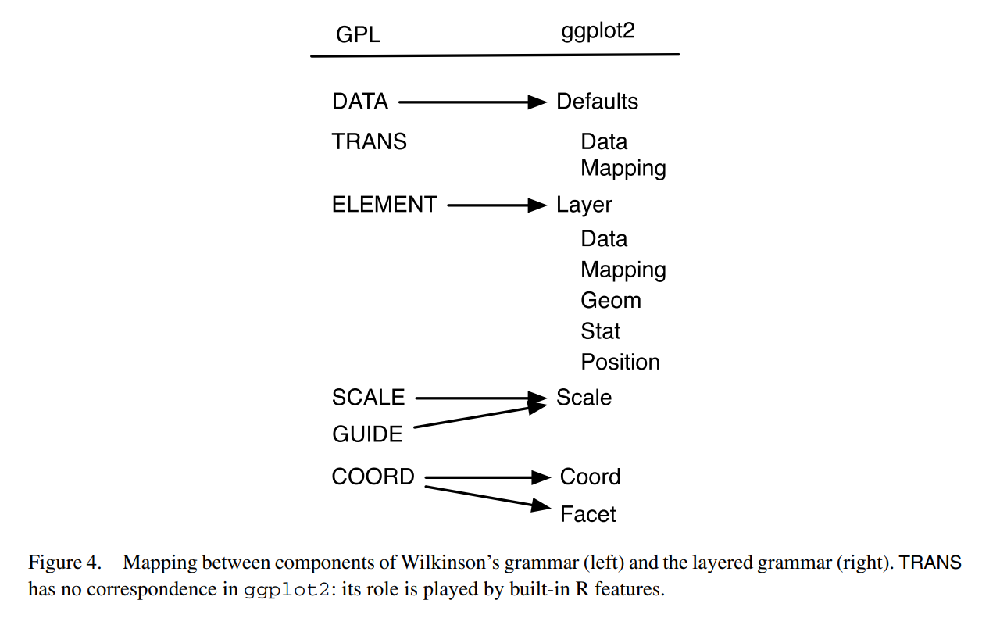

<!-- fontawesome CDN -->
<link href="https://maxcdn.bootstrapcdn.com/font-awesome/4.7.0/css/font-awesome.min.css" rel="stylesheet">

<!-- logo -->
<div class="logo">
  <a href="http://www.icjia.state.il.us/"></img></a>
</div>


```{r setup, include=FALSE}
library(dplyr)
library(tidyr)
library(icjiar)
library(ggplot2)
library(ggthemes)
library(tibble)
library(knitr)
opts_chunk$set(echo = TRUE, warning = FALSE, fig.height = 5, fig.width = 6.5, message = FALSE)
```

This page contains the notes for **the first part of R Workshop Module 4: Data visualization with R**, which is part of the R Workshop series prepared by ICJIA Research Analyst [Bobae Kang](http://www.icjia.state.il.us/biographies/bobae-kang) to enable and encourage ICJIA researchers to take advantage of R, a statistical programming language that is one of the most powerful modern research tools.

### Links
Click [**here**](../index.html) to go to the workshop **home page**.

Click [**here**](../modules.html) to go to the workshop **Modules page**.

Click [**here**](../slides/module4_slides1.html) to view the accompanying **slides for Module 4, Part 1**.

Navigate to the other workshop materials:

<button class="btn" data-toggle="collapse" data-target="#collapse-navigate" aria-expanded="false" aria-controls="collapse-navigate">**SEE MORE**</button>

<div class="collapse mt-1" id="collapse-navigate">
<div style="padding:20px;">

* **Module 1: Introduction to R** ([**slides**](../slides/module1_slides.html),
[**note**](module1_notes.html))
* **Module 2: R basics**
    * Part 1 ([**slides**](../slides/module2_slides1.html), [**note**](module2_notes1.html))
    * Part 2 ([**slides**](../slides/module2_slides2.html), [**note**](module2_notes2.html))
* **Module 3: Data analysis with R**
    * Part 1 ([**slides**](../slides/module3_slides1.html), [**note**](module3_notes1.html))
    * Part 2 ([**slides**](../slides/module3_slides2.html), [**note**](module3_notes2.html))
* **Module 4: Data visualization with R**
    * Part 2 ([**slides**](../slides/module4_slides2.html), [**note**](module4_notes2.html))
* **Module 5: Statistical modeling with R**
    * Part 1 ([**slides**](../slides/module5_slides1.html), [**note**](module5_notes1.html))
    * Part 2 ([**slides**](../slides/module5_slides2.html), [**note**](module5_notes2.html))
* **Module 6: "To Infinity and Beyond"**
    * Part 1 ([**slides**](../slides/module6_slides1.html), [**note**](module6_notes1.html))
    * Part 2 ([**slides**](../slides/module6_slides2.html), [**note**](module6_notes2.html))

</div>
</div>


***


# Data visualization with R (1): The Grammar of Graphics

In Module 4, we will be exploring data visualization in R. Although base R offers some data visualiation capabilities, a visualization package of `tidyverse` called `ggplot2` has become the de facto standard for data visualization in R. Hence, we will begin with learning the basics of `ggplot2`.  

***

# The Grammar of Graphics

The name of the package `ggplot2` comes from the notion of the "grammar of graphics," proposed by statistician and computer scientist Leland Wilkinson. Let's take a quick look at this notion, its origin, and how the `ggplot2` package relates it.

## Wilkinson's "grammar"

> "The grammar of graphics takes us beyond a limited set of charts (words) to an almost unlimited world of graphical forms (statements). <br>-Wilkinson, L. (2005), p.1"

In his book, *The Grammar of Graphics* (2005), Wilkinson proposes a set of principles and terminology for defining and constructing statistical graphics. We may see this book as a theoretical elaboration of his preceding project called the Graphical Production Library (GPL), an implementation of "a language for quantitative graphics" (Wklinson et al., 2000). An underlying philosophy of GPL is that, "Instead of treating a graphics display as a viewer for underlying data, GPL treats data as an accesorry to viewing a graph."

Wilkinson's "grammar" has the following components:

* Data
* Transformation
* Element
* Scale
* Guide
* Coordinate system

A graphic object then consists of, or is parameterized by, these components. It is a more modular apporach to visulizing data. We won't dig any further into each component as defined by Wilkinson and his colleagues. Suffice it to say, however, that Hadley Wickham's `ggplot2` is strongly influneced by Wilkinson's "grammar" with certain changes.


## ggplot2 package
```{r echo=FALSE, out.width="20%", out.extra='style="display: block; margin: auto; box-shadow: none;"'}
include_graphics("../images/ggplot2.png")
```
<p style="font-size:0.5em; text-align: center; color: #777;">
Source: <a href="https://d33wubrfki0l68.cloudfront.net/0ab849ed51b0b866ef6895c253d3899f4926d397/dbf0f/images/hex-ggplot2.png">tidyverse.com</a>
</p>

`ggplot2` is R ecosystem's response to Wilkinson's grammar of graphics. It is an R package developed by Hadley Wickham, one of the main authors of many `tidyverse` packages.


## Motivation
> This article proposes an alternative parameterization of the [graphical] grammar, based around the idea of building up a graphic from multiple layers of data. The grammar differs from Wilkinson's in its arrangement of the components, the development of a hierarchy of defaults, and in that it is embedded inside another programming language.<br>-Wickham, H. (2010), p.4

In his article, "A Layered Grammar of Graphics" (2010), Wickham explains his motivation for `ggplot2`. In short, `ggplot2` is an alternative to Wilkinson's grammar, replacing "element" in the latter with more modular layers.

## Comparison
```{r echo=FALSE, out.width="60%", out.extra='style="display: block; margin: auto; box-shadow: none;"'}

```
<p style="font-size:0.5em; text-align: center; color: #777;">
Source: Wickham, H. (2010). "A Layered Grammar of Graphics."
</p>

The figure above offers a quick summary of how `ggplot2` compares to Wilkinson's grammar. Refer to Wickham (2010) for a detailed explanation.

***

# Basic components

Enough of backgrounds. Let us now really get started with `ggplot2`. First we explore three basic components of `ggplot2`:

* Data and aesthetic mappings
* Geometic objects
* Labels

## Data and aesthetic mappings
```{r eval=FALSE}
# data and aesthetics
ggplot(data, aes(x, y, ...))
```
* `data` is a data frame object (or its variant)
* `aes()` defines aesthetic mappings
    * `x` and `y` are columns in `data` input to be mapped to the x-axis and y-axis
    
    
## Geometic objects
```{r eval=FALSE}
# adding one or more geometric objects
ggplot(data, aes(x, y, ...)) +
  geom_object()

# with geom_specific `aes`
ggplot(data) +
  geom_object(aes(x, y, ...))
```
* There are many "geom" objects for different graph types:
* A `geom` object can take its own `aes` input
    * All `aes` specifications can be directly provided for each geometric object

### Basic `geom` object
```{r echo=FALSE}
kable(
  tribble(
    ~`geom`, ~Description, ~Input,
    "`geom_histogram`", "Histograms", "Continous `x`",
    "`geom_bar`", "Bar plot with frequncies", "Discrete `x`",
    "`geom_col`", "Bar plot with values", "Discrete x and continuous `y`",
    "`geom_point`", "Points/scattorplots", "Discrete/continuous `x` and `y`",
    "`geom_jitter`", "Jittered points", "Discrete/continuous `x` and `y`",
    "`geom_line`", "Line plots", "Discrete/continuous x and y",
    "`geom_abline`", "Reference line", "`intercept` and `slope` value",
    "`geom_hline`, `geom_vline`", "Reference lines", "`xintercept` or `yintercept`"
  )
)
```

## Example
```{r}
# geom histogram example
data <- ispcrime %>% filter(year == 2015, county != "Cook")
ggplot(data, aes(violentCrime)) +
  geom_histogram()
```


```{r}
# geom col example
data <- ispcrime %>% filter(county == "Cook") %>% gather("type", "count", murder:aggAssault)
ggplot(data, aes(type, count, fill = type)) +
  geom_col(width = 0.8)
```


```{r}
# geom point example
data <- ispcrime %>% filter(county != "Cook") %>% left_join(regions)
ggplot(data, aes(violentCrime, propertyCrime, color = region)) +
  geom_point(aes(size = violentCrime + propertyCrime), alpha = .5)
```


```{r}
# geom line example
data <- ispcrime %>% filter(county == "Cook")
ggplot(data, aes(year, violentCrime)) +
  geom_line(color = "maroon", size = 1.5) +
  geom_hline(yintercept = mean(data$violentCrime), linetype = "longdash")
```


### Other `geom` objects
```{r echo=FALSE}
kable(
  tribble(
    ~`geom`, ~Description, ~Input,
    "`geom_density`", "Smoothed density estimates", "Continous `x`",
    "`geom_density2d`", "Contours of a 2-d density estimates", "Continous `x`",
    "`geom_boxplot`", "Box plots", "Disc. `x` and cont. `y`",
    "`geom_smooth`", "Smoothed conditional means", "",
    "`geom_text`, `geom_label`", "Text", "",
    "`geom_polygon`", "Polygons", ""
  )
)
```

* See [the official reference page](http://ggplot2.tidyverse.org/reference/index.html#section-layer-geoms) for the full list of `geom`s.


## Labels
```{r eval=FALSE}
# adding labels
plot + labs(title, subtitle, caption, x, y, ...)
```
* Each argument of `labs()` take a character vector of length 1
    * `title` and `subtitle` appear at the top-left.
    * `caption` appears at the bottom-right
    * `x` and `y` are for x-axis and y-axis names
* Adjusting the position and style of labels is handled via `theme()`

**alternatively ...**
```{r eval=FALSE}
plot +
  xlab(label) +
  ylab(label) +
  ggtitle(label, subtitle = NULL)
```
* Each argument of the `labs()` can be added with a separate function.
    * `xlab()` is for x-axis name
    * `ylab()` is for y-axis name
    * `ggtitle()` is for plot title and subtitle

### Example

```{r include=FALSE}
# plot to use
plot <- ggplot(
  ispcrime %>% filter(county != "Cook") %>% left_join(regions),
  aes(violentCrime, propertyCrime, color = region)
  ) +
  geom_point(aes(size = violentCrime + propertyCrime), alpha = .5)
```

```{r}
# a generic example with title, subtitle, and axes names
plot +
  labs(
    title = "This is plot title", subtitle = "This is plot subtitle",
    x = "x-axis here", y = "y-axis here",
    caption = "(and caption...)"
  )
```


```{r}
# a title with mathematical expressions
plot +
  ggtitle(label = expression(paste("Another plot title with math expressions like ", pi, " and ", sigma^{2})))
```

***

# Additional components

* Scales
* Guides
* Coordinate systems
* Facets
* Themes


## Scales
* Scales control "the details of how data values are translated to visual properties"
* Scale limits
* Position scales (discrete, continuous, datetime)
* Others


### Scale limits
```{r eval=FALSE}
plot +
  xlim(...) +
  ylim(...) +
  lims(...)
```
* `xlim()` changes x-axis limits
* `ylim()` changes y-axis limits
* `lims()` is a general function to change limits
* `...` in all three functions is a name-value pair, where the name is an aesthetic and the value is either a length-2 numeric, a character, a factor, or a datetime 

```{r}
# limit x axis to 2000; this removes points with violentCrime > 2000
plot + xlim(0, 2000)
```

### Position scales
#### Position scales (discrete)
```{r eval=FALSE}
# replace * with x or y
scale_*_discrete(name, breaks, labels, limits, ...)
```

#### Common `scale_*` arguments
```{r echo=FALSE}
kable(
  tribble(
    ~Argument, ~Description,
    "`name`", "a name of the scale, used as the axis label or the legend title",
    "`breaks`", "controls the breaks in the guide, which can be a character vector",
    "`labels`", "controls the lable for each break; its input must be the same length as `breaks` input",
    "`limits`", "a character vector specifying the data range for the scale"
  )
)
```

#### Position scales (continuous)
```{r eval=FALSE}
# replace * with x or y
scale_*_continuous(name, breaks, labels, limits, ...)

scale_*_log10(...)

scale_*_sqrt(...)

scale_*_reverse(...)
```

#### Position scales (datetime)
```{r eval=FALSE}
# replace * with x or y
scale_*_date(name, breaks, labels, limits, ...)

scale_*_datetime(...)

scale_*_time(...)
```

```{r}
# apply the log 10 scale to the y-axis 
plot + scale_y_log10()
```

### Custom scale "manuals"
```{r eval=FALSE}
scale_*_manual(name, breaks, labels, limits, ..., values)
```
* Scale manuals is used to create my own discrete scale
* "Manual" is available for:
    * `colour`
    * `fill`
    * `size`
    * `shape`
    * `linetype`
    * `alpha`

```{r}
plot + scale_color_manual(
  name = "",
  breaks = c("Central", "Northern", "Southern"),
  labels = c("Central region", "Northern region", "Southern region"),
  values = c("#00ffff", "#ffff00", "#ff00ff")
)
```


### Other custom scales

`ggplot2` offers many more functions to customize scales.

See the full documentation on scales [here](http://ggplot2.tidyverse.org/reference/#section-scales).

## Guides
```{r eval=FALSE}
guides(...)
guide_legend(...)
```
* `guides` can be used to set (or remove) guides for each scale
* `guide_legend()` can be used to specify the legend components for each visual properties (e.g. `colour`, `size`, `alpha`, etc.)
    * `guide_legned()` is used as an input for each scale argument in `guide()`


### Example
```{r}
plot + guides(
  colour = guide_legend(title = "Region", title.position = "bottom"),
  size = FALSE
)
```

## Coordinate systems
```{r eval=FALSE}
plot + coord_cartesian()
```

* The default system is `coord_cartesian`
  * Can be tweatked with: `coord_fixed`, `coord_flip`, `coord_map` and `coord_trans`
* An alternative, polar coordiante system can be used with `coord_polar`
  * Most commonly used for creating a pie chart


```{r echo=FALSE}
plot <- ggplot(ispcrime %>% filter(county == "Cook") %>% gather("type", "count", murder:aggAssault)
, aes(type, count, fill = type)) +
  geom_col()
```

### Example
```{r}
# default plot
plot
```


```{r}
# with coord_flip()
plot + coord_flip()
```


```{r}
# pie chart with coord_polar()
ggplot(ispcrime %>% filter(county == "Cook") %>% gather("type", "count", murder:aggAssault), aes("", count, fill = type)) +
  geom_col(width = 1) +
  coord_polar("y")
```

## Facets
```{r eval=FALSE}
plot + facet_grid(facets, scales, ...)
plot + facet_wrap(facets, nrow, ncol, scales, ...)
```
* A great way to visualize multi-dimensional data as a series of 2D graphes
* `facets` input takes a "formula" according to which the faceting is applied


### `facet_grid` vs `facet_wrap`

* `facet_grid()` and `facet_wrap()` are mostly similar to each other
* However, they differs where:
    * `facet_grid()` facets the plot with a variable in a single direction (horizontal or vertical)
    * `facet_wrap()` simply places the facets next to each other and wraps them accoridng to the provided number of columns and/or rows.


### Facet formulas
```{r echo=FALSE}
kable(
  tribble(
    ~Type, ~Formula, ~Description,
    "Grid", "`facet_grid(. ~ x)`", "Facet horizontally across `x` values",
    "Grid", "`facet_grid(y ~ .)`", "Facet vertically across `y` values",
    "Grid", "`facet_grid(y ~ x)`", "Facet 2-dimensionally",
    "Wrap", "`facet_wrap(~ x)`", "Facet across `x` values",
    "Wrap", "`facet_wrap(~ x + y)`", "Facet across `x` and `y` values"
  )
)
```


### Example
```{r echo=FALSE}
# get some plot
plot <- ggplot(ispcrime %>% filter(county != "Cook", year > 2011) %>% left_join(regions), aes(violentCrime, propertyCrime)) +
  geom_point(aes(color = region, size = violentCrime + propertyCrime), alpha = .5) +
  scale_size(guide = "none")
```


```{r}
# facet_grid horizontal
plot + facet_grid(. ~ region)
```


```{r}
# facet_grid horizontal with free scales
plot + facet_grid(. ~ region, scales = "free")
```


```{r}
# facet_grid vertical
plot + facet_grid(year ~ .)
```


```{r}
# facet_grid two-dimensional
plot + facet_grid(year ~ region)
```


```{r}
# facet wrap
plot + facet_wrap(~ year)
```


```{r}
# facet wrap with specified nrow/ncol
plot + facet_wrap(~ year, ncol = 3)
```


```{r}
# facet wrap with multiple variables
plot + facet_wrap(~ year + region, ncol = 3)
```


## Themes
```{r eval=FALSE}
# themes
plot + theme_gray(base_size = 11, base_family = "")
```
* `ggplot2` offers several predefined themes
    * the default theme is `theme_gray()` (or `theme_grey()`)
    * `base_size` controls the base font size
    * `base_family` controls the base font family ("serif", "sans", "mono")
* `ggthemes` pacakge offers additional predefined themes


### Example
```{r echo=FALSE}
# get some plot
plot <- ggplot(
  ispcrime %>% filter(county != "Cook", year %in% c(2014, 2015)) %>% left_join(regions),
  aes(violentCrime, propertyCrime)
  ) +
  geom_point(aes(color = region, size = violentCrime + propertyCrime), alpha = .5) +
  facet_wrap(~year) +
  scale_size(guide = "none")
```
```{r}
plot + theme_gray() # this is the default
```


```{r}
plot + theme_bw()
```


```{r}
plot + theme_linedraw()
```


```{r}
plot + theme_light()
```


```{r}
plot + theme_dark()
```


```{r}
plot + theme_minimal()
```


```{r}
plot + theme_classic()
```


```{r}
plot + theme_void()
```


```{r}
plot + ggthemes::theme_economist()
```


```{r}
plot + ggthemes::theme_fivethirtyeight()
```


```{r}
plot + ggthemes::theme_hc()
```


```{r}
plot + ggthemes::theme_wsj()
```


```{r eval=FALSE}
plot + theme(...)
```
* `theme` has arguments to control and motify individual components of a plot theme:
    * all line, rectangular, text and title elements
    * aspect ratio of the panel
    * axis title, text, ticks, and lines
    * legend background, margin, text, title, position, and more
    * panel aspect ratio, border, and grid lines
    * and more
* Read the full documentation [here](http://ggplot2.tidyverse.org/reference/theme.html)


***

# Resources

* `ggplot2` official [reference](http://ggplot2.tidyverse.org/reference/index.html)
* ["Data Visualization Cheat Sheet"](https://github.com/rstudio/cheatsheets/raw/master/data-visualization-2.1.pdf) by RStudio
* [*R Graphics Cookbook*](http://www.cookbook-r.com/Graphs/) by Winston Chang
* [`ggplot2` tutorials in *r-statistics.co*](http://r-statistics.co/ggplot2-Tutorial-With-R.html) by Selva Prabhakaran
* Extending `ggplot2`:
    * [*`ggplot2` extentions*](http://www.ggplot2-exts.org/index.html) website by Daniel Emaasit


***


# References
<ul style="list-style-type:none">
  <li>Grolemund, G. & Wickham, H. (2017).<a href="http://r4ds.had.co.nz/data-visualisation.html">"Data visualization"</a>. <span style="font-style:italic">R for Data Science</span></li>
  <li>Tidyverse. (n.d.). <a href="http://ggplot2.tidyverse.org/reference">"References"</a>. <span style="font-style:italic">ggplot2.tidyverse.org</span></li>
  <li>Wickham, H. (2010). "A Layered Grammar of Graphics". <span style="font-style:italic">Journal of Computational and Graphical Statistics 19(1)</span>:3-28.</li>
  <li>Wilkinson, L. (2005). <span style="font-style:italic">The Grammar of Graphics</span>.</li>
  <li>Wilkinson, L., Rope, D., Carr, D. & Rubin, M. (2000). "The Language of Graphics". <span style="font-style:italic">Journal of Computational and Graphical Statistics 9(3)</span>:530-543.</li>
</ul>