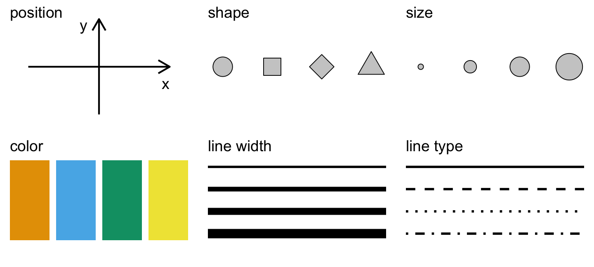

<!-- fontawesome CDN -->
<link href="https://maxcdn.bootstrapcdn.com/font-awesome/4.7.0/css/font-awesome.min.css" rel="stylesheet">

<!-- logo -->
<div class="logo">
  <a href="http://www.icjia.state.il.us/" target="_blank"></img></a>
</div>


```{r setup, include=FALSE}
library(dplyr)
library(tidyr)
library(icjiar)
library(ggplot2)
library(ggthemes)
library(tibble)
library(knitr)
opts_chunk$set(echo = TRUE, warning = FALSE, fig.height = 4.5, fig.width = 6, message = FALSE)
```

This page contains the notes for **the first part of R Workshop Module 4: Data visualization with R**, which is part of the R Workshop series prepared by ICJIA Research Analyst [Bobae Kang](http://www.icjia.state.il.us/biographies/bobae-kang){target="_blank"} to enable and encourage ICJIA researchers to take advantage of R, a statistical programming language that is one of the most powerful modern research tools.

### Links
Click [**here**](../index.html) to go to the workshop **home page**.

Click [**here**](../modules.html) to go to the workshop **Modules page**.

Click [**here**](../slides/module4_slides1.html){target="_blank"} to view the accompanying **slides for Module 4, Part 1**.

Navigate to the other workshop materials:

<button class="btn" data-toggle="collapse" data-target="#collapse-navigate" aria-expanded="false" aria-controls="collapse-navigate">**SEE MORE**</button>

<div class="collapse mt-1" id="collapse-navigate">
<div style="padding:20px;">

* **Module 1: Introduction to R** ([**slides**](../slides/module1_slides.html),
[**note**](module1_notes.html))
* **Module 2: R basics**
    * Part 1 ([**slides**](../slides/module2_slides1.html), [**note**](module2_notes1.html))
    * Part 2 ([**slides**](../slides/module2_slides2.html), [**note**](module2_notes2.html))
* **Module 3: Data analysis with R**
    * Part 1 ([**slides**](../slides/module3_slides1.html), [**note**](module3_notes1.html))
    * Part 2 ([**slides**](../slides/module3_slides2.html), [**note**](module3_notes2.html))
* **Module 4: Data visualization with R**
    * Part 2 ([**slides**](../slides/module4_slides2.html), [**note**](module4_notes2.html))
* **Module 5: Statistical modeling with R**
    * Part 1 ([**slides**](../slides/module5_slides1.html), [**note**](module5_notes1.html))
    * Part 2 ([**slides**](../slides/module5_slides2.html), [**note**](module5_notes2.html))
* **Module 6: "To Infinity and Beyond"**
    * Part 1 ([**slides**](../slides/module6_slides1.html), [**note**](module6_notes1.html))
    * Part 2 ([**slides**](../slides/module6_slides2.html), [**note**](module6_notes2.html))

</div>
</div>


***


# Data visualization with R (1): The Grammar of Graphics

In Module 4, we will be exploring data visualization in R. Although base R offers some data visualiation capabilities, a visualization package of `tidyverse` called `ggplot2` has become the *de facto* standard for data visualization in R. Hence, we will begin with learning the basics of `ggplot2`.  

***

# The Grammar of Graphics

The name of the package `ggplot2` comes from the notion of the "grammar of graphics," proposed by statistician and computer scientist Leland Wilkinson. Let's take a quick look at this notion, its origin, and how the `ggplot2` package relates it.

## Wilkinson's "grammar"

> "The grammar of graphics takes us beyond a limited set of charts (words) to an almost unlimited world of graphical forms (statements). <br>-Wilkinson, L. (2005), p.1"

In his book, *The Grammar of Graphics* (2005), Wilkinson proposes a set of principles and terminology for defining and constructing statistical graphics. We may see this book as a theoretical elaboration of his preceding project called the Graphical Production Library (GPL), an implementation of "a language for quantitative graphics" (Wklinson et al., 2000). An underlying philosophy of GPL is that, "Instead of treating a graphics display as a viewer for underlying data, GPL treats data as an accesorry to viewing a graph."

Wilkinson's "grammar" has the following components:

* Data
* Transformation
* Element
* Scale
* Guide
* Coordinate system

A graphic object then consists of, or is parameterized by, these components. It is a more modular apporach to visulizing data. We won't dig any further into each component as defined by Wilkinson and his colleagues. Suffice it to say, however, that Hadley Wickham's `ggplot2` is strongly influneced by Wilkinson's "grammar" with certain changes.


## ggplot2 package
```{r echo=FALSE, out.width="25%", out.extra='style="display:block; margin:auto; box-shadow:none;"'}
include_graphics("../images/ggplot2.png")
```
<p style="font-size:0.5em; text-align:center; color:#777;">
Source: <a href="https://d33wubrfki0l68.cloudfront.net/0ab849ed51b0b866ef6895c253d3899f4926d397/dbf0f/images/hex-ggplot2.png" target="_blank">tidyverse.com</a>
</p>

`ggplot2` is R ecosystem's response to Wilkinson's grammar of graphics. It is an R package developed by Hadley Wickham, one of the main authors of many `tidyverse` packages.


## Motivation
> This article proposes an alternative parameterization of the [graphical] grammar, based around the idea of building up a graphic from multiple layers of data. The grammar differs from Wilkinson's in its arrangement of the components, the development of a hierarchy of defaults, and in that it is embedded inside another programming language.<br>-Wickham, H. (2010), p.4

In his article, "A Layered Grammar of Graphics" (2010), Wickham explains his motivation for `ggplot2`. In short, `ggplot2` is an alternative to Wilkinson's grammar, replacing "element" in the latter with more modular layers.

## Comparison
```{r echo=FALSE, out.width="80%", out.extra='style="display:block; margin:auto; box-shadow:none;"'}
include_graphics("../images/grammar-of-graphics2.png")
```
<p style="font-size:0.5em; text-align:center; color:#777;">
Source: Wickham, H. (2010). "A Layered Grammar of Graphics."
</p>

The figure above offers a quick summary of how `ggplot2` compares to Wilkinson's grammar. Refer to Wickham (2010) for a detailed explanation.

***

# Basic components

Enough of backgrounds. Let us now really get started with `ggplot2`. First we explore three of the basic `ggplot2` components:

* Data and aesthetic mappings
* Geometic objects
* Labels

## Data and aesthetic mappings
```{r eval=FALSE}
# data and aesthetics
ggplot(data, mapping = aes(x, y, ...))
```
Plotting in `ggplot2` starts with the `ggplot()` function, which initalizes a `ggplot` object. Among others, `data` and `mapping` are the most important arguments.

`data` input is a `data.frame` object or any of its variants (e.g. `tibble` and `data.table`).

`mapping` defines how to "map" the data into the plot: that is, which variable corresponds to `x` axis, `y` axis, `colour`, or `size`? The `mapping` input is the output of `aes()` function, which defines such aesthetic mappings. Each argument input should be a variable (or column) in the `data` input.

### `aes` components
The following table lists the `aes` components available for a `ggplot` object other than `x` and `y`:
```{r echo=FALSE}
kable(
  tribble(
    ~"`aes` component", ~Description, ~Input,
    "`colour`", "Border color", "Name (`\"red\"`), rgb specification (`#FF0000`), or `NA`",
    "`fill`", "Fill color", "Name (`\"red\"`), rgb specification (`#FF0000`), or `NA`",
    "`shape`", "Shape of a point", "An integer value 0 to 24, or `NA`",
    "`linetype`", "Linetype", "An integer value 0 to 6 or a string",
    "`size`", "Size of line/point", "A non-negative numeric value",
    "`alpha`", "Transparency", "A numeric value 0 to 1"
  )
)
```

The following figure provides a visual illustration of these aesthetics:
```{r echo=FALSE}

```
<p style="font-size:0.5em; color: #777;">
Source: <a href="http://serialmentor.com/dataviz/aesthetic-mapping.html" target="_blank">Figure 1.1</a> in Wilke, C. (n.d). <span style="font-style:italic">Data Visualiation</span>.
</p>

And the following two pictures illustrate `shape` and `linetype` values available in `ggplot2`: 

### `shape` values
```{r echo=FALSE}
include_graphics("../images/ggplot2_shapes.png")
```
<p style="font-size:0.5em; color: #777;">
Source: Tidyverse. (n.d.). <a href="http://ggplot2.tidyverse.org/articles/ggplot2-specs.html" target="_blank">"Aesthetic specifications"</a>. <span style="font-style:italic">ggplot2.tidyverse.org</span>.
</p>


### `linetype` values
```{r echo=FALSE}
include_graphics("../images/ggplot2_linetypes.png")
```
<p style="font-size:0.5em; color: #777;">
Source: Tidyverse. (n.d.). <a href="http://ggplot2.tidyverse.org/articles/ggplot2-specs.html" target="_blank">"Aesthetic specifications"</a>. <span style="font-style:italic">ggplot2.tidyverse.org</span>.
</p>


## Geometric objects
```{r eval=FALSE}
# adding one or more geometric objects
ggplot(data, aes(x, y, ...)) +
  geom_*()

# with geom_specific `aes`
ggplot(data) +
  geom_*(aes(x, y, ...))
```
Geometric objects, or `geom`s, "control the type of plot you create" (Wickham 2010). There are many `geom` available in `ggplot2` for different graph types, some of which are listed below. 

A `geom` object can take its own `aes` input instead of simply inheriting from the preceding `ggplot()` inputs, which is the default behavior. In other words, all `aes` specifications can be directly provided for each geometric object. 

### Basic `geom`s
Let us take some of the `geom` objects for basic plot types:
```{r echo=FALSE}
kable(
  tribble(
    ~`geom`, ~Description, ~Input,
    "`geom_histogram`", "Histograms", "Continous `x`",
    "`geom_bar`", "Bar plot with frequncies", "Discrete `x`",
    "`geom_col`", "Bar plot with values", "Discrete x and continuous `y`",
    "`geom_point`", "Points/scattorplots", "Discrete/continuous `x` and `y`",
    "`geom_jitter`", "Jittered points", "Discrete/continuous `x` and `y`",
    "`geom_line`", "Line plots", "Discrete/continuous x and y",
    "`geom_abline`", "Reference line", "`intercept` and `slope` value",
    "`geom_hline`, `geom_vline`", "Reference lines", "`xintercept` or `yintercept`"
  )
)
```

### Examples {#basic_plot_example}
Let's take a look at some examples. First we get a dataset to work with, which is a modified version of `ispcrime`.

Then we pass the new data into `ggplot()` function as an input for `data`. Our input for `mapping` is `aes(violentCrime)`. We did not specify what the `violentCrime` should map to, the `aes()` interprets it as the input for its first argument, `x`.

Then we adds a `geom` layer to `ggplot` with `+` operator. Our choice of `geom` is histogram. And viola! We get a histogram of `violentCrime` counts: 

```{r}
# geom histogram example
data <- ispcrime %>% filter(year == 2015, county != "Cook")
ggplot(data, aes(violentCrime)) +
  geom_histogram()
```

The second example is a bar plot using another differently modified `ispcrime` data. This time, we have three variables to map to: `type`, `count`, and `fill`. Not that the first two inputs for `aes()` are automatically understood as inputs for `x` and `y`, in that order. Any additional mapping argument must be specified explicitly.

The output is a bar chart where x-axis is `type` values and `y-axis` is correspoding `count` values. We also have the bars colored by their `type` value. Yes, this is somewhat redundant since each bar is already corresponding to a unique `type` value, but additional coloring helps viewers to easily distinguish these bars.

```{r}
# geom col example
data <- ispcrime %>% filter(county == "Cook") %>% gather("type", "count", murder:aggAssault)
ggplot(data, aes(type, count, fill = type)) +
  geom_col(width = 0.8)
```

The third example is a bubble plot, or a modified scattorplot, using a subset of `ispcrime` table (excluding Cook county data) joined with `regions` table. Here, we use `violentCrime` as `x` value and `propertyCrime` as `y` value. Also, we use `region` values as color aesthetics and the sum of `violentCrime` and `propertyCrime` as size aesthetics. Lastly, we set the transparency value (`alpha`) to 0.5.

```{r}
# geom point example
data <- ispcrime %>% filter(county != "Cook") %>% left_join(regions)
ggplot(data, aes(violentCrime, propertyCrime, color = region)) +
  geom_point(aes(size = violentCrime + propertyCrime), alpha = .5)
```

The last example is a line graph with one horizontal reference line. The line graph uses a subset of `ispcrime` data (Cook data only) as the data input and use `year` and `violentCrime` as `x` and `y` axes. In `geom_line()`,  the line color and size are specified. In `geom_hline()`, the y intercept for the reference line is given as the mean of `violentCrime` values and the linetype is specified to be the long-dash.

```{r}
# geom line example
data <- ispcrime %>% filter(county == "Cook")
ggplot(data, aes(year, violentCrime)) +
  geom_line(color = "maroon", size = 1.5) +
  geom_hline(yintercept = mean(data$violentCrime), linetype = "longdash")
```


### Other `geom`s
`ggplot2` offers more `geom`s, some of which are listed in the following table with their descriptions: 
```{r echo=FALSE}
kable(
  tribble(
    ~`geom`, ~Description, ~Input,
    "`geom_density`", "Smoothed density estimates", "Continous `x`",
    "`geom_density2d`", "Contours of a 2-d density estimates", "Continous `x`",
    "`geom_boxplot`", "Box plots", "Disc. `x` and cont. `y`",
    "`geom_smooth`", "Smoothed conditional means", "",
    "`geom_text`, `geom_label`", "Text", "",
    "`geom_polygon`", "Polygons", ""
  )
)
```

* See [the official reference page](http://ggplot2.tidyverse.org/reference/index.html#section-layer-geoms){target="_blank"} for the full list of `geom`s.


## Labels
```{r eval=FALSE}
# adding labels
plot + labs(title, subtitle, caption, x, y, ...)
```
Labels include title, subtitle, caption, and x-axis and y-axis names of a plot. One way to specifiy these labels is to use `labs()` function, each argument of which takes a character vector of length 1. As default, `title` and `subtitle` appear at the top-left, and `caption` appears at the bottom-right. `x` and `y` inputs correspond to x-axis and y-axis names. Adjusting the position and style of labels is handled via `theme()`.

```{r eval=FALSE}
plot +
  xlab(label) +
  ylab(label) +
  ggtitle(label, subtitle = NULL)
```
Alternatively, we have the following functions to give labels to a plot:

* `xlab()` is for x-axis name
* `ylab()` is for y-axis name
* `ggtitle()` is for plot title and subtitle

### Examples
First, we create a `ggplot` object to give labels to.
```{r include=FALSE}
# plot to use
plot <- ggplot(
  ispcrime %>% filter(county != "Cook") %>% left_join(regions),
  aes(violentCrime, propertyCrime, color = region)
  ) +
  geom_point(aes(size = violentCrime + propertyCrime), alpha = .5)
```

Here, we add all labels to the `plot` using the `labs()` function. 
```{r}
# a generic example with title, subtitle, and axes names
plot +
  labs(
    title = "This is plot title", subtitle = "This is plot subtitle",
    x = "x-axis here", y = "y-axis here",
    caption = "(and caption...)"
  )
```

As an alternative, we use `ggtitle` to add only the title to the `plot`. Note that, with the `expression()` function, it is possible to include mathematical expression in our title. We can use `expression()` for any label with either `labs()` or separate label functions.    
```{r}
# a title with mathematical expressions
plot +
  ggtitle(label = expression(paste("Another plot title with math expressions like ", pi, " and ", sigma^{2})))
```


***


# Additional components

For simple plots, the three components we have seen above would be sufficient. With the following additional components, we can have greater flexibility to generate more complex plots:

* Scales
* Guides
* Coordinate systems
* Facets
* Themes


## Scales
Scales are used to control "the details of how data values are translated to visual properties." `ggplot2` offers many options to get the scale right for our plots. Here we will explore the following: 

* Scale limits
* Position scales (discrete, continuous, datetime)
* Others

### Scale limits
```{r eval=FALSE}
plot +
  xlim(...) +
  ylim(...) +
  lims(...)
```
`ggplot2` offers three functions to impose limits to various aesthetic mappings in our visualization. `xlim()` changes x-axis limits and `ylim()` changes y-axis limits. `lims()` is a general function to change limits for any `aes()` component.

`...` in `xlim()` and `ylim()` are two numeric values to specify lower and upper limits for the corresponding axis. `NA` can be used to set the automatic lower/upper limit. On the other hand, `...` in all `lim()` is a name-value pair, where the name is an aesthetic and the value is either a length-2 numeric, a character, a factor, or a datetime.

```{r}
# limit x axis to 2000 at the top;
# this removes points with violentCrime > 2000
plot + xlim(NA, 2000)
```

### Position scales
#### Position scales (continuous)
```{r eval=FALSE}
scale_x_continuous(..., expand = waiver(), trans = "identity", position = "bottom")
scale_y_continuous(..., expand = waiver(), trans = "identity", position = "left")

# shortcuts for common transformations
scale_x_log10(...)
scale_y_log10(...)

scale_x_sqrt(...)
scale_y_sqrt(...)

scale_x_reverse(...)
scale_y_reverse(...)
```
Position scales functions are used to change on which scale the x or y axis is presented. `scale_x_continuous()` and `scale_y_continuous()` are general functions to manipulate the scale of continuous x and y variables.

The default scale is "identity". There are a few shortcuts for commonly used scales. Other transformation options for `trans` include: "asn", "atanh", "boxcox", "exp", "log", "log1p", "log2", "logit", "probability", "probit", and "reciprocal".

#### Common `scale` arguments
The following table lists some common arguments for `scale` functions and provide descriptions.
```{r echo=FALSE}
kable(
  tribble(
    ~Argument, ~Description,
    "`name`", "a name of the scale, used as the axis label or the legend title",
    "`breaks`", "controls the breaks in the guide, which can be a character vector",
    "`labels`", "controls the lable for each break; its input must be the same length as `breaks` input",
    "`limits`", "a character vector specifying the data range for the scale"
  )
)
```

Refer to the official documentation [here](http://ggplot2.tidyverse.org/reference/scale_continuous.html){target="_blank"} for more on the `scale` arguments.

#### Position scales (discrete)
```{r eval=FALSE}
scale_x_discrete(..., expand = waiver(), position = "bottom")
scale_y_discrete(..., expand = waiver(), position = "left")
```

`...` is common discrete scale parameters including `name`, `breaks`, `labels`, and `limits`. For `x` axis, the position input can be either "bottom" (default) or "top". For `y` axis, the position input can be either "left" (default) or "right".

#### Position scales (datetime)
```{r eval=FALSE}
scale_x_date(...)
scale_y_date(...)

scale_x_datetime(...)
scale_y_datetime(...)

scale_x_time(...)
scale_y_time(...)
```
There are position scales functiosn specific to date/datetime variables.

#### Example
The following example applies the log 10 scale to the y-axis.
```{r}
# apply the log 10 scale to the y-axis 
plot + scale_y_log10()
```

### Custom scale "manuals"
```{r eval=FALSE}
scale_*_manual(name, breaks, labels, limits, ..., values)
```
Scale manuals are used to create customized discrete scales. Such "manuals" are available for the following aesthetics:

* `colour` or `color`
* `fill`
* `size`
* `shape`
* `linetype`
* `alpha`

#### Example
The example below uses `scale_colour_manual()` to specify the scale of `colour` mapping.
```{r}
plot + scale_colour_manual(
  name = "",
  breaks = c("Central", "Northern", "Southern"),
  labels = c("Central region", "Northern region", "Southern region"),
  values = c("#00ffff", "#ffff00", "#ff00ff")
)
```

### Other custom scales

`ggplot2` offers many more functions to customize scales.

See the full documentation on scales [here](http://ggplot2.tidyverse.org/reference/#section-scales){target="_blank"}.


## Guides
```{r eval=FALSE}
guides(...)
guide_legend(...)
guide_colourbar() # equivalent to guide_colorbar()
```

The guides refer to the axes and the legends that help viewers to interpret the plots. While most aspect of the guides can be controlled by scale functions, there are sometimes needs for additional fine-tuning.

The `guides()` can be used to set (or remove) guides for each scale. The `guide_legend()` is used as an input for each scale argument in `guide()` (e.g., `fill`) to specify the legend components for each visual properties (e.g. `colour`, `size`, `alpha`, etc.). Similarly, `guide_colourbar()` or `guide_colorbar()` is used as an input for a scale arguement in `guide()` to control the continous color bar.

### Example
The following example uses `guides()` to control the legend title of `colour` mapping and remove the legend for `size` mapping.
```{r}
plot + guides(
  colour = guide_legend(title = "Region", title.position = "bottom"),
  size = FALSE
)
```


## Coordinate systems
```{r eval=FALSE}
plot + coord_cartesian()
```
`ggplot2` offers multiple options for coordiante systems to plot data onto. The default option is `coord_cartesian()`, which gives us the familiar-looking two-dimensional plain. The default coordiante system can be tweaked using `coord_fixed()` (fixed aspect ratio of `x` and `y` axes), `coord_flip()` (swapping `x` and `y` axes), `coord_map()` (map projections) and `coord_trans()` (transforming `x` axis and/or `y` axis).

In fact, some of the scale transformations (e.g. `scale_*_log10`) we have seen earlier can be seen as shortcut functions for `coord_trans()`.

As an alternative, the polar coordiante system can be used with `coord_polar()`, which is most commonly used for creating a pie chart with `ggplot2`.

### Examples
```{r echo=FALSE}
plot <- ggplot(ispcrime %>% filter(county == "Cook") %>% gather("type", "count", murder:aggAssault)
, aes(type, count, fill = type)) +
  geom_col()
```

Let's quickly see how manipulating the coordinate system works. We have a bar plot that looks like the following:  
```{r}
# default plot
plot
```

What if we want to have bar plots that go horizaontally? This may be a reasonable choice if the `x` axis values are two long and look bad on the plot. Applying `coord_flip()` will take us there:

```{r}
# with coord_flip()
plot + coord_flip()
```

The following is an example of creating a pie chart using `coord_polar()`. Frankly, it is not the most intuitive way to create a pie chart, but it can be done:

```{r}
# pie chart with coord_polar()
ggplot(ispcrime %>% filter(county == "Cook") %>% gather("type", "count", murder:aggAssault), aes("", count, fill = type)) +
  geom_col(width = 1) +
  coord_polar("y")
```


## Facets
```{r eval=FALSE}
plot + facet_grid(facets, scales, ...)
plot + facet_wrap(facets, nrow, ncol, scales, ...)
```
`ggplot2` implements a notion of facetting with `facet_grid()` and `facet_wrap()`, which together offer a great way to visualize multi-dimensional data as a series of 2D graphes. In both functions, `facets` input takes a "formula" according to which the faceting is applied.

### `facet_grid` vs `facet_wrap`
Let us quickly compare `facet_grid()` and `facet_wrap()`. Although `facet_grid()` and `facet_wrap()` are mostly similar to each other, they differ where:

* `facet_grid()` facets the plot with a variable in a single direction (horizontal or vertical)
* `facet_wrap()` simply places the facets next to each other and wraps them accoridng to the provided number of columns and/or rows.

### Facet formulas
The following table describes how `facet` formulas work in `facet_grid()` and `facet_wrap()`:

```{r echo=FALSE}
kable(
  tribble(
    ~Type, ~Formula, ~Description,
    "Grid", "`facet_grid(. ~ x)`", "Facet horizontally across `x` values",
    "Grid", "`facet_grid(y ~ .)`", "Facet vertically across `y` values",
    "Grid", "`facet_grid(y ~ x)`", "Facet 2-dimensionally",
    "Wrap", "`facet_wrap(~ x)`", "Facet across `x` values",
    "Wrap", "`facet_wrap(~ x + y)`", "Facet across `x` and `y` values"
  )
)
```


### Examples
Now we take a look at some examples to better understand how different facetting operations work. We uses a predefind plot that is a slightly modified version of the bubble plot we have seen [above](#basic_plot_example).

```{r echo=FALSE}
# get some plot
plot <- ggplot(ispcrime %>% filter(county != "Cook", year > 2011) %>% left_join(regions), aes(violentCrime, propertyCrime)) +
  geom_point(aes(color = region, size = violentCrime + propertyCrime), alpha = .5) +
  scale_size(guide = "none")
```

#### `facet_grid()` examples
The first example applies `facet_grid()` for facetting the data *horizontally* using `region` values.
```{r}
# facet_grid horizontal
plot + facet_grid(. ~ region)
```

The second example is the same as the previous example, except that the scale is "freed up" so that each facet has its own scale for the `x` (hosizontal) axis. We can verify this by looking at the `x` axis of each facet.
```{r}
# facet_grid horizontal with free scales
plot + facet_grid(. ~ region, scales = "free")
```

The next example applies `facet_grid()` for facetting the data *vertically* using `year` values.
```{r}
# facet_grid vertical
plot + facet_grid(year ~ .)
```

We can get a two-dimensional facetting by combining horizonal and vertical facetting with `facet_grid()`, like the following: 
```{r}
# facet_grid two-dimensional
plot + facet_grid(year ~ region)
```

#### `facet_wrap()` examples
The first `facet_wrap()` example facets the plot based on `year` values. Note that the plots are rearranged automatically into 2 rows and 2 columns.
```{r}
# facet wrap
plot + facet_wrap(~ year)
```

It is possible to explicitly specify the arrangement of facets. In the following example, we forec the `facet_wrap()` output to have 3 columns.
```{r}
# facet wrap with specified nrow/ncol
plot + facet_wrap(~ year, ncol = 3)
```

We can combine multiple variables to create a more detailed facetting of plots, by adding more variables with `+` operator. Each facet corresponds to a combination of the two varialbe values. This is also available with `facet_grid()`. Remember that introducing more and more variables will lead to a uninformative plot.
```{r}
# facet wrap with multiple variables
plot + facet_wrap(~ year + region, ncol = 3)
```


## Themes
```{r eval=FALSE}
# themes
plot + theme_gray(base_size = 11, base_family = "")
```
Theme is what controls the overall appearance of the `ggplot` visualiation. `ggplot2` offers several predefined themes that can be quickly applied to the `ggplot` object.

The default theme is `theme_gray()` (or `theme_grey()`... Remember? Wickham is Australian). The predefined theme takes two arguments for the base font size (`base_size`) and font family (`base_family`). `base_size` input is a number, and `base_family` is a string (e.g. "serif", "sans", "mono").

In addition, `ggthemes` pacakge offers additional predefined themes.


### Examples
The following examples illustrate how each predefined theme looks like and how these themes differ from one another.

#### `ggplot2` examples
We will start with 8 predefined themes provided by `ggplot2`:

```{r echo=FALSE}
# get some plot
plot <- ggplot(
  ispcrime %>% filter(county != "Cook", year %in% c(2014, 2015)) %>% left_join(regions),
  aes(violentCrime, propertyCrime)
  ) +
  geom_point(aes(color = region, size = violentCrime + propertyCrime), alpha = .5) +
  facet_wrap(~year) +
  scale_size(guide = "none")
```
```{r}
plot + theme_gray() # this is the default
```


```{r}
plot + theme_bw()
```


```{r}
plot + theme_linedraw()
```


```{r}
plot + theme_light()
```


```{r}
plot + theme_dark()
```


```{r}
plot + theme_minimal()
```


```{r}
plot + theme_classic()
```


```{r}
plot + theme_void()
```

#### `ggthemes` examples
Now let's see some predefined themes provided by `ggthemes`. Please visit [this vignette page](https://cran.r-project.org/web/packages/ggthemes/vignettes/ggthemes.html){target="_blank"} to find out more `ggthemes` options. 

```{r}
plot + ggthemes::theme_economist()
```


```{r}
plot + ggthemes::theme_fivethirtyeight()
```


```{r}
plot + ggthemes::theme_hc()
```


```{r}
plot + ggthemes::theme_solarized()
```


### General themeatic specifications
```{r eval=FALSE}
plot + theme(...)
```
`ggplot2` allows for a greater degree of flexibility on controlling thematic components via `theme()`. `theme()` ahs many arguments to control and motify individual components of a plot theme, including:

* all line, rectangular, text and title elements
* aspect ratio of the panel
* axis title, text, ticks, and lines
* legend background, margin, text, title, position, and more
* panel aspect ratio, border, and grid lines
* and more

`theme()` is a powerful function, but its wide range of choices make it difficult to go over all. That said, I recommend you to read the full documentation [here](http://ggplot2.tidyverse.org/reference/theme.html){target="_blank"}.


***


# Resources

* Chang, W. [*R Graphics Cookbook*](http://www.cookbook-r.com/Graphs/){target="_blank"}.
* Emaasit, D. [*`ggplot2` extentions*](http://www.ggplot2-exts.org/index.html){target="_blank"}.
    * A list of R pacakges extending `ggplot2`
* Prabhakaran, S. ["How to make any plot in `ggplot2`?"](http://r-statistics.co/ggplot2-Tutorial-With-R.html){target="_blank"}. *r-statistics.co*.
* RStudio. ["Data Visualization Cheat Sheet"](https://github.com/rstudio/cheatsheets/raw/master/data-visualization-2.1.pdf){target="_blank"}.
* Tidyverse. ["Reference"](http://ggplot2.tidyverse.org/reference/index.html){target="_blank"}. *ggplot2.tidyverse.org*.
* Wilke, C. [*Fundamentals of Data Visualization*](http://serialmentor.com/dataviz/){target="_blank"}.


***


# References
<ul>
  <li>Grolemund, G. & Wickham, H. (2017).<a href="http://r4ds.had.co.nz/data-visualisation.html" target="_blank">"Data visualization"</a>. <span style="font-style:italic">R for Data Science</span></li>
  <li>Tidyverse. (n.d.). <a href="http://ggplot2.tidyverse.org/reference" target="_blank">"References"</a>. <span style="font-style:italic">ggplot2.tidyverse.org</span></li>
  <li>Wickham, H. (2010). "A Layered Grammar of Graphics". <i>Journal of Computational and Graphical Statistics 19(1)</i>:3-28.</li>
  <li>Wilkinson, L. (2005). <i>The Grammar of Graphics</i>.</li>
  <li>Wilkinson, L., Rope, D., Carr, D. & Rubin, M. (2000). "The Language of Graphics". <i>Journal of Computational and Graphical Statistics 9(3)</i>:530-543.</li>
</ul>