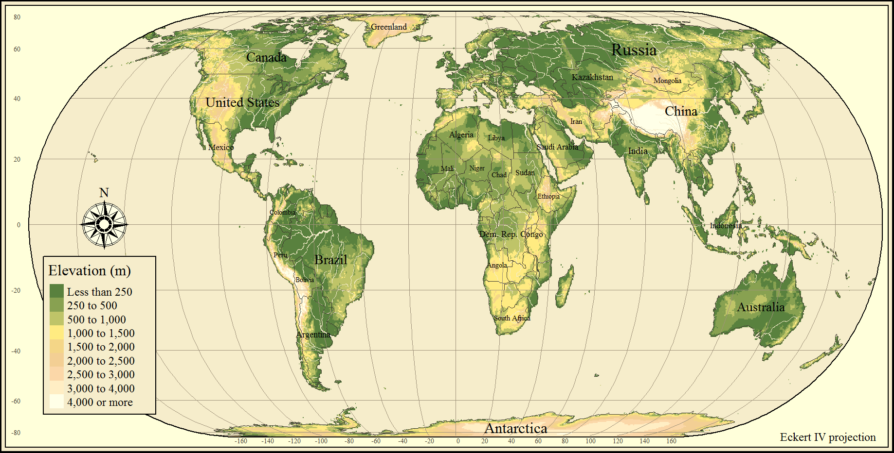
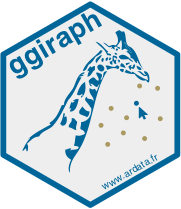
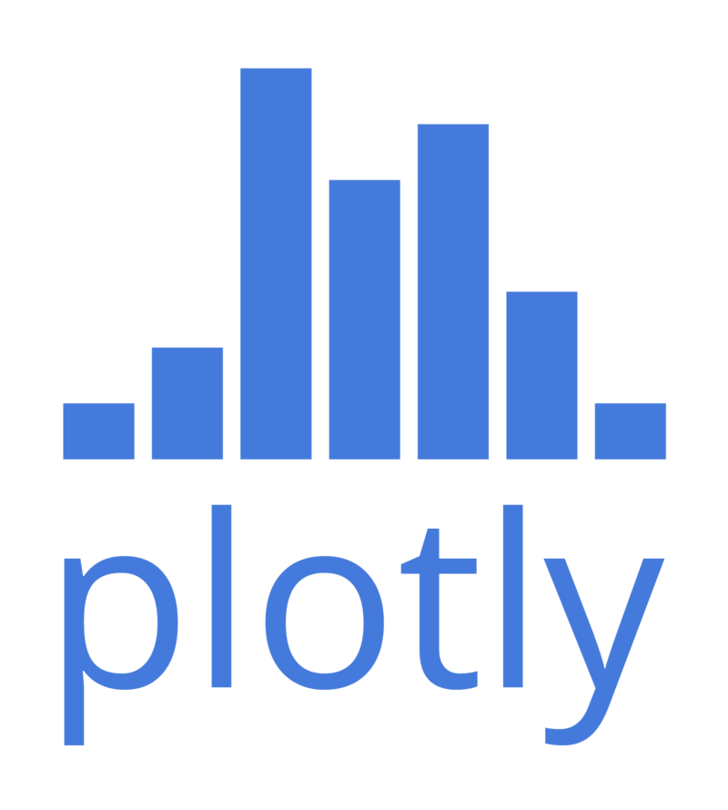
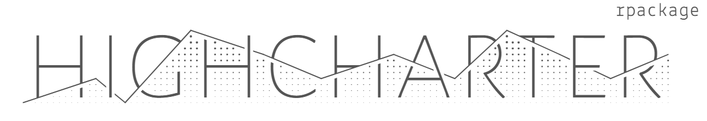

<!-- fontawesome CDN -->
<link href="https://maxcdn.bootstrapcdn.com/font-awesome/4.7.0/css/font-awesome.min.css" rel="stylesheet">

<!-- logo -->
<div class="logo">
  <a href="http://www.icjia.state.il.us/" target="_blank"></img></a>
</div>


```{r setup, include=FALSE}
library(knitr)
library(ggplot2)
library(icjiar)
library(dplyr)
library(tibble)
# library(kableExtra)
library(tmap)
library(leaflet)
library(ggiraph)
library(plotly)
library(highcharter)

opts_chunk$set(echo = TRUE, message = FALSE, warning = FALSE)
```

This page contains the notes for **the second part of R Workshop Module 4: Data visualization with R**, which is part of the R Workshop series prepared by ICJIA Research Analyst [Bobae Kang](http://www.icjia.state.il.us/biographies/bobae-kang){target="_blank"} to enable and encourage ICJIA researchers to take advantage of R, a statistical programming language that is one of the most powerful modern research tools.

### Links
Click [**here**](../index.html) to go to the workshop **home page**.

Click [**here**](../modules.html) to go to the workshop **Modules page**.

Click [**here**](../slides/module4_slides2.html){target="_blank"} to view the accompanying **slides for Module 4, Part 2**.

Navigate to the other workshop materials:

<button class="btn" data-toggle="collapse" data-target="#collapse-navigate" aria-expanded="false" aria-controls="collapse-navigate">**SEE MORE**</button>

<div class="collapse mt-1" id="collapse-navigate">
<div style="padding:20px;">

* **Module 1: Introduction to R** ([**slides**](../slides/module1_slides.html),
[**note**](module1_notes.html))
* **Module 2: R basics**
    * Part 1 ([**slides**](../slides/module2_slides1.html), [**note**](module2_notes1.html))
    * Part 2 ([**slides**](../slides/module2_slides2.html), [**note**](module2_notes2.html))
* **Module 3: Data analysis with R**
    * Part 1 ([**slides**](../slides/module3_slides1.html), [**note**](module3_notes1.html))
    * Part 2 ([**slides**](../slides/module3_slides2.html), [**note**](module3_notes2.html))
* **Module 4: Data visualization with R**
    * Part 1 ([**slides**](../slides/module4_slides1.html), [**note**](module4_notes1.html))
* **Module 5: Statistical modeling with R**
    * Part 1 ([**slides**](../slides/module5_slides1.html), [**note**](module5_notes1.html))
    * Part 2 ([**slides**](../slides/module5_slides2.html), [**note**](module5_notes2.html))
* **Module 6: "To Infinity and Beyond"**
    * Part 1 ([**slides**](../slides/module6_slides1.html), [**note**](module6_notes1.html))
    * Part 2 ([**slides**](../slides/module6_slides2.html), [**note**](module6_notes2.html))

</div>
</div>


***


# Data visualization with R (2): Maps and interactive plots

In the previous part, we studied the basic plotting with `ggplot2`. In this part, we will explore some options for creating maps and interactive plots. 


***


# Maps
```{r echo=FALSE, fig.width=7.5, fig.height=5, out.extra='style="display: block; margin: auto; box-shadow: none;"'}
usmap <- map_data("state")
arr <- USArrests %>%
  add_rownames("region") %>%
  mutate(region = tolower(region))

ggplot() +
  geom_map(data = usmap, map = usmap, aes(x=long, y=lat, map_id=region)) +
  geom_map(data = arr, map = usmap, aes(map_id=region, fill=Assault), color = "white") +
  scale_fill_continuous(low='thistle2', high='darkred', guide='colourbar') +
  coord_map("albers", lat0 = 39, lat1 = 45) +
  theme_void()
```

A lot of criminal justice datasets are geospatial, i.e., they are often collected on a certain geographical unit. In cases like this, maps offer a excellent way to visualize geographical distribution of certin attributes and trends.

In this section, we begin with learning one of the most popular geospatial data format called shapefile. Then we will touch on how to import shapefile data into R using `rgdal` pakage, an R interface to Geospatial Data Abstraction Library (GDAL) for reading and writing geospatial data formats. Then we will take a quick look at spatial data types in R.


## Shapefile
In practice, a lot of geosaptial datasets we work with come in the shapefile format. So, what is shapefile? The following two quotes offer brief answers to the question:

> "A shapefile is a simple, nontopological format for storing the geometric location and attribute information of geographic features. Geographic features in a shapefile can be represented by points, lines, or polygons (areas)."<br> - "What is a shapefile?", *Esri*


> "The shapefile format is a popular geospatial vector data format for geographic information system (GIS) software [...] developed and regulated by Esri [...]. The shapefile format can spatially describe vector features: points, lines, and polygons [...]. Each item usually has attributes that describe it, such as name or temperature." - "Shapefile", *Wikipedia*

### Shapefile components
A shapefile format in fact consists of a collection of files. The following are commonly included when using shapefile data in R:
```{r echo=FALSE}
kable(
  tribble(
    ~"File extension", ~Description,
    "`.shp`", "The main file that stores the feature geometry; *required*.",
    "`.shx`", "The index file that stores the index of the feature geometry; *required*.",
    "`.dbf`", "The dBASE table that stores the attribute information of features; *required*.",
    "`.prj`", "The file that stores the coordinate system information; used by ArcGIS."
  )
)
```

### Importing a shapefile
```{r eval=FALSE}
library(rgdal)
spatial_object <- readORG(dsn, layer)

# example:
# il_counties <- read(dsn = "shapefiles", layer = "il_counties")
```
In practice, mapping of any kind starts with importing an existing shapefile into the R environment. The `rgdal` package offers the `readORG()` function for this work.

`dsn` is the path to the directory with a shapefile to import, and `layer` is the name of a shapefile to import. The output is a spatial vector object.

### Spatial (vector) objects in R
There are multiple spatial vector object types provided by the `sp` package. 

`Spatial*` classes are those without attributes other than spatial ones (coordinates, lines, etc.). There are `SpatialPoints`, `SpatialMultiPoints`, `SpatialPixels`, `SpatialGrid`, ``SpatialLines`, and `SpatialPolygons`.

`Spatial*DataFrame` classes are those with additional attributes in a `data.frame` table, which can be accesssed using standard methods for accessing data in a `data.frame`.

* See the ["Spatial Cheatsheet"](http://www.maths.lancs.ac.uk/~rowlings/Teaching/UseR2012/cheatsheet.html){target="_blank"} for more one spatial objects in R

### Example
```{r}
class(counties)
```
The `icjiar` package provides a spatial object named `counties` for countes in Illinois. Using `class()` function, we find that `counties` is of the `SpatialPolygonsDataFrame` class.


## Packages for maps

* `tmap` package for thematic maps
* `leaftlet` package for interactive maps
* And more


## tmap: Thematic maps in R
```{r echo=FALSE, out.width="60%", out.extra='style="display:block; margin:auto; box-shadow: none;"'}

```
<p style="font-size:0.5em; text-align: center; color: #777;">
Source: <a href="https://github.com/mtennekes/tmap" target="_blank">tmap GitHub repo</a>
</p>

### What is `tmap`?
> "With the tmap package, thematic maps can be generated with great flexibility. The syntax for creating plots is similar to that of ggplot2. The add-on package tmaptools contains tool functions for reading and processing shape files." - "tmap in a nutshell"

While there are a variety of ways to plot maps using R, in my experience, `tmap` is the most accessible R package for generating maps, making it easy to get visually appealing maps using data in the shapefile format.

### The `qtm()` function
```{r eval=FALSE}
qtm(shape_object, ...)
```

`tmap` offers the `qtm()` function to generate a "quick thematic map". `qtm()` is comparable to `qplot()` in `ggplot2` (we didn't cover `qplot()` in the previous part; try `?qplot()` on your R console to see documenetation).

Although the goal of `qtm()` is to provide a quick and easy way to generate a `tmap` object, it offers the same level of flexibility as the main plotting interface using `tm_()` functions. The main interface is stil recommended for complex plots.

#### Example
Here is an example of using `qtm()` to quickly generate a map of Illinois counties, colored by their judicial circuits.
```{r}
qtm(counties, fill = "circuit")
```

### The `tm_*()` interface
```{r eval=FALSE}
tm_shape(shape_object) +
  tm_*() # add tmap elements as layers
```
The main interface for `tmap` to creating maps use `tm_*()` functions. `qtm()` is a quick-and-dirty way to create a map and, in fact, is almost as flexible as the `tm_*()` way. However, as we add more options to tweak our map, `qtm()` loses its major benefit of simplicity. In constrast, the `tm_*()` way allows us to organize or code better.

In the `tm_*()` way, we begin with `tm_shape()`, which creates a `tmap` object from a spatial "shape object." Then we add add layers to it, just as we would do with `ggplot2` plotting.

There are three kinds of layers in `tmap`: two types of "drawing" layers (base and derived) and "attribute" layers.

#### Base `tmap` drawing layers
The following table lists `tmap`'s base drawing layers, with their descriptions and options for aesthetic mappings. 
```{r echo=FALSE}
kable(
  tribble(
    ~Layer, ~Description, ~Aesthetics,
    "`tm_polygons`", "Draws polygons", "col",
    "`tm_symbols`", "Draws symbols", "size, col, shape",
    "`tm_lines`", "Draws lines", "col, lwd",
    "`tm_raster`", "Draws a raster", "col",
    "`tm_text`", "Add text labels", "text, size, col"
  )
)
```

<p style="font-size:0.5em">The table is duplicated from a `tmap` <a href="https://cran.r-project.org/web/packages/tmap/vignettes/tmap-nutshell.html" target="_blank">vignette page</a></p>

#### Derived `tmap` drawing layers
The following table lists `tmap'`s derieved drawing layers, with their descriptions and options for aesthetic mappings.
```{r echo=FALSE}
kable(
  tribble(
    ~Layer, ~Description, ~Aesthetics,
    "`tm_fill`", "Fills the polygons", "see `tm_polygons`",
    "`tm_borders`", "Draws polygon borders", "none",
    "`tm_bubbles`", "Draws bubbles", "see `tm_symbols`",
    "`tm_squares`", "Draws squares", "see `tm_symbols`",
    "`tm_dots`", "Draws dots", "see `tm_symbols`",
    "`tm_markders`", "Draws markers", "see `tm_symbols` and `tm_text`",
    "`tm_iso`", "Draws iso/contour lines", "see `tm_lines` and `tm_text`"
  )
)
```

<p style="font-size:0.5em">The table is duplicated from a `tmap` <a href="https://cran.r-project.org/web/packages/tmap/vignettes/tmap-nutshell.html" target="_blank">vignette page</a></p>

#### `tmap` attribute layers
The following table lists `tmap`'s attribute layers with their descriptions.
```{r echo=FALSE}
kable(
  tribble(
    ~Layer, ~Description,
    "`tm_grid`", "Add coordinate grid lines",
    "`tm_credits`", "Add credits text label",
    "`tm_compass`", "Add map compass",
    "`tm_scale_bar`", "Add scale bar"
  )
)
```

<p style="font-size:0.5em">The table is duplicated from a `tmap` <a href="https://cran.r-project.org/web/packages/tmap/vignettes/tmap-nutshell.html" target="_blank">vignette page</a></p>

#### Example
This example code shows how to create the same map in the `tm_*()` way.
```{r}
tm_shape(counties) +
  tm_borders() +
  tm_fill(col = "circuit")
```

### Layouts for maps
```{r eval=FALSE}
tm_layout(title = NA, scale = 1, title.size = 1.3, bg.color = "white", aes.color = c(fill = "grey85", borders = "grey40", symbols = "grey60", dots = "black", lines = "red", text = "black", na = "grey75"), ...)
```
`tmap` offers `tm_layout()`, a function to control all the layout settings, including title, fonts, colors, backgrounds, and many more.

Using `tm_layout()` to tweak layout settings to find the right look can be overwhelming and tedious. As alternatives, there are `tm_style_*()` functions and `tm_format_*()` functions to easily apply some predefined layout settings.

More specifically, `tm_style_*()` functions which offer predefined sets of styling-related layout settings such as background colors, colors and font. This is comparable to `ggplot2` themes. On the other hand, `tm_format_*()` functions which offer predefined sets of position-related layout settings such as margins.

#### Predefined styles
The following table lists the predefined styles `tmap` offers and their descriptions.
```{r echo=FALSE}
kable(
  tribble(
    ~Style, ~Description,
    "`tm_style_white`", "White background, commonly used colors (default)",
    "`tm_style_gray`", "Gray background, useful to highlight sequential palettes (e.g. in choropleths)",
    "`tm_style_natural`", "Emulation of natural view: blue waters and green land",
    "`tm_style_bw`", "Greyscale",
    "`tm_style_classic`", "Classic styled maps",
    "`tm_style_col_blind`", "Style for colorblind viewers",
    "`tm_style_cobalt`", "Inspired by latex beamer style cobalt",
    "`tm_style_albatross`", "Inspired by latex beamer style albatross",
    "`tm_style_beaver`", "Inspired by latex beamer style beaver"
  )
)
```

#### Example
As mentioned before, "style" in `tmap` is roughly comparable to "theme" in `ggplot2`. Here is one example of applying a style to the same `tmap` plot we created above.
```{r}
tm_shape(counties) +
  tm_borders() +
  tm_fill(col = "circuit") +
  tm_style_classic()
```

Try out other "styles" and see how they change your map!

#### Predefined formats
The following table lists the predefined formats `tmap` offers and their descriptions.
```{r echo=FALSE}
kable(
  tribble(
    ~Format, ~Description,
    "`tm_format_World`", "Format specified for world maps",
    "`tm_format_World_wide`", "for world maps with more space for the legend",
    "`tm_format_Europe`", "for maps of Europe",
    "`tm_format_Europe_wide`", "for maps of Europe with more space for the legend",
    "`tm_format_NLD`", "for maps of the Netherlands",
    "`tm_format_NLD_wide`", "for maps of the Netherlands with more space for the legend"
  )
)
```

#### Example
"Format" has more to do with the spacing and arrangement of plot elements. Take a look at the following plot with a predefined format. Notice that now the plot is made "wider".
```{r}
tm_shape(counties) +
  tm_borders() +
  tm_fill(col = "circuit") +
  tm_format_World_wide()
```

Try out other "formats" and see how they change your map!

### Static vs interactive modes
```{r eval=FALSE}
tmap_mode("plot") # set to static "plot" mode
tmap_mode("view") # set to interactive "view" mode

ttmp() # toggle between modes
```

`tmap` offers two different "modes" for generating maps. The "plot" mode generates a static map image, which is the default mode option. On the other hand, the "view" mode generates an interactive `leaflet` map. We can use `tmap_mode()` function to set the mode. `ttmap()` is a shortcut function to toggle between modes. Note that the set mode is applied for all `tmap` plots generated in that session, untile it is reset.

Additionally, `tm_view()` is a function to specify options for the interactive "view" mode, some of which can be set with `tm_layout()`.

If we want to create an interactive `leaflet` map without changing the mode setting for the whole session, we can use `tm_leaflet()`, which takes a `tmap` object as the argument input.

#### Example
Here we try the simple `qmap()` we saw ealier in the interactive view mode. the default option comes with many useful features, including on-click tooltips (try click anywhere on the Illinois map) and an option for changing base maps (try hover your mouse pointer over the button below the zoom buttons).
```{r}
tmap_mode("view")
qtm(counties, fill = "circuit")
```


## `Leaflet`
```{r echo=FALSE, out.width="60%", out.extra='style="display: block; margin: auto; box-shadow: none;"'}
include_graphics("../images/leaflet.png")
```
<p style="font-size:0.5em; text-align: center; color: #777;">
Source: <a href="http://leafletjs.com/" target="_blank">leafletjs.com</a>
</p>

### What is `leaflet`?
> "Leaflet is one of the most popular open-source JavaScript libraries for interactive maps. It's used by websites ranging from The New York Times and The Washington Post to GitHub and Flickr, as well as GIS specialists like OpenStreetMap, Mapbox, and CartoDB."<br>-"Leaflet for R", RStudio

`leaflet` is a powerful library for generating interactive maps, perhaps one of the most powerful options that are freely available.

However, it takes much time and practice to get familiar with its API--even using R. There is no function in `leaflet` that is equivalent to `qtm()` and quickly generates a map with default settings. That said, using `tmap`'s interactive view could be a great alterantive to using `leaflet`'s API directly.

Nonetheless, if you are serious about creating some beautiful interactive maps, it certainly pays to learn `leaflet`.

#### Example
The following example creates a simple `leaftlet` map. Note that you have to pretty much define everything you want to see on your map. On one hand, `leaflet` provides a great degree of flexibility; on the other hand, it takes many more lines of code to get a relatively simple output.

```{r}
pal <- colorFactor(topo.colors(5), counties$circuit)
leaflet(counties) %>%
  addProviderTiles("CartoDB.Positron") %>%
  addPolygons(fillColor = ~pal(circuit), color = "darkgrey", weight = 2) %>%
  addLegend(pal = pal, values = ~circuit)
```


## Other options

* Base R plot is capable of draw a simple map from a spatial object. However, anything more than a simple plotting of borders is better handled with third-party packages. 
* The `sp` package offers `spplot()`, which builds on the base R plot functionality. `spplot()` takes an object of spatial classes as its source data, making it easy to work with imported shapefiles (See Eubank, N. (2015) in [Resources](#resources_map) for more). 
* `ggplot2` can use `geom_polygon()` and/or `geom_map()` to plot spatial polygons with some modificiations (See Kahle, D. & Wickham, H. (2013) in [Resources](#resources_map) for more).
* `ggmap` is an R package offering functions to easily downlaod base maps from various sources, which can be used with `ggplot2` layers (See Kahle, D. & Wickham, H. (2013) in [Resources](#resources_map) or `ggmap` [github repo](https://github.com/dkahle/ggmap){target="_blank"} for more).


## Resources {#resources_map}
Here are some resources on drawing maps in R. I strongly recommand you to read through the `tmap` vignettes to get started with generating good-looking maps with `tmap`.

Also, if you are interested in digging deeper into spatial data manipulation in R based on the `sp` package's spatial classes, make sure you check out an online manual/book by Hijmans (2016).

Finally, a new paradigm for working with spatial objects in R has recently emerged and is implemented by the `sf` package. To learn more about `sf`, take a look at Pebesma (n.d.) and the package vignettes listed on the webpage.

* Eubank, N. (2015). ["Making maps in R"](http://www.nickeubank.com/wp-content/uploads/2015/10/RGIS3_MakingMaps_part1_mappingVectorData.html){target="_blank"}.
* Hijmans, R. (2016). ["Spatial Data Manipulation"](http://rspatial.org/spatial/index.html){target="_blank"}. *R Spatial*.
* `leaftlet` [official documentation page](https://rstudio.github.io/leaflet/){target="_blank"}
* Lovelace, R. et al. (2017). ["Introduction to visualising spatial data in R
"](https://cran.r-project.org/doc/contrib/intro-spatial-rl.pdf){target="_blank"}.
* Pebesma, E. (n.d.). [*Simple Features for R*](http://r-spatial.github.io/sf/){target="_blank"}.
* `tmap` [github repository](https://github.com/mtennekes/tmap){target="_blank"}
    * [Links to package vignettes and examples](https://github.com/mtennekes/tmap#vignettes-and-examples){target="_blank"}


***


# Interactive Plots
```{r echo=FALSE, out.width="25%", out.extra='style="display: block; margin: auto; box-shadow: none;"'}
include_graphics("../images/interactive.png")
```
<p style="font-size:0.5em; text-align:center; color: #777;">
Source: <a href="https://commons.wikimedia.org/wiki/File:Interactive_icon.svg" target="_blank">Wikipedia Commons</a>
</p>

More compelling visualizations can be created with incorporating interactivity. We have already seen some interactive plots with `tmap` view mode and `leaflet`. Here we will explore some options for creating plots in general with some interactive features. Please note that this section is not meant to serve as a comprehensive or exhaustive manual for any of the introduced packages.

## Packages for interactive plots

* `ggiraph`: an `htmlwidget` package for interactive `ggplot2` graphics
* `plotly`: R API for the plotly.js library
* `highcharter`: R API for the highchart.js library
* And more


## `ggiraph`
```{r echo=FALSE, out.width="30%", out.extra='style="display: block; margin: auto; box-shadow: none;"'}

```
<p style="font-size:0.5em; text-align: center; color: #777;">
Source: <a href="https://davidgohel.github.io/ggiraph/" target="_blank">ggiraph documentation page</a>
</p>

### What is `ggiraph`?
> "ggiraph is an htmlwidget and a ggplot2 extension. It allows ggplot graphics to be animated."<br>- Gohel, D. (package author/creator)

`ggiraph` offers interactive `geom`s to be used for a `ggplot2` plot and renders the plot with interactive `geom`s as an interactive visualization.

### Interactive "geom" layers
```{r eval=FALSE}
p <- plot + geom_*_interactive(...)
ggiraph(code = print(p), ...)
```
To add interactivity to `ggplot2` plot with `ggiraph`, we first need to create a `ggplot` object (`plot` in the code chunk above) with interactive "geom" layers. The `ggiraph()` function than uses the `ggplot` object with interactive layers to generate an interactive plot.

`ggiraph` offers 12 interactive "geom" layers that can be integrated into a `ggplot` object, including the following:

* `geom_bar_interactive`, `geom_boxplot_interactive`, `geom_histogram_interactive`, `geom_line_interactive`, `geom_map_interactive`, `geom_path_interactive`, `geom_point_interactive`, `geom_polygon_interactive`, `geom_rect_interactive`, `geom_segment_interactive`, `geom_text_interactive`, and `geom_tile_interactive`.

### Interactive aesthetic mappings
```{r eval=FALSE}
aes(tooltip, onclick, data_id)
```
Each interactive "geom" has mapping for the following interactive elements: 

* `tooltip` is a column containing information to be displayed as tooltip
* `onclick` is a column containing JavaScript instructions to run for a "click" event
* `data_id` is a column containing id to be associated with elements. Please note that this mapping must be specified to use a customized "hover" effect.

#### Example
First we get the data we will use, which is a filtered subset of `ispcrime` dataset joined with `regions` dataset. 
```{r}
data <- ispcrime %>% filter(county != "Cook") %>% left_join(regions)
```

Since `ggiraph` requires a `ggplot` object to convert into an interactive, we create one. Note that we use `geom_point_interactive()` layer, instead of `ggplot2`'s native `geom_point()`.
```{r}
p <- ggplot(data, aes(x = violentCrime, propertyCrime, color = region)) +
  geom_point_interactive(aes(tooltip = county, data_id = county))
```

Now we can plug the plot into `ggiraph()` to make it an interactive plot. This example has `hover_css` argument input for specifying the hover effect.
```{r}
ggiraph(code = print(p), hover_css = "fill:orange; fill-opacity:.3; cursor:pointer;")
```


## `plotly`
```{r echo=FALSE, out.width="35%", out.extra='style="display: block; margin: auto; box-shadow: none;"'}

```
<p style="font-size:0.5em; text-align: center; color: #777;">
Source: <a href="https://commons.wikimedia.org/wiki/File:Plotly_logo_for_digital_final_(6).png" target="_blank">wikimedia.org</a>
</p>

### What is `plotly`?
> "Plotly's R graphing library makes interactive, publication-quality graphs online. Examples of how to make line plots, scatter plots, area charts, bar charts, error bars, box plots, histograms, heatmaps, subplots, multiple-axes, and 3D (WebGL based) charts."<br>- "Plotly R Library", *plotly*

### The `ggplotly()` function
```{r eval=FALSE}
ggplotly(p = ggplot2::last_plot(), ...)
```
`plotly` offers the `ggplotly()` function as a quick and easy way to convert a `ggplot` object into an interactive plotly object.

The first argument of `ggplotly()`, `p`, is a `ggplot2`'s `ggplot` object to be made interactive. The default value for `p` is the most recently created `ggplot` object if ther is any.
    
#### Example
We use the same subset of `ispcrime` we created earlier to try out `ggplotly`. As in the case of using `ggiraphy`, we than create a `ggplot` object, but without using any special layer.
```{r}
# using the same data
p <- ggplot(data, aes(violentCrime, propertyCrime, colour = region)) +
  geom_point() + labs(title = "Using ggplotly()")
```

We then simply plug the ordinary `ggplot` object into `ggplotly()` to get an interactive plot with some nice default features. These features include tooltips, an ability to zoom in and out, an option to download the plot as a static image, and many more.
```{r}
ggplotly(p)
```

Try the interactive features of this plot to understand them better.

### The `plot_ly()` interface
```{r eval=FALSE}
plot_ly(data, x, y, color, alpha, symbol, size, ...)

 # equivalent to add_type()
add_trace(p, ..., type = "type", inheret = TRUE)
```
Using the `plot_ly()` function, we can create a native `plotly` visualization. First, we use `plot_ly()`, which takes a data frame and defines the aesthetic mappings. Then we add "traces" to the `plotly` object, which are comparable to "geom" layers in `ggplot2`.

In fact, we can specify traces within the `plot_ly()` function. However, using `add_trace()` and its variants make it possible to use a `dplyr`-style workflow with pipe operators and better organize the code. By default, each trace added using `add_trace()` inherits the mappings from `p`.

### plotly `add_` functions
`plotly` offers various traces to use. The following table lists some `add_` functions and their descriptions.
```{r echo=FALSE}
kable(
  tribble(
    ~Function, ~Description, ~"Equivalent to `add_trace(...)`",
    "`add_trace()`", "add traces with options", "`NA`",
    "`add_markers()`", "adds a scattorplot", "`type=\"scatter\", mode=\"markers\"`",
    "`add_lines()`", "adds a line plot", "`type=\"scatter\", mode=\"lines\"`",
    "`add_bars()`", "adds a bar plot", "`type=\"bar\", mode=\"markers\"`",
    "`add_histogram()`", "adds a histogram", "`type=\"histogram\"`",
    "`add_boxplot()`", "adds a box plot", "`type=\"box\"`",
    "`add_pie()`", "adds a pie chart", "`type=\"\", mode=\"\"`",
    "`add_text()`", "adds texts", "",
    "`add_polygons()`", "adds polygons", "`type=\"\", mode=\"\"`"
  )
)
```

#### Example
The following code uses the `plot_ly()` interface to replicate the plot we created above. Here we use `add_markers()` for generating a scattorplot. The output is a plot with a native `plotly` layout.
```{r}
plot_ly(data, x = ~violentCrime, y = ~propertyCrime, color = ~region) %>%
  add_markers() %>%
  layout(title = "Using plot_ly() interface")
```


## `highcharter`
```{r echo=FALSE, out.width="100%", out.extra='style="display: block; margin: auto; box-shadow: none;"'}

```
<p style="font-size:0.5em; text-align: center; color: #777;">
Source: <a href="https://github.com/jbkunst/highcharter" target="_blank">highcharter github repo (jbkunst/highcharter)</a>
</p>

### What is `highcharter`?
> "Highcharter is a R wrapper for Highcharts javascript libray and its modules. Highcharts is very mature and flexible javascript charting library and it has a great and powerful API."<br>-Kunst, J. (package author)

`Highcharts` is one of my favorite JavaScript visualization library that offers elegant plots with interactive features. In fact, you may have already seen `Highcharts` plots in ICJIA R&A Unit's online articles (e.g. Figure 1 and Figure 2 in [this article](http://www.icjia.state.il.us/articles/evaluation-of-illinois-multi-jurisdictional-drug-task-forces){target="_blank"}).

### The `hchart()` function
```{r eval=FALSE}
hchart(data, type, hcaes(x, y, ...))
```
`highcharter` offers the `hchart()` function to quickly generates a hichchart plot, which is comparable to `qplot()` in `ggplot2`. `type` defines the type of plot (e.g. "scattor" for scattorplot), and `hcaes()` works like `aes()` in `ggplot2` to define aesthetic mappings.

#### Example
The following example uses `hchart()` to quickly generate the same scattorplot we have made ealier. `data` is the same subset of `ispcrime`.
```{r}
hchart(data, type = "scatter", hcaes(x = violentCrime, y = propertyCrime, group = region)) %>%
  hc_title(text = "Using hchart() interface")
```

### The `highchart()` interface
```{r eval=FALSE}
highchart() %>%
  hc_add_series(...) %>% # add a "series"
  hc_xAxis(...) %>% # define x-axis
  hc_yAxis(...) %>% # define y-axis
  hc_title(...) %>% # add the main title
  hc_chart(...) %>% # modify general plot options
  hc_color(...) %>% # control colors
  hc_*(...) # and more...
```
There is also the `highchart()` interface to create a highchart plot in a way similar to the original JavaScript interface. In general, this is a more exacting way of creating a highchart plot, but learning it can be highly rewarding. A potential compromise is to use `hchart()` to get the basic plot and chain additional `hc_*()` functions to fine-tune the plot.

#### Example
Here is the same scattorplot created using the formal interface.
```{r}
highchart() %>%
  hc_add_series(data, type = "scatter", hcaes(x = violentCrime, y = propertyCrime, group = region)) %>%
  hc_title(text = "Using highchart() interface")
```


## Resources
As usual, we have only scratched the surface of these interactive plotting packages. I recommand you to pick one package you are intersted and take a look through its official documentation to gain a deeper understanding of their APIs.

* `ggiraph` [official documentation page](https://davidgohel.github.io/ggiraph/articles/offcran/using_ggiraph.html){target="_blank"}
* `highcharter` [official documentation page](http://jkunst.com/highcharter/index.html){target="_blank"}
* `plotly` [official documentation page](https://plot.ly/r/){target="_blank"}
* Sievert, C. (n.d.) [*`plotly` for R*](https://plotly-book.cpsievert.me/){target="_blank"}.


## More on interactive plotting
To be honest, the interactive plotting packages we have explored above are only those I have some experience with. As you might have suspected, there are many more R pakcages for interactive plotting. The following are few of such packages that I find interesting:

* `rAmCharts` is an R interface to the [`amCharts`](https://www.amcharts.com/products/){target="_blank"} JavaScript library that offers interactive options for many common plot types and more. See `rAmCharts` [online documentation](https://datastorm-open.github.io/introduction_ramcharts/amBoxplot.html){target="_blank"} for more.
* `chartjs` is an R interface to the [`Chart.js`](http://www.chartjs.org/){target="_blank"} JavaScript library and offers six chart types (bar, line, pie, doughnut, radar, and polar area) for interactive plots. See `chartjs` [website](http://tutuchan.github.io/chartjs/){target="_blank"} for more.
* `googleVis` offers an R API to [Google Charts](https://developers.google.com/chart/){target="_blank"}, which offers rich set of interactive charts and data tools. See `googleVis` tutorial [slides](http://decastillo.github.io/googleVis_Tutorial/){target="_blank"} by the package creator for more information.
* `dygraphs` is an R interface to the [dygraphs](http://rstudio.github.io/dygraphs/index.html){target="_blank"} JavaScript library for interactive time-series plots. See `dygraph` [online documentation](http://rstudio.github.io/dygraphs/index.html){target="_blank"} for more.


## Other visualizations
There are also R packages for visualizing specific kinds of data. I find the following three to be particuarly interesting and worth exploring: 

* [`visNetwork`](http://datastorm-open.github.io/visNetwork/){target="_blank"} (wrapper for `vis.js`) and [`networkD3`](http://visjs.org/){target="_blank"} are two popular packages for interactive visualization of network/graph data in R. Start with [`igraph`](http://igraph.org/r/){target="_blank"} or [`tidygraph`](https://github.com/thomasp85/tidygraph){target="_blank"} package to learn how to work with network objects in R
* [`wordcloud2`](https://cran.r-project.org/web/packages/wordcloud2/vignettes/wordcloud.html){target="_blank"} (wrapper for `worldcloud2.js`) is a package for creating word clouds, a popular way to visualize text data.
* [`data.tree`](https://cran.r-project.org/web/packages/data.tree/vignettes/data.tree.html){target="_blank"} is an R package for managing as well as visualizing hierarchical data and tree structures.


***


# References
<ul>
  <li>Gohel, D. (n.d.). <a href="https://davidgohel.github.io/ggiraph/index.html" target="_blank"><i>ggiraph</i></a>.</li>
  <li>Kunst, J. (2017). <a href="http://jkunst.com/highcharter/index.html" target="_blank"><i>HIGHCHARTER</i></a>.</li>
  <li>Sievert, C. (n.d.). <a href="https://plotly-book.cpsievert.me/" target="_blank"><i>plotly for R</i></a>.</li>
  <li>Tennekes, M. (n.d.). <a href="https://cran.r-project.org/web/packages/tmap/vignettes/tmap-nutshell.html" target="_blank">"tmap in a nutshell"</a>.</li>
  <li>Tennekes, M. (n.d.). <a href="https://cran.r-project.org/web/packages/tmap/vignettes/tmap-modes.html" target="_blank">"tmap modes: plot and interactive view"</a>.</li>
</ul>