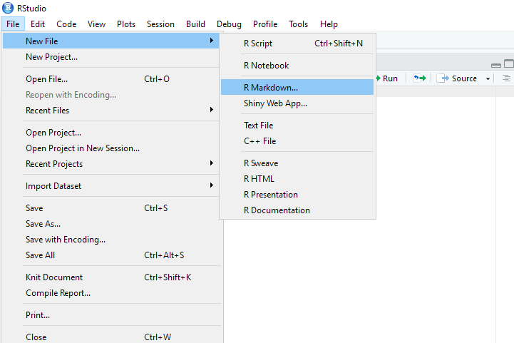
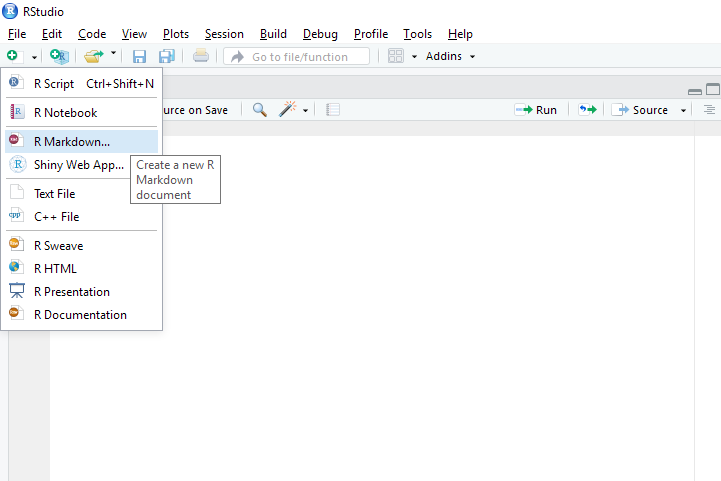
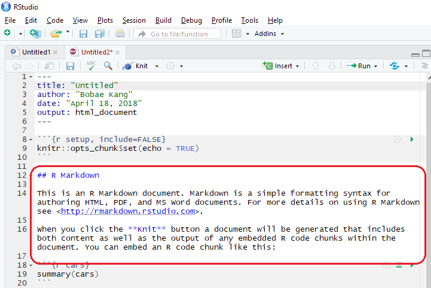
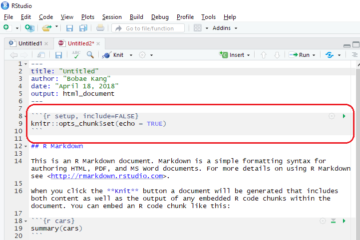
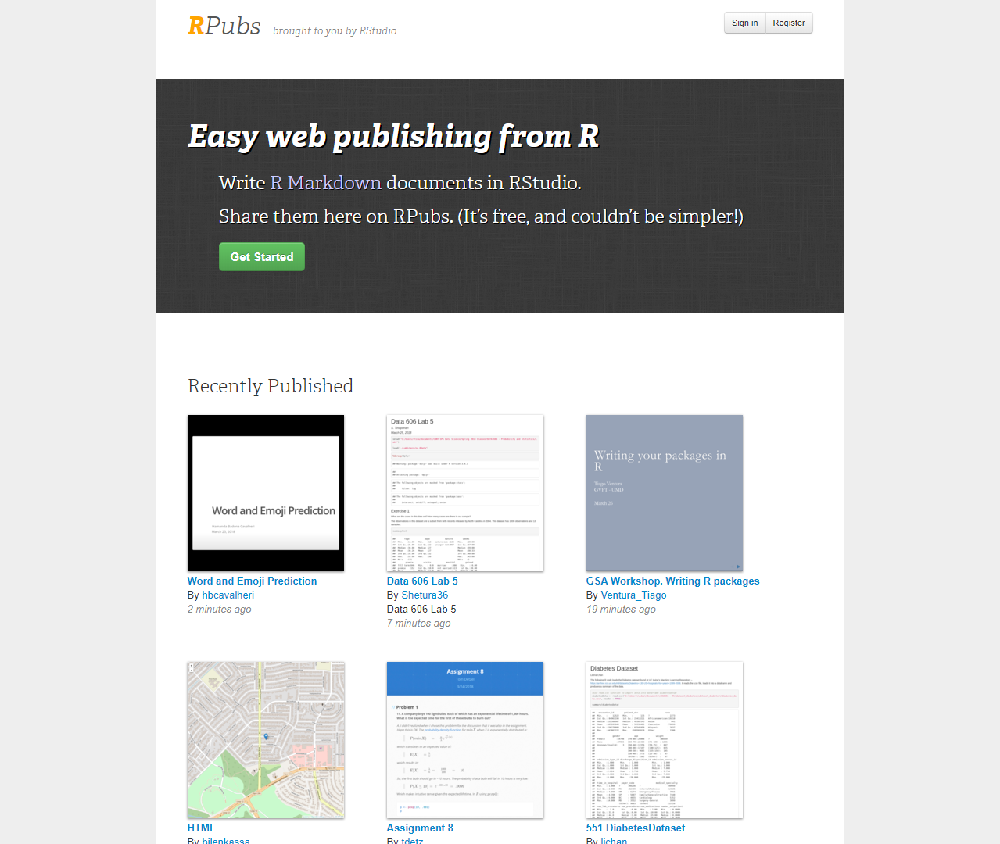
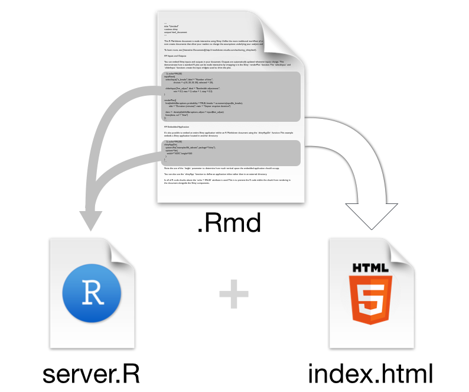
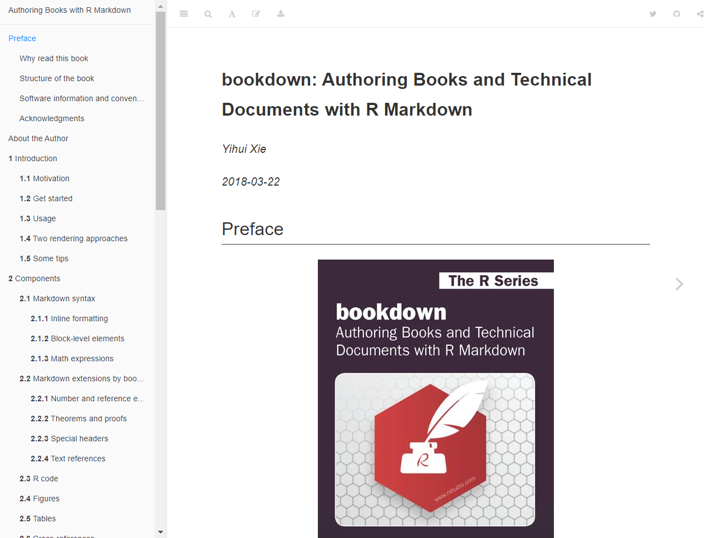
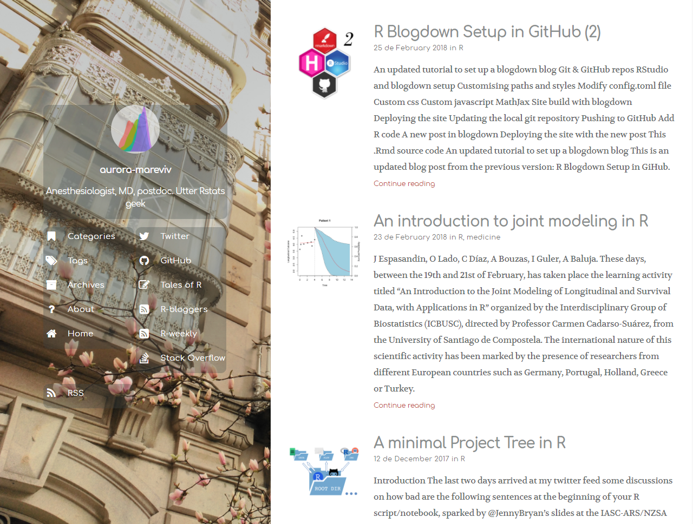

<!-- fontawesome CDN -->
<link href="https://maxcdn.bootstrapcdn.com/font-awesome/4.7.0/css/font-awesome.min.css" rel="stylesheet">

<!-- logo -->
<div class="logo">
  <a href="http://www.icjia.state.il.us/" target="_blank"></img></a>
</div>


```{r setup, include=FALSE}
library(knitr)
opts_chunk$set(echo = TRUE)
```

This page contains the notes for **the first part of R Workshop Module 6: "To Infinity and Beyond"**, which is part of the R Workshop series prepared by ICJIA Research Analyst [Bobae Kang](http://www.icjia.state.il.us/biographies/bobae-kang){target="_blank"} to enable and encourage ICJIA researchers to take advantage of R, a statistical programming language that is one of the most powerful modern research tools.

### Links
Click [**here**](../index.html) to go to the workshop **home page**.

Click [**here**](../modules.html) to go to the workshop **Modules page**.

Click [**here**](../slides/module6_slides1.html){target="_blank"} to view the accompanying **slides for Module 6, Part 1**.

Navigate to the other workshop materials:

<button class="btn" data-toggle="collapse" data-target="#collapse-navigate" aria-expanded="false" aria-controls="collapse-navigate">**SEE MORE**</button>

<div class="collapse mt-1" id="collapse-navigate">
<div style="padding:20px;">

* **Module 1: Introduction to R** ([**slides**](../slides/module1_slides.html),
[**note**](module1_notes.html))
* **Module 2: R basics**
    * Part 1 ([**slides**](../slides/module2_slides1.html), [**note**](module2_notes1.html))
    * Part 2 ([**slides**](../slides/module2_slides2.html), [**note**](module2_notes2.html))
* **Module 3: Data analysis with R**
    * Part 1 ([**slides**](../slides/module3_slides1.html), [**note**](module3_notes1.html))
    * Part 2 ([**slides**](../slides/module3_slides2.html), [**note**](module3_notes2.html))
* **Module 4: Data visualization with R**
    * Part 1 ([**slides**](../slides/module4_slides1.html), [**note**](module4_notes1.html))
    * Part 2 ([**slides**](../slides/module4_slides2.html), [**note**](module4_notes2.html))
* **Module 5: Statistical modeling with R**
    * Part 1 ([**slides**](../slides/module5_slides1.html), [**note**](module5_notes1.html))
    * Part 2 ([**slides**](../slides/module5_slides2.html), [**note**](module5_notes2.html))
* **Module 6: "To Infinity and Beyond"**
    * Part 2 ([**slides**](../slides/module6_slides2.html), [**note**](module6_notes2.html))

</div>
</div>


***


# "To Infinity and Beyond" (1): Sharing your work
After learning how to use R to analyze data and get results, now is the time for us to explore various options to share our work effectively and elegantly.   

***


# R Markdown
```{r echo=FALSE, out.width="35%", out.extra='style="display: block; margin: auto; box-shadow: none;"'}
include_graphics("../images/rmarkdown.png")
```
<p style="font-size:0.5em; text-align:center; color: #777;">
Source: <a href="https://rmarkdown.rstudio.com/authoring_quick_tour.html" target="_blank">R Markdown</a>
</p>


## What is R Markdown?
> "R Markdown is a file format for making dynamic documents with R. An R Markdown document is written in markdown (an easy-to-write plain text format) and contains chunks of embedded R code."<br><br> - Garret Grolemund from R Studio

R Markdown supports a variety of document formats and makes it easy to create amazing reports, presentation slides, or even websites to share your findings in R with others.


## Why use R Markdown?
There are many benefits of using R Markdown.

First, it is a great way to incorporate your R code into a document. It not only shows your code to make it transparent, but also runs it as the document is rendered so that the resulting output is always true to the code. This is particularly useful when the code is used to compute certain key values or create tables/plots using data. 

Second, R Markdown makes it easy to generate various formats of documents for the same contents--an HTML document, a PDF report, presentation slides, etc.--with little to no changes to the R Markdown script.

R Markdown's ability to incorporate R code makes the rendered document and its content largely reproducible. If the data changes and we have to compute certain values again, we simply re-render the document using the modified data.

Finally, the report generating process can be largely automated with `rmarkdown` tools.


## Getting started
To get started with R Markdown, we first have to install `rmakrdown` package. If you are using RStudio IDE (which you should), this is already taken care of.

Creating a new R Markdown file is easily done using RStudio IDE. Go to its menu bar, and click File > New File > R Markdown.

Onces we have our R Markdown file ready to be rendered, we "Knit" the R Markdown file into a document in the desired format.

The following screenshots show how this is done:

```{r echo=FALSE, out.width="80%"}

```

On the RStuido IDE menu, click "File > New File > R Markdown".

```{r echo=FALSE, out.width="80%"}

```

Alternatively, you can click a button right below File menu, which is for creating a new file. When you clikc the button, you will see various options for a new file. Click "R Markdown".

```{r echo=FALSE, out.width="80%"}
include_graphics("../images/rmarkdown3.png")
```

When you click "R Markdown", you will see a small window for specifying a few options, including "Title", "Author", and "Default Output format".

```{r echo=FALSE, out.width="80%"}
include_graphics("../images/rmarkdown4.png")
```

Onces you click "OK", a new R Markdown script shows up on the script pane of RStudio IDE. Now we are ready to work on our R Markdown file!


## R Markdown structure

### YAML header
An R Markdown file starts with a YAML header, which specifies options for rendering the output document. In the following picture, the part in the red box is a YAML header, enclosed by three dashes (`---`) on the top and bottom.

```{r echo=FALSE, out.width="80%"}
include_graphics("../images/rmarkdown5.png")
```

### YAML header options

Basic YAML header options include the title, author, and date of the document as well as the output specifications (output format and related options). We will take a closer look at the output options below. 

### Knit and preview

RStudio IDE offers a button for "knitting" the R Markdown file into documents of specified formats. Next to the "Knit" button is a button with options for previews.

```{r echo=FALSE, out.width="80%"}
include_graphics("../images/rmarkdown6.png")
```

### Knit options
Clickling the "Knit" button will simply knit the document. On the other hand, clicking a small down-arrow button will show some options for knitting the document.

```{r echo=FALSE, out.width="80%"}
include_graphics("../images/rmarkdown6-1.png")
```

### Preview options
Clikcing the cogwheel icon next to "Knit" button presents optiosn for preview.
```{r echo=FALSE, out.width="80%"}
include_graphics("../images/rmarkdown6-2.png")
```

### Markdown
The main body of the R Markdown file is a markdown script.
```{r echo=FALSE, out.width="80%"}

```


## Markdown basics
We will take a quick tour of markdown basics. More specifically, we will see the markdown syntax for the following elements:

* Headers
* Font types (italic, bold, strikethrough, superscript)
* Lists (ordered, unordered)
* Hyperlinks
* Images
* Blackquotes
* Horizontal line/page break
* Math equations (using LaTeX)
* Code/R code (chunk, in-line)

### Headers
```
# Header 1

## Header 2

### Header 3
```

### Font types
```
_italic_  __bold__

*italic*  **bold**


~~strikethrough~~


superscript^2^
```

### Lists
```
Unordered list  |  Ordered list
                | 
* Item 1        |  1. Item 1
    * Item 1a   |      1. Item 1a
* Item 2        |  2. Item 2
    + Item 2a   |      1. Item 2a
    - Item 2b   |      2. Item 2b
```
```
Mixed list

1. Item 1
    * Item 1a
* Item 2
    1. Item 2a
    + Item 2b
```

### Hyperlinks
```
[text with hyperlink](http://link.path)
```

### Images
```


```

### Blockquotes
```
> A line of text following the "> " is a blockquote.
```
> A line of text following the "> " is a blockquote.

### Horizontal line/page break
```
More then three asteriks or dashs

***

******

------
```

### Math equations
```
Inline math equations look like: $y = (x + 1)^2$
```
<div style="font-size:.8em;">
Inline math equations look like: $y = (x + 1)^2$
</div>
<br>

```
A block of math equations look like:

$$y = x^2 + 2x + 1$$
```
<div style="font-size:.8em;">
A block of math equations look like: $$y = x^2 + 2x + 1$$
</div>

### R code chunk
The highlighted part in the markdown body is an R code chunk. Each code chunk can have R code that will be executed when knitting the whole document.
```{r echo=FALSE, out.width="80%"}

```

### Insert a new code chunk
Inserting a new code chunk can be done with clicking the "Insert" button on the right top of the script pane. Alternatively, we can used a keyboard shortcut: `Ctrl + Alt + i`.
```{r echo=FALSE, out.width="80%"}
include_graphics("../images/rmarkdown9.png")
```


### Run code chunks
Click the "Run" button to see options for executing R code chunks. Also, we can execute each code chunk separately with the green play button on the right top of the code chunk. Alternatively, we can use a keyboard shortcut: `Ctrl + Enter`.

```{r echo=FALSE, out.width="80%"}
include_graphics("../images/rmarkdown10.png")
```


## knitr options
`knitr` package offers various options to control the knitted output of code chunks. There are global options and local options.

```{r eval=FALSE}
# use the following to control global options
knitr::opts_chunk$set(eval = TRUE, echo = TRUE, ...)
```

Global options act as the default settings for the whole document. This can be specified using `opts_chunk$set()` function

```{r eval=FALSE}
_```{r eval = FALSE, echo = FALSE, ...}
```

Local options per code chunk are only applied to the specific code chunck. They can specified in the curly braces `{}` at the beginning of the code chunk. Local options overide the global options if relevant.

See [here](https://yihui.name/knitr/options/){target="_blank"} for full documentation of `knitr` chunk options.

### Commonly used options
The following table lists commonly used code chunk options and their descriptions.
```{r echo=FALSE}
kable(
  tibble::tribble(
    ~Option, ~Description,
    "`eval` (`TRUE`)", "Evaluate code in chunk? If FALSE, only code is shown",
    "`echo` (`TRUE`)", "Show code in chunk? If FALSe, only output is shown",
    "`error` (`FALSE`)", "Preserve the error? If TRUE, knitting continues in case of errors",
    "`message` (`TRUE`)", "Display code messages?",
    "`warning` (`TRUE`)", "Display code warnings?",
    "`include` (`TRUE`)", "Include the code chunk? If FALSE, neither code nor output is shown but code is still evaluated",
    "`fig.show` (`asis`)", "How to show/arrange plots? (`\"asis\"`, `\"hold\"`, `\"animate\"`, `\"hide\"`)",
    "`fig.width`, `fig.height` (`7`)", "Plot width and height in inches."
  )
)
```


## Tables
There are often cases where we want to generate a table using R code and include it in the R Markdown output. There are different options for printing a table:

* Printing basic data frame object
* Proper (HTML) tables with `knitr::kable()`
* Interactive tables with `DT::datatable()`

### Default print example
```{r}
my_table <- data.frame(
  my_fruits = c("apple", "banana", "clementine"),
  my_animals = c("dogs", "cats", "llamas"),
  my_flavors = c("chocolate", "vanila", "cookie dough"),
  my_colors = c("red", "green", "orange"),
  my_cities = c("Chicago", "New Work", "Los Angeles")
)

my_table
```

### `kable` example
```{r}
knitr::kable(my_table)
```

### `datatable` example
```{r}
DT::datatable(my_table)
```


***


# Documents
```{r echo=FALSE, out.width="33%", out.extra='style="display: block; margin: auto; box-shadow: none;"'}
include_graphics("../images/document_icon.png")
```
<p style="font-size:0.5em; text-align:center; color: #777;">
Source: <a href="https://www.wikimedia.org" target="_blank">Wikimedia Commons</a>
</p>

## R Markdown output formats
R Markdown supports various output formats, including HTML, PDF, Microsoft Word, and more.

Output format can be specified using `output` in the YAML header. R Markdown is not limited to generate a single format for the given file. In order words, depending on the YAML `output` setting, the same file can be rendered in multiple formats.

Different output format has different YAML render options. Refer the page 2 of R Markdown cheat sheet on RStudio's [Cheat Sheets page](https://www.rstudio.com/resources/cheatsheets/){target="_blank"} for a full list.

### Common output formats
The following table lists common output formats on YAML header and what they create.
```{r echo=FALSE}
kable(
  tibble::tribble(
    ~"`output` value", ~Creates,
    "`html_document`", "HTML file",
    "`html_notebook`", "R Notebook HTML file",
    "`pdf_document`", "PDF (requires Tex) file",
    "`word_document`", "Microsoft Word file",
    "`md_document`", "Markdown file",
    "`github_document`", "GitHub compatible markdown file",
  )
)
```

### Commonly used YAML render options
The following table lists commonly used YAML render options and their descriptions as well as availability.
```{r echo=FALSE}
kable(
  tibble::tribble(
    ~Option, ~Description, ~"Available for",
    "`css`", "CSS file to use to style document", "html",
    "`highlight`", "Syntax highlighting", "html, pdf, word",
    "`number_sections`", "Add section numbering to headers", "html, pdf",
    "`theme`", "Bootswatch theme to use for page", "html",
    "`toc`", "Add a table of contents", "html, pdf, word, md, github",
    "`toc_depth`", "The lowest level of headings in toc", "html, pdf, word, md, github",
    "`toc_float`", "Float the toc on the left", "html",
  )
)
```

### Output appearances
Available highlights for R Markdown documents are as follows: `"default"`, `"tango"`, `"pygments"`,  `"kate"`, `"monochrome"`, `"espresso"`, `"zenburn"`, `"haddock"`, and `"textmate"`

Available themes for R Markdown documents are as follows: `"default"`, `"cerulean"`, `"journal"`, `"flatly"`, `"readable"`, `"spacelab"`, `"united"`, `"cosmo"`,  `"lumen"`, `"paper"`, `"sandstone"`, `"simplex"`, and `"yeti"`. R Markdown themes are in fact drawn from ["Bootswatch"](https://bootswatch.com/){target="_blank"} themes, so you can visit the website to get a feel for each theme for your own R Markdown document. 


## R Notebooks
> "An R Notebook is an R Markdown document with chunks that can be executed independently and interactively, with output visible immediately beneath the input."<br>- "R Notebooks", RStudio

While all other R Markdown formats requires "knitting" to see the final output, an R notebook document is automatically re-rendered each time the source file (`.Rmd`) is saved. This offers a more interactive workflow.


## `htmlwidgets` for R
* There are many R packages (90+) for taking full advantage of the interactivity that web can offer.
* With these packages, we can easily incorporate interactive widgets into HTML documents generated using R Markdown
* Examples of `htmlwidgets` include:
    * `plotly` and `highcharter` for interactive visualizations
    * `leaflet` for interactive maps
    * `DT` for interactive data tables
* Visit *`htmlwidgets` for R* [website](http://www.htmlwidgets.org/){target="_blank"} to find out more


## RPubs
> "RPubs is a quick and easy way to disseminate data analysis and R code and do ad-hoc collaboration with peers."<br>- RStudio Team

Publishing an R Markdown output on RPubs is as easy as clicking the "publish" button on RStudio. You may consider RPubs as something comparable to Tableau Public's Gallery website, although there are some differences.

Click the image below to try R

<a href="https://rpubs.com/" target="_blank">
```{r echo=FALSE, out.width="80%", out.extra='style="display: block; margin: auto; box-shadow: none;"'}

```
</a>


***


# Presentations
```{r echo=FALSE, out.width="33%", out.extra='style="display: block; margin: auto; box-shadow: none;"'}
include_graphics("../images/presentation_icon.png")
```
<p style="font-size:0.5em; text-align:center; color: #777;">
Source: <a href="https://www.wikimedia.org" target="_blank">Wikimedia Commons</a>
</p>


## Creating presentation slides
RStudio supports many options for creating presentation slides that are both modern-looking and highly customizable.

Popular ways to create slides using R include:

* R Markdown formats:
    * `ioslides_presentation` (HTML)
    * `revealjs::revealjs_presentation` (HTML)
    * `slidy_presentation` (HTML)
    * `beamer_presentation` (PDF)
* R Presentation (HTML)


## `ioslides`
```
---
title: "My first ioslide presentation"
output: ioslides_presentation
---
```

`ioslides` output format is built into RStudio. `ioslides` fully integrates R Markdown syntax. For example, creating new slides is as easy as using `#` and `##` headings.

To learn more about `ioslides`, read the "Presentations with ioslides" [article](https://rmarkdown.rstudio.com/ioslides_presentation_format.html){target="_blank"} on RStudio.


### `ioslides` sample source code

Here is a sample course code for creating simple `ioslides` HTML slides. The result will have a title slide with the information in YAML header.

```
---
title: "My first ioslide presentation"
author: Bobae Kang
date: April 18, 2018
output: ioslides_presentation
---
  
# First section


## Normal slide

- Item one
- Item two

## Another slide | With a subtitle

This slide has a two-column layout

----


```

### Example
The following is my own sample `ioslides` presentation slides:

<iframe src="../interactive/slides_ioslides.html" style="display: block; margin: auto; min-height:650px; width:100%;"></iframe>


## `revealjs`
```
---
title: "My first revealjs presentation"
output: revealjs::revealjs_presentation
---
```

With `revealjs` R package, it is possible to use R Markdown (and its syntax) to generate slides using reveal.js, a JavaScript library for interactive slides in HTML. Try [this demo slides](https://revealjs.com/){target="_blank"} generated using reveal.js to see how its slides look like.

Creating slides with `revealjs` is mostly the same as using `ioslides`, except for certain options that are available only with `revealjs`. To learn more about `revealjs`, read the "Presentations with reveal.js" [article](https://rmarkdown.rstudio.com/revealjs_presentation_format.html){target="_blank"} on RStudio.


### Example
The following is my own sample `reveal.js` presentation slides:

<iframe src="../interactive/slides_revealjs.html" style="display: block; margin: auto; min-height:650px; width:100%;"></iframe>


## Other formats
There are more options for creating presentation slides via R Markdown, including the following:

* HTML presentations with `slidy`
    * Use `output: slidy_presentation` in the YAML header
    * See the "Presentations with Slidy" [article](https://rmarkdown.rstudio.com/slidy_presentation_format.html){target="_blank"} on RStudio
* PDF presentations with `beamer`
    * Use `output: beamer_presentation`
    * See the "Presentations with Beamer" [article](https://rmarkdown.rstudio.com/beamer_presentation_format.html){target="_blank"} on RStudio
* HTML presentations with `xaringan`
    * Use `output: xaringan::moom_reader`
    * Visit the package [GitHub repository](https://github.com/yihui/xaringan){target="_blank"} for more 


## R Presentation
R Presentation is another file format for an interactive HTML slides that are built on amazing reveal.js. All Workshop slides are generated using R Presentation with some customizing work.

Unlike what we have seen abvoe, R Presentation is not a R Markdown document and has its own file extension (`.RPres`). Similar to R Notebook, R Presentation offers an interactive "Preview" which gets automatically re-rendered each time the source file (`.RPres`) is saved. This can support a more interactive workflow for creating slides.

Unfortunately, R Presentation is no longer in active development.

To learn more about R Presentation, visit [relevant pages](https://support.rstudio.com/hc/en-us/sections/200130218-R-Presentations){target="_blank"} on RStudio Support website.


***


# Shiny
```{r echo=FALSE, out.width="25%", out.extra='style="display: block; margin: auto; box-shadow: none;"'}
include_graphics("../images/shiny_logo.png")
```
<p style="font-size:0.5em; text-align:center; color: #777;">
Source: <a href="https://www.rstudio.com/" target="_blank">R Studio</a>
</p>


## What is Shiny?
> "Shiny is an open source R package that provides an elegant and powerful web framework for building web applications using R. Shiny helps you turn your analyses into interactive web applications without requiring HTML, CSS, or JavaScript knowledge."<br>- RStudio.com

To get a feel for what Shiny is capable of, try my ICJIA Uniform Crime Report Data dashboard app [here](https://bobaekang.shinyapps.io/crime_data_profile_demo/){target="_blank"}.

Also, check out more examples on RStudio's ["Shiny User Showcase" page](https://www.rstudio.com/products/shiny/shiny-user-showcase/){target="_blank"}.

Shiny opens up a whole new world of opportunities. Two common "applications" of Shiny include building dashboards and generating interactive documents.


## Dashboards
A data dashboard is a visual interface to data to allow its viewers for gain key insights. It is often an interactive application that provides viewers with options to explore data from multiple angles interactively. A Shiny application is perfectly capable of making a great dashboard.


## Interactive documents
Shiny can be used to generate interactive documents with Shiny app widgets embedded. An interactive document can be created by knitting an R Markdown file with the YAML head including `runtime: shiny` and `output: html_document` or `output: ioslids_presentation`. Embedded Shiny R code chunks will render a mini application, which can offer your readers yet another way to gain insights from your work.


### Structure of an interactive document
The following figure offers a visual illustration of the structure of an interactive document powered by Shiny. 

```{r echo=FALSE, out.width="60%", out.extra='style="display: block; margin: auto; box-shadow: none;"'}

```
<p style="font-size:0.5em; text-align:center; color: #777;">
Source: <a href="https://shiny.rstudio.com/articles/interactive-docs.html" target="_blank">"Introduction to interactive documents"</a>. Shiny from R Studio
</p>


## Getting started
```{r eval=FALSE}
install.pacakges("shiny")
library(shiny)

runExample("01_hello")
```

Shiny is a package, so you first have to install and import it. Once the package is imported to your R environment, try a simple built-in example for Shiny application!


## Parts of Shiny application
A Shiny app consists of two parts, `server` and `ui`.

They can be separated into two files, `server.R` and `ui.R`. In this case, both files must be located in the same directory, typically named "app".

Alternatively, both parts can live in a single file, `app.R`.

For interactive documents, the R Markdown document serves as the user interface, so there is no need for a serarate `ui` file.


### server.R
```{r eval=FALSE}
function(input, output, session) {
  ## R code for server logic
}
```

`server.R` file contains the server-side logic of the application. It contains a function with two required arguments (`input` and `output`) and one optional argument (`session`) to define the server logic.

`input` object is an environment for storing user inputs modified by user's interaction with the application `ui`.

`output` object is an environment for storing elements (plots, tables, texts, etc) to be rendered and shown in the `ui`.

Finally, `session` object is an environment that can be used to access information relating to the session. Using `session` is optional.

### ui.R
```{r eval=FALSE}
fluidPage(
  ## R code for user interface
)
```
`ui.R` file defines the user interface elements, such as layouts, panels, inputs and outputs. The file contains `fluidPage()` function.

Available layouts include: the sidebar layout and grid layout.

Available panels include: the title panel, sidebar panel, main panel, tabset panel, navigation list panel, and more.

`shiny` offers functions to take user inputs and functions to render outputs (as defined in `server.R`).

### app.R
```{r eval=FALSE}
library(shiny)

server <- function(input, output) {
  # server-side logic
}

ui <- fluidPage(
  # user interface
)

shinyApp(ui, server)
```

`app.R` file must include `shinyApp(ui, server)` at the end, where `server` is an object containing code for server-side logic and `ui` is an object containing user interface elements.


## More on Shiny development
Developing a Shiny app takes much practice, planning and <span style="text-decoration:line-through">pain</span> experiment. However, the reward is YUGE!

You can get started with Shiny using [these tutorials](https://shiny.rstudio.com/tutorial/){target="_blank"} by RStudio. Also, follow along [these articles](https://shiny.rstudio.com/articles/){target="_blank"} by RStudio to hone your Shiny skills.

If you need examples and inspirations for your own projects, visit Shiny [Gallery](https://shiny.rstudio.com/gallery/widget-gallery.html){target="_blank"} and check out featured applications and widgets.


## Deploying Shiny apps
Shiny applications, including the interactive documents, can be deployed for use in the following ways:

* Via [shinyapps.io](http://www.shinyapps.io/){target="_blank"}
* Via [Shiny Server](https://www.rstudio.com/products/shiny/shiny-server/){target="_blank"}
* Via [ShinyProxy](https://www.shinyproxy.io){target="_blank"}


### Deploying via shinyapps.io
The easiest way to deploy/publish a Shiny application is via [shinyapps.io](http://www.shinyapps.io/){target="_blank"}, RStudio's cloud hosting service for Shiny application. Using [shinyapps.io](http://www.shinyapps.io/){target="_blank"} requires signing up to their service, which can also be done with Google or GitHub account. Onces registered, it takes only a few clicks on the RStudio IDE to deploy an application via [shinyapps.io](http://www.shinyapps.io/){target="_blank"}.

While free hosting of Shiny application is available, it is limited to 5 applications and 25 active hours per month. This might be sufficient for quickly sharing demo projects, but not enough for serious applications. See the pricing for hosting Shiny apps on [shinyapps.io website](http://www.shinyapps.io/){target="_blank"} for more. 


***


# Websites
```{r echo=FALSE, out.width="33%", out.extra='style="display: block; margin: auto; box-shadow: none;"'}

```
<p style="font-size:0.5em; text-align:center; color: #777;">
Source: <a href="https://www.wikimedia.org" target="_blank">Wikimedia Commons</a>
</p>


## Static websites
A collection R Markdown documents in HTML format can be made into a website.

To do so, we need a `_site.yml` file in the same folder as individual documents to be put together. `_site.yml` specifies the name and the routing structure of the resulting website.

With `_site.yml` and all HTML documents ready, run `rstudio::render_site()` to generate the website.

For details, see the "R Markdown Websites" [article](https://rmarkdown.rstudio.com/rmarkdown_websites.html){target="_blank"} on RStudio website.

### _site.yml format example (Workshop website)
The following is a _site.yml format example. This is in fact the actual YAML file for the R Workshop website, which can be found [here](https://github.com/bobaekang/icjia-r-workshop/blob/master/_site.yml){target="_blank"}.

```
name: ICJIA R Workshop
output_dir: '.'
navbar:
  title: ICJIA R WORKSHOP
  right:
  - text: Home
    href: index.html
  - text: Modules
    href: modules.html
  - text: About
    href: about.html
output:
  html_document:
    includes:
      after_body: include_footer.html
    css: css/style.css
    lib_dir: site_libs
    self_contained: no
```

### Hosting websites on Github Pages
> "GitHub Pages is a static site hosting service designed to host your personal, organization, or project pages directly from a GitHub repository."<br>-"What is GitHub Pages?", GitHub Help

[GitHub](https://github.com/){target="_blank"} is a free and commercial online repository service for storing and sharing projects using [Git](https://git-scm.com/){target="_blank"}.

The ICJIA R Workshop website is hosted on GitHub Pages. (Please not that the ICJIA network currently blocks all websites hosted on GitHub Pages.)

Read more about GitHub Pages and hosting static sites on GitHub Pages on *GitHub Help* [here](https://help.github.com/categories/github-pages-basics/){target="_blank"}.


## Books with `blogdown`
`bookdown` package, built on R Markdown, facilitates writing books and long articles/reports. A `bookdown` publication is made downloadable in PDF, EPUB and MOBI formats, making it more like a real electronic "book" than just an online documentation website.

Check out `bookdown` package [website](https://bookdown.org/){target="_blank"} to find out more.

Also, read Xie, Y. (2018). [*`bookdown`: Authoring Books and Technical Documents with R Markdown*](https://bookdown.org/yihui/bookdown/){target="_blank"} for a comprehensive guide for `bookdown`. The book itself is generated using `bookdown`.

### *bookdown: Authoring Books and Technical Documents with R Markdown*
<a href="https://bookdown.org/yihui/bookdown/" target="_blank">
```{r echo=FALSE, out.width="80%"}

```
</a>


## Blogs with `blogdown`
`blogdown` is a package to generate static websites using R Markdown and the [Hugo](https://gohugo.io/), a popular open-source static website generator.

You can visit *Awesome Blogdown* [website](http://awesome-blogdown.com/){target="_blank"} for a curated list of `blogdown` examples.

Also, read Xie, Y. et al. (2018). [*`blogdown`: Creating Websites with R Markdown*](https://bookdown.org/yihui/blogdown/){target="_blank"} for a comprehensive guide for `blogdown`.

The following are examples of blogs/websites built using `blogdown`:

### Example 1: *OpenGIS and Stuff*
<a href="http://roelandtn.frama.io/post/" target="_blank">
```{r echo=FALSE, out.width="80%"}
include_graphics("../images/blogdown_example1.png")
```
</a>

### Example 2: *Visible Data*
<a href="http://www.visibledata.co.uk/" target="_blank">
```{r echo=FALSE, out.width="80%"}
include_graphics("../images/blogdown_example2.png")
```
</a>

### Example 3: *Tales of R*
<a href="https://aurora-mareviv.github.io/talesofr/" target="_blank">
```{r echo=FALSE, out.width="80%"}

```
</a>


***


# References
<ul>
  <li>Sellors, M. <a href="http://awesome-blogdown.com/" target="_blank"><i>Awesome Blogdown</i></a>.</li>
  <li>Chang, W. (2017). <a href="https://shiny.rstudio.com/articles/app-formats.html" target="_blank">"App formats and launching apps"</a>. <i>Shiny from RStudio</i>.</li>
  <li>Grolemund, G. (2014). <a href="http://shiny.rstudio.com/articles/interactive-docs.html" target="_blank">"Introduction to interactive documents"</a>. <i>Shiny from RStudio</i>.</li>
  <li>Grolemund, G. (2014). <a href="https://rmarkdown.rstudio.com/articles_intro.html" target="_blank">"Introduction to R Studio"</a>. <i>R Markdown from RStudio</i>.</li>
  <li>RStudio. (2016). <a href="https://www.rstudio.com/resources/cheatsheets/" target="_blank">R Markdown Cheat Sheet"</a>.</li>
  <li>Xi, Y. (2018). <a href="https://yihui.name/knitr/options/" target="_blank">"Options: Chunk options and package options"</a>. <i>knitr: Elegant, flexible, and fast dynamic report generation with R</i>.</li>
</ul>