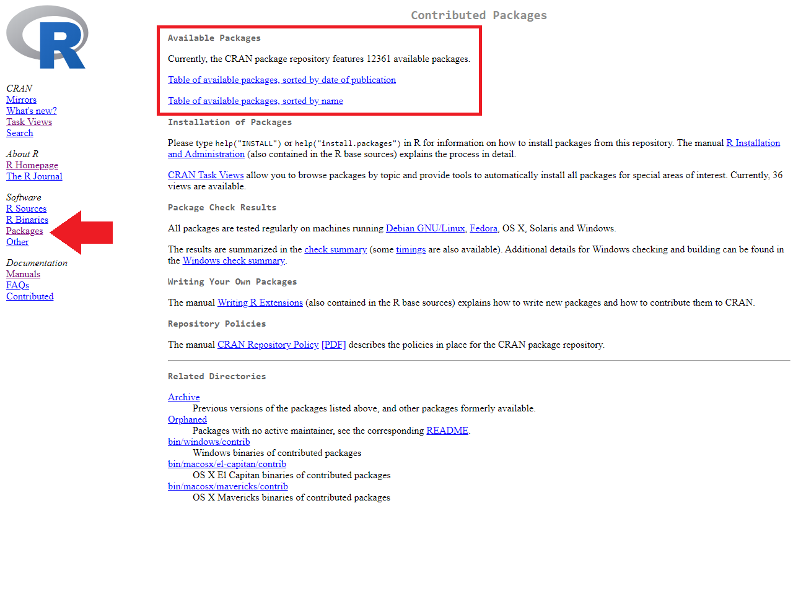
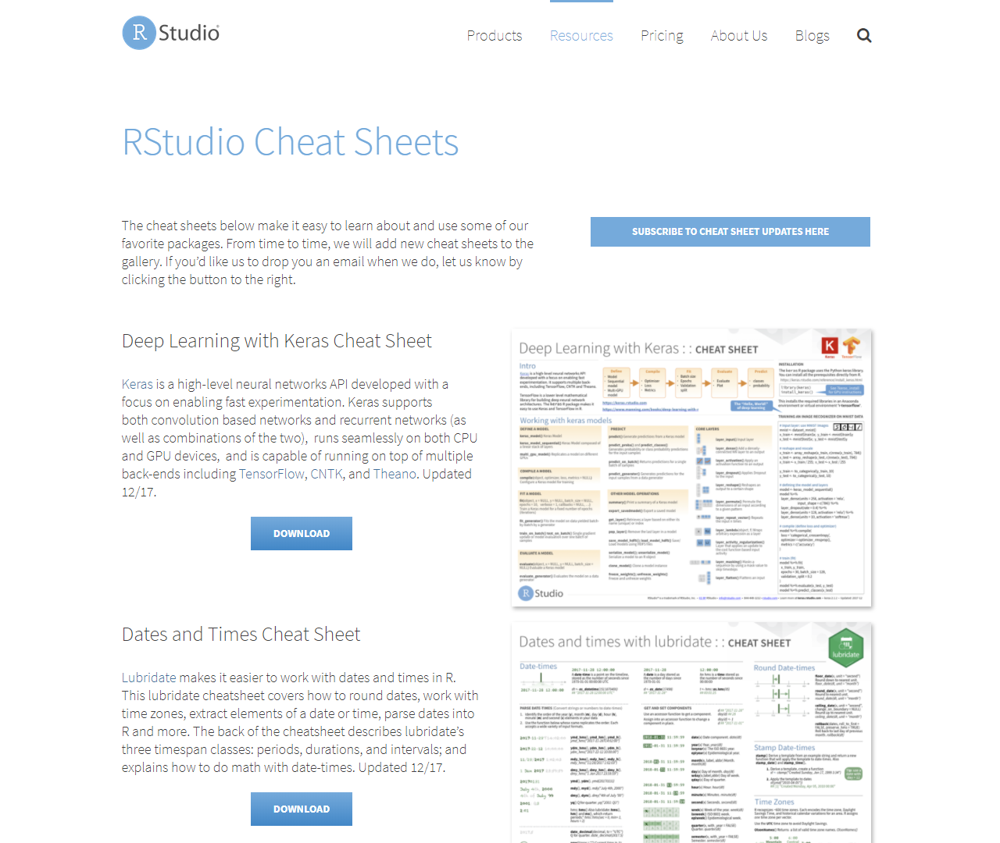
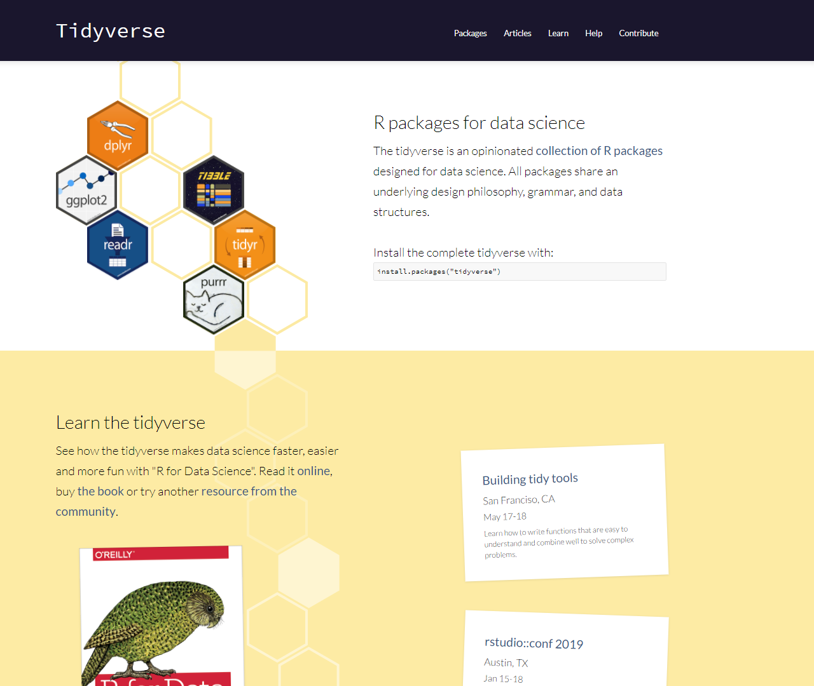
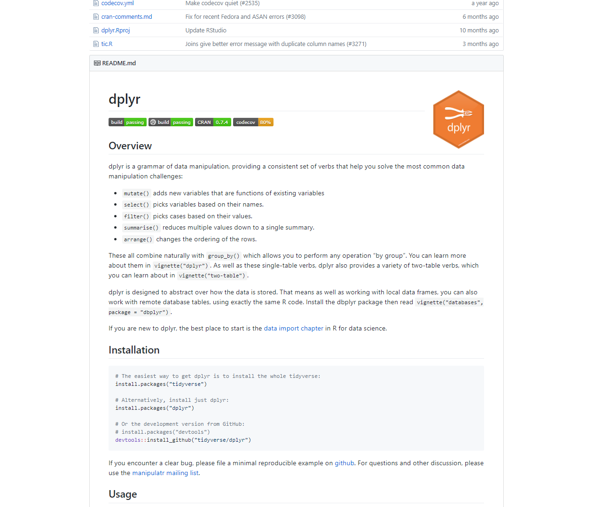

<!-- fontawesome CDN -->
<link href="https://maxcdn.bootstrapcdn.com/font-awesome/4.7.0/css/font-awesome.min.css" rel="stylesheet">

<!-- logo -->
<div class="logo">
  <a href="http://www.icjia.state.il.us/"></img></a>
</div>


```{r setup, include=FALSE}
library(knitr)
opts_chunk$set(echo = TRUE)
```

This page contains the notes for **the second part of R Workshop Module 6: "To Infinity and Beyond"**, which is part of the R Workshop series prepared by ICJIA Research Analyst [Bobae Kang](http://www.icjia.state.il.us/biographies/bobae-kang) to enable and encourage ICJIA researchers to take advantage of R, a statistical programming language that is one of the most powerful modern research tools.

### Links
Click [**here**](../index.html) to go to the workshop **home page**.

Click [**here**](../modules.html) to go to the workshop **Modules page**.

Click [**here**](../slides/module6_slides2.html){target="_blank"} to view the accompanying **slides for Module 6, Part 2**.

Navigate to the other workshop materials:

<button class="btn" data-toggle="collapse" data-target="#collapse-navigate" aria-expanded="false" aria-controls="collapse-navigate">**SEE MORE**</button>

<div class="collapse mt-1" id="collapse-navigate">
<div style="padding:20px;">

* **Module 1: Introduction to R** ([**slides**](../slides/module1_slides.html),
[**note**](module1_notes.html))
* **Module 2: R basics**
    * Part 1 ([**slides**](../slides/module2_slides1.html), [**note**](module2_notes1.html))
    * Part 2 ([**slides**](../slides/module2_slides2.html), [**note**](module2_notes2.html))
* **Module 3: Data analysis with R**
    * Part 1 ([**slides**](../slides/module3_slides1.html), [**note**](module3_notes1.html))
    * Part 2 ([**slides**](../slides/module3_slides2.html), [**note**](module3_notes2.html))
* **Module 4: Data visualization with R**
    * Part 1 ([**slides**](../slides/module4_slides1.html), [**note**](module4_notes1.html))
    * Part 2 ([**slides**](../slides/module4_slides2.html), [**note**](module4_notes2.html))
* **Module 5: Statistical modeling with R**
    * Part 1 ([**slides**](../slides/module5_slides1.html), [**note**](module5_notes1.html))
    * Part 2 ([**slides**](../slides/module5_slides2.html), [**note**](module5_notes2.html))
* **Module 6: "To Infinity and Beyond"**
    * Part 1 ([**slides**](../slides/module6_slides1.html), [**note**](module6_notes1.html))

</div>
</div>


***


# "To Infinity and Beyond" (2): Leveraging online resources
In this final part, we will explore options for getting help and find resource materials to get answers to our questions. R users are blessed with a wealth of information that is freely available online from a variety of sources. Knowing where to look when in need of help, we are truly ready to solve any problems using R. 

***


# Why online resources?
One of the key reasons we must know how to leverage online resources is simply that we cannot know everything.

In fact, no one knows everything! Many advanced R programmers still rely on the Internet partly because the ecosystem keeps evolving and partly because they, too, are only humans with plastic memories.

For us emerging R programmers, one of the greatest benefit of knowing where to look online comes from the fact that "Someone has already done it." Questions we ask are often not so unique. Even when we are asking truly unique questions, there are many others who worked on similar questions or questions that address some part of ours. And, as R community is very active online, we are likley to find some information on what others have done on the Internet!


```{r echo=FALSE, out.width="80%", out.extra='style="display: block; margin: auto; box-shadow: none;"'}
include_graphics("http://www.azquotes.com/picture-quotes/quote-the-very-best-proof-that-something-can-be-done-is-that-someone-has-already-done-it-bertrand-russell-146-34-03.jpg")
```
<p style="font-size:0.5em; text-align:center; color: #777;">
Source: <a href="http://www.azquotes.com/quote/1463403" target="_blank">AZ Quotes</a>
</p>


***


# Before going online
```{r echo=FALSE, out.width="30%", out.extra='style="display: block; margin: auto; box-shadow: none;"'}
include_graphics("../images/wireless_icon.png")
```
<p style="font-size:0.5em; text-align:center; color: #777;">
Source: <a href="https://commons.wikimedia.org/wiki/File:Wireless-icon.svg" target="_blank">Wikimedia Commons</a>
</p>


## "The 15 minute rule"
But, wait. Before going online, you should first try to solve the problem on your own. If you cannot solve it after "15 mintues," *then* go online looking for advices.

<blockquote class="twitter-tweet" data-lang="en"><p lang="en" dir="ltr">15 min rule: when stuck, you HAVE to try on your own for 15 min; after 15 min, you HAVE to ask for help.- Brain AMA <a href="https://t.co/MS7FnjXoGH">pic.twitter.com/MS7FnjXoGH</a></p>&mdash; Rachel Thomas (@math_rachel) <a href="https://twitter.com/math_rachel/status/764931533383749632?ref_src=twsrc%5Etfw">August 14, 2016</a></blockquote>
<script async src="https://platform.twitter.com/widgets.js" charset="utf-8"></script>

Even though you shouldn't be reinventing the wheel all the time, "first trying it yourself" will help you to become an indepedent thinker/programmer. In the long run, this will prove to be a critical skill you need to adapt to the changing R ecosystem.


## "Oops, my bad"
When faced with some error, remember that we all make typos. Always. So we should check for typos!

Unfortunately, RStudio does not check for typos in our code automatically. However, we can refer to an error caused by the typos to figure out what went wrong.

Also, check if a package is loaded before using its functions. A common error message we might see would be the following:

```
Error in some_function() : could not find function "some_function"
```

Make sure the intended package is imported or the function is defined before using it.

## Help function
```{r eval=FALSE}
# these are equivalent
?some_function
help(some_function)
```
Looking ino the documentation is often the best way to understand what a function is and how to use it. We can bring out the documentation if available using the `?` followed by the function name or `help()`.


## Error messages and debugging
When an error is thrown, it comes with an error message. Error messages often have rich information about what went wrong and where it went wrong.

If we are working with custom functions we defined, RStudio's debugging tools can help us to spot the source of an error in the script and debug it. See [this article](https://support.rstudio.com/hc/en-us/articles/200713843){target="_blank"} on debugging with RStudio. Also, see [this video](https://vimeo.com/99375765){target="_blank"} by RStudio on introduction to debugging.


# Google
```{r echo=FALSE, out.width="35%", out.extra='style="display: block; margin: auto; box-shadow: none;"'}

```
<p style="font-size:0.5em; text-align:center; color: #777;">
Source: <a href="https://www.google.com/about/products/" target="_blank">Google.com</a>
</p>


## How to google for questions
"Googling" is a great technique to find answers to our own questions. Here are some tips to effectively take advantage of Google.

1. Be succinct and specific. The search term should be a set of keywords. Here, package names and/or function names often make good keywords. Also, using the relevant error message as a serach term can help.
2. Look at questions/answers on platforms like Stack Overflow and Quora
3. Refer to "official" resources if available. From your search results, first try the links to CRAN, RStudio, package GitHub repository, and other "official" resource mateirals.


***


# "Official" resources
```{r echo=FALSE, out.width="35%", out.extra='style="display: block; margin: auto; box-shadow: none;"'}
include_graphics("../images/Rlogo.png")
```
<p style="font-size:0.5em; text-align:center; color: #777;">
Source: <a href="https://www.r-project.org/logo/" target="_blank">R Project</a>
</p>

"Official" resources are those provided by authortative entities, such as CRAN, RStudio, and package authors/maintainers. Though we can get to such "official" resources via Google search. knowing how to find them directly can facilitate our search for answers.


## CRAN website
The Comprehensive R Archive Network (CRAN) has many resources for R and R packages, including the following:

* Manuals
* Task Views
* Package pages

### Manuals
CRAN offers the following "manuals":

* ["An Introduction to R"](https://cran.r-project.org/doc/manuals/R-intro.html){target="_blank"}
* ["R Data Import/Export"](https://cran.r-project.org/doc/manuals/R-data.html){target="_blank"}
* ["R Installation and Administration"](https://cran.r-project.org/doc/manuals/R-admin.html){target="_blank"}
* ["Writing R Extensions"](https://cran.r-project.org/doc/manuals/R-exts.html){target="_blank"}
* ["The R language definition"](https://cran.r-project.org/doc/manuals/R-lang.html){target="_blank"} (draft)
* ["R Internals"](https://cran.r-project.org/doc/manuals/R-ints.html){target="_blank"}

Manuals page can be found under "Documentation" on the menu located on the left side of the CRAN website. Each manual can be viewed as an HTML page or downloaded as PDF or EPUB file.

```{r echo=FALSE, out.width="100%"}
include_graphics("../images/cran_manuals_page.png")
```

### Task Views
A Task View offers a brief introduction to a particular topic and an annotated list of relevant R packages.

CRAN has tasks views on a selection of topics, including:

* [Machine learning & Statistical Learning](https://cran.r-project.org/web/views/MachineLearning.html){target="_blank"}
* [Multivariate Statistics](https://cran.r-project.org/web/views/Multivariate.html){target="_blank"}
* [Official Statistics & Survey Methodology](https://cran.r-project.org/web/views/OfficialStatistics.html){target="_blank"}
* [Statistics for the Social Sciences](https://cran.r-project.org/web/views/SocialSciences.html){target="_blank"}
* [Survival Analysis](https://cran.r-project.org/web/views/Survival.html){target="_blank"}
* [Time Series Analysis ](https://cran.r-project.org/web/views/TimeSeries.html){target="_blank"}

CRAN Task Views page can be found under "CRAN" on the menu located on the left side of the CRAN website.

```{r echo=FALSE, out.width="100%"}
include_graphics("../images/cran_taskviews_page.png")
```


### Package pages
Each contributed package that is listed on CRAN has a page on the CRAN website. Here we can find a reference manual and vignettes for the package.

To directly get to the package page, try on your broswer:

* "https://cran.project.org/package=[package-name]"

with replacing [package-name] with any existing package name.

Alternatively, we can search for a particular package on the CRAN website user interface. Packages page can be found under "Software" on the menu located on the left side of the CRAN website.

```{r echo=FALSE, out.width="100%"}

```

#### CRAN package page example (`dplyr`)
Here is an example page for `dplyr` package. It offers detailed information about the current version available on CRAN as well as links to its reference manual and vignettes (in the red box).

```{r echo=FALSE, out.width="100%"}
include_graphics("../images/cran_package_page.png")
```

### Pacakge reference manuals
R packages have reference manuals that contain documentation for all its contents, i.e. functions and datasets. Basically, it is a collection of `help()` documentations in a pdf format.

Reference manual can also be found by googling. Just try "package-name pdf" as your Google search term.

### Pacakge vignettes
Packages often have vignettes to introduce its contents. Some vignettes can be accessed via `vignette("package")` on R console. Other vignettes are found on the pacakge page on CRAN.

Unfortunately, not all packages have vignettes, so don't be suprised when you cannot find vignettes for certain packages.


## RStudio website
RStudio's [website](https://www.rstudio.com/){target="_blank"} offer many useful resources under "Resources" menu, including the following:

* [Cheet sheets page](https://www.rstudio.com/resources/cheatsheets/){target="_blank"} has download links to over 30 "cheat sheets" on R and R packages in the PDF format.
* [Webinar & videos page](https://www.rstudio.com/resources/webinars/){target="_blank"}

<a href="https://www.rstudio.com/" target="_blank">
```{r echo=FALSE, out.width="100%"}
include_graphics("../images/rstudio_page.png")
```
</a>

### Cheet sheets
Currently, 13 RStudio cheat sheets are available, including:

* "Data Transformation with dplyr"
* "Data Import"
* "Data Visualization with ggplot2"
* "Date and times with lubridate"
* "Work with strings with stringr"

There are about 15 user-made cheat sheats as well. 

Some RStudio cheat sheats can also be found in RStudio IDE menu at "Help > Cheatsheets".

The image below shows the Cheet Sheets page on RStudio website under "Resources" menu.
<a href="https://www.rstudio.com/resources/cheatsheets/" target="_blank">
```{r echo=FALSE, out.width="100%"}

```
</a>

<br>
And the following is the example cheat sheet for using `dplyr` to manipulate tabular datasets in R.
<a href="https://github.com/rstudio/cheatsheets/blob/master/data-transformation.pdf" target="_blank">
```{r echo=FALSE, out.width="100%"}
include_graphics("../images/rstudio_cheatsheet_example.png")
```
</a>


### Webinar & videos
RStudio's webinars and videos offer materials covering a variety of subjects. Some materials are organized by topics, including:

* "RStudio Essentials"
* "Shiny Essentials" and "Advanced Shiny"
    * Some videos here are also available via Shiny website
* "The Essentials of Data Science"
* "Advanced Data Science"

Materials from RStudio's annual conference, `rstudio::conf`, are also made available.

<a href="https://www.rstudio.com/resources/webinars/" target="_blank">
```{r echo=FALSE, out.width="100%"}
include_graphics("../images/rstudio_webinars_videos.png")
```
</a>


## Tidyverse website
Tidyverse has its own [website](https://www.tidyverse.org/){target="_blank"} to introduce tidyverse packages, share updates and news on tidyverse, and offer guides to training matarials.

<a href="https://www.tidyverse.org/" target="_blank">
```{r echo=FALSE, out.width="100%"}

```
</a>

There are also child websites for many of tidyverse packages with standardized URL: "[package-name].tidyverse.org".

### Tidyverse child websites
The following table lists tidyverse's child websites for some of its packages: 
```{r echo=FALSE}
kable(
  tibble::tribble(
    ~Pacakge, ~Description, ~URL,
    "`ggplot2`", "For data visualization", "http://ggplot2.tidyverse.org/",
    "`dplyr`", "For data manpulation", "http://dplyr.tidyverse.org/",
    "`tidyr`", "For tidying up data", "http://tidyr.tidyverse.org/",
    "`readr`", "For data implort/export", "http://readr.tidyverse.org/",
    "`purrr`", "For better loops", "http://purrr.tidyverse.org/",
    "`tibble`", "For extending `data.frame`", "http://tibble.tidyverse.org/",
    "`stringr`", "For working with strings", "http://stringr.tidyverse.org/",
    "`forcats`", "For working with factors", "http://forcats.tidyverse.org/",
    "`readxl`", "For importing Excel files", "http://readxl.tidyverse.org/",
    "`haven`", "For SPSS, SAS, and Stata data", "http://haven.tidyverse.org/",
    "`lubridate`", "For working with datetimes", "http://lubridate.tidyverse.org/",
    "`magrittr`", "For specialized pipe oprators", "http://magrittr.tidyverse.org/"
  )
)
```


## R Markdown website
RStudio has a separate [website](https://rmarkdown.rstudio.com/){target="_blank"} focused on all things R Markdown.

The R Markdown website has useful resources such as its [Articles page](https://rmarkdown.rstudio.com/articles.html){target="_blank"} that offers a number of tutorials on creating various sorts of R Markdown documents and the [Formats page](https://rmarkdown.rstudio.com/formats.html){target="_blank"} that provides links to reference matarials on various R Markdown formats and templates.

<a href="https://rmarkdown.rstudio.com" target="_blank">
```{r echo=FALSE, out.width="100%"}
include_graphics("../images/rmarkdown_page.png")
```
</a>


## Shiny website
RStudio also has a separate [website](https://shiny.rstudio.com/){target="_blank"} on everything Shiny. Some of the useful resource materials can be found in the following pages:

First, its [Video & wrttien tutorial page](https://shiny.rstudio.com/tutorial/){target="_blank"} has links to tutorial videos and articles on Shiny as well as recorded conference presentations and webinars.

Second, the [Articles page](https://shiny.rstudio.com/articles/){target="_blank"} offers a list of web articles on building Shiny applications.

Finally, the [Reference page](https://shiny.rstudio.com/reference/shiny/){target="_blank"} contains links to upgrade notes and function references for lastest as well as previous versions of the Shiny package.

<a href="https://shiny.rstudio.com/" target="_blank">
```{r echo=FALSE, out.width="100%"}
include_graphics("../images/shiny_page.png")
```
</a>


## `htmlwidgets` website
*`htmlwidgets` for R* [website](http://www.htmlwidgets.org/){target="_blank"} presents brief descriptions and examples for various packages for incorporating interactive widgets into R ecosystem.

Currently, there are about 100 widgets registered as `htmlwidgets`. Visit its ["Gallery" page](http://gallery.htmlwidgets.org/){target="_blank"} to see what widgets are available.

Some popular `htmlwidgets` packagees include:

* `plotly` and `highcharter` for interactive visualizations
* `leaflet` for interactive maps
* `DT` for interactive data tables

<a href="http://www.htmlwidgets.org/" target="_blank">
```{r echo=FALSE, out.width="100%"}
include_graphics("../images/htmlwidgets_page.png")
```
</a>

<a href="http://gallery.htmlwidgets.org/" target="_blank">
```{r echo=FALSE, out.width="100%"}
include_graphics("../images/htmlwidgets_gallery.png")
```
</a>


***


# R Community
```{r echo=FALSE, out.width="70%", out.extra='style="display: block; margin: auto; box-shadow: none;"'}
include_graphics("../images/community_title.jpg")
```
<p style="font-size:0.5em; text-align:center; color: #777;">
Source: <a href="https://en.wikipedia.org/wiki/Community_(TV_series)" target="_blank">"Community (TV series)", Wikipedia</a>
</p>

One of the greatest strengths of R is its community that is highly active and diverse. Naturally, a lot of quality resource materials on the Internet come from the members of R community.


## R-bloggers
[*R-bloggers*](https://www.r-bloggers.com/){target="_blank"} is a blog that collects and features articles and blog posts on R and programming in R from a variety of sources.

The blog offers an excellent way to stay up-to-date on new packages and developments in the R community. Its posts cover new updates in R and major R packages, tutorials, information on upcoming events and conferences, and much more.

<a href="https://www.r-bloggers.com/" target="_blank">
```{r echo=FALSE, out.width="100%"}
include_graphics("../images/rbloggers_page.png")
```
</a>


## Online "books"

There are many "books" written by R community members that are freely available online. Some excellent online books are as follows:

* Healy, K. (2018). [*Data Visualization: A practical introduction*](http://socviz.co/index.html){target="_blank"}.
* Grolemund, G. and Wickham, H. (2017). [*R for Data Science*](http://r4ds.had.co.nz/){target="_blank"}.
* Lovelace, R. et al. (2018). [*Geocomputation in R*](https://bookdown.org/robinlovelace/geocompr/){target="_blank"}.
* Wickham, H. (2017). [*Advanced R*](http://adv-r.had.co.nz/){target="_blank"}.
* Wilke, C. (n.d.). [*Fundamentals of Data Visualization*](http://serialmentor.com/dataviz/){target="_blank"}.

Also, visit the `bookdown` package [website](https://bookdown.org/){target="_blank"} to find many more free online books on R!

### *R for Data Science*
```{r echo=FALSE, out.width="35%"}
include_graphics("../images/r4ds_cover.png")
```
<p style="font-size:0.5em; text-align:center; color: #777;">
Source: <a href="http://r4ds.had.co.nz/" target="_blank">R for Data Science</a>
</p>

I especially recommend *R for Data Science* by Hadley Wickham and Garrett Grolemund as your first R book. Much of this workshop is inspired by this book. It is written for beginners and covers key concepts and applications of R programming for data analysis.


## Helpful websites

There are many excellent websites providing tutorials and learning materials on R and data analysis with R. The following are some of my personal favorites:

* Kabacoff, R. [*Quick-R*](https://www.statmethods.net/index.html){target="_blank"}.
* Prahbhakaran, S. [*r-statistics.co*](http://r-statistics.co/){target="_blank"}.
* U of Cincinnati. [*UC Business Analytics R Programming Guide*](http://uc-r.github.io/){target="_blank"}.
* Wollschlaeger, D. [*R Examples Repository*](http://dwoll.de/rexrepos/index.html){target="_blank"}.
* Yau, C. [*R Tutorial*](http://www.r-tutor.com/){target="_blank"}.

And, of course, take advantage of this workshop's [website](bobaekang.github.io/icjia-r-workshop){target="_blank"}! :)


***


# GitHub repositories
```{r echo=FALSE, out.width="40%", out.extra='style="display: block; margin: auto; box-shadow: none;"'}
include_graphics("../images/octacat_github.png")
```
<p style="font-size:0.5em; text-align:center; color: #777;">
Source: <a href="https://github.com/logos" target="_blank">GitHub</a>
</p>


## What is GitHub?
> "GitHub is a development platform inspired by the way you work. From open source to business, you can host and review code, manage projects, and build software alongside millions of other developers." - GitHub.com

Most R packages are available as GitHub repositories, which can be "cloned" and downloaded if wanted. Here we can view the source code that shows what the package functions are doing under the hood to get restults they promise. Not only can we understand better what the functions are doing, we can also use the source code as an inspiration for writing our own functions or even packages.

Also, many R package authors offer brief explanations and even quick tutorials for their packages on the GitHub repositories.

### Github repository example (`dplyr`)
Here is a screenshot of `dplyr` GitHub repository:

```{r echo=FALSE, out.width="100%"}
include_graphics("../images/github_repo1.png")

```


***


# Online courses
```{r echo=FALSE, out.width="40%", out.extra='style="display: block; margin: auto; box-shadow: none;"'}
include_graphics("../images/mooc.png")
```
<p style="font-size:0.5em; text-align:center; color: #777;">
Source: <a href="http://worldview.stanford.edu/blog/edtech-2013" target="_blank">worldview.stanford.edu</a>
</p>

If you are a kind of person who learns best from taking courses on the subject matter, you can take advantage of online courses on R.


## Popular sites
Some popular online learning websites with courses on R are as follows:

* [DataCamp](https://www.datacamp.com/){target="_blank"}
* [Coursera](https://www.coursera.org/){target="_blank"}
* [edX](https://www.edx.org/){target="_blank"}


## DataCamp
DataCamp is one of the best websites out there for learning R. It appears that many programmers and package authors at RStudio have courses on DataCamp. This means that you can learn about certain packages directly from the authors!

DataCamp requires registration and log-in to take the courses. There are some free courses available, but most are paid courses with one free chapter. Cost is $25/month with the annual plan or \$29/month. Onces you are subscribed, all courses are made available.

DataCamp offers 70+ courses on R. In general, a course is short (~4 hours) and focused on a specific topic. DataCamp's R courses cover materials that range from basic to intermediate level.


## Coursera
Coursera is a MOOC (massive open online courses) site works with universities and offers learning materials that feel like a college course on a variety of subjects. Coursera has courses, specializations and online degrees. You can find out more about differences between these options [here](https://about.coursera.org/){target="_blank"}.

Coursera requires registration and log-in. Once you are logged in, you can "audit" any course for free. For a small fee (\$29 to \$99), you can get course Certificate and online support.

Some notable contents on Coursera include:

* Data Science Specialization (10 courses)
* Statistics with R Specialization (5 courses)


## edX
edX is another MOOC site that offers university-level courses, which are generally free and self-paced. Like Coursera, edX courses are usually organized in a college-course like format.

Taking courses on edX requires registration and log-in. edX offer [verified certificate](https://www.edx.org/verified-certificate){target="_blank"} for individual courses and [XSeries certificate](https://www.edx.org/xseries){target="_blank"} for XSeries programs for a small fee.

edX is perhaps better for learning basics on topics like:

* Computer science and programming
* Probability and statistics


***


# References
<ul>
  <li>Soltoff, B. (n.d.). <a href="http://cfss.uchicago.edu" target="_blank"><i>Computing for Social Sciences</i></a>.</li>
</ul>