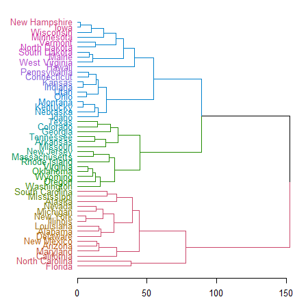
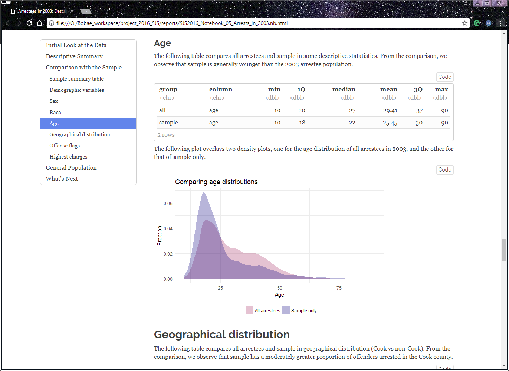

<!-- fontawesome CDN -->
<link href="https://maxcdn.bootstrapcdn.com/font-awesome/4.7.0/css/font-awesome.min.css" rel="stylesheet">

<!-- logo -->
<div class="logo">
  <a href="http://www.icjia.state.il.us/"></img></a>
</div>

```{r setup, include=FALSE}
library(knitr)
opts_chunk$set(echo = TRUE)
```

This page contains the script for **R Workshop R&A Meeting Presentation**, prepared by ICJIA Research Analyst [Bobae Kang](http://www.icjia.state.il.us/biographies/bobae-kang) for a Research and Analysis Unit monthly meeting on Feburary 13, 2018. The presentation is meant to announce and advertise the workshop series to the Unit as well as to provide a brief introduction to the workshop is about. The presentation slides are available [**here**](../slides/presentation_slides.html).


***

# Welcome_
```{r echo=FALSE, out.width="50%", out.extra='style="display: block; margin: auto; box-shadow: none;"'}

```

Welcome to this presentation. Today I would like to share with you a workshop series on R, which I have developed specifically to encourage and enable ICIJA researchers to incorporate R into their research and data analysis workflow.

This presentation can be roughly divided into two parts. For the first half, I will talk about what R is and offer a quick overview of its functionalities. Then, I will discuss the workshop objectives and structure.

## Quick survey
Before we move on, let us take a quick survey:

* How many of you have heard of R before?
* How many of you have tried R before?
* How many of you use R regularly?
    * Can you briefly tell us what you use R for?

# A brief intro to R
Now let me give you a very brief introduction to R.

## What is R?

> "R is a language and environment for statistical computing and graphics." - The R Foundation

So, R is a programming language that is specifically *built for* data analysis and visualization. It is also one of the the most popular choices of programming language among academic researchers and data scientists.

Let's dig a little further and talk about the benefits of using R in more details.

* First, R is open-source, which means free. This also means that, if you are interested, you can look at the source code and find out exactly what each function is doing under the hood. Also, not only R is free, but also its supporting softwares are free. No strings attached.

* R is built for statistical analysis, which means that it already comes with a breadth of functionalities for data analysis and statistics. This sets R apart from other programming languages in general.

* R allows researchers to conduct research in a reproducible and transparent fashion. A research done programmatically means every step taken for data manipulation and statistical modeling is in plain sight, making it easily to replicate the results or collaborate with others. This also gives researchers a jump-start when starting a new, but similar project.

* R can be greatly extended with powerful third-party packages. This, in fact, is one of the greatest blessings of using R that no proprietary sofewares, like SPSS, STATA, or SAS, can imitate. 

* With these packages, researchers can tackle a variety of tasks using a *single* platform, from collecting data to cleaning data to creating plots to fitting statistical models to generating a report, and even more.

## R is versatile

That said, one of the greatest benefits of using R is its versatility. Many who have not used R think that it is just another statistical software. That is not true at all. R is a programming language with a fast-growing ecosystem of diverse packages and applications, which enables its users to do wonders--literally.

For the next few minutes, I would like to quickly showcase what R is capable of.


***


# Data manipulation
First, let's see how some basic data manipulation and analysis can be done using R.

### Code 1
```{r echo=FALSE, message=FALSE}
library(icjiar)
library(dplyr)

ispcrime_tbl <- tibble::as.tibble(ispcrime)
regions_tbl <- tibble::as.tibble(regions)
```

```{r}
# peak at the first rows of the data
head(ispcrime_tbl)
```
Here, with a single command, we can take a quick peak at the data to get some basic understanding of the data table.

### Code 2
```{r}
# get a quick summary of violent crime and property crime
ispcrime_tbl %>%
  select(violentCrime, propertyCrime) %>%
  summary()
```
Now, if we want to get some quick summary of a selected set of columns, this can be done easily. You don't need to understand what each line of the code is doing at this point--we will go through them in the workshop.

### Code 3
```{r}
# filter to keep only counties starting with C for 2015
#   while creating and showing a new variable for total crime count
ispcrime_tbl %>%
  filter(substr(county, 1, 1) == "C", year == 2015) %>%
  mutate(totalCrime = violentCrime + propertyCrime) %>%
  select(year, county, totalCrime)
```
Here is an example of somewhat more complicated data manipulation task. Here we filter the data using two different columns and add a new computed variable. Then we take a look at a select set of columns. I think the syntax is intuitive enough to be informative even to non-R-users.

### Code 4
```{r}
# get annual average count of violent crime by county
ispcrime_tbl %>%
  group_by(county) %>%
  summarise(annualAvgCrime = sum(violentCrime, propertyCrime, na.rm = TRUE) / 5)
```
This is an example of aggregating data. Here, we "group" the data by the county column to get the average count of violent crime from 2011 to 2015. In the process, we can ignore the missing values, treating them as zero in effect. That choice might not make sense in this particular case, but being able to ignore missing value easily can come handy.  

### Code 5
```{r, message=FALSE}
# merging regions data and count the number of rows by region
ispcrime_tbl %>%
  left_join(regions) %>%
  group_by(region) %>%
  count()
```
Finally, let's take a look at an example of merging tables and aggregating. This code merges, or joins, the ISP crime table with regions table, which connects each county to the corresponding region. Then we aggregate and get a frequency table on the regional level.


***


# Data visualization
Now, let us take a look at some plots geenrated in R. R ecosystem provides great data visualization packages that we can benefit from, and with such tools we can create publication-ready plots with a few lines of code.

```{r echo=FALSE, message=FALSE, warning=FALSE}
library(ggplot2)
library(RColorBrewer)
library(tmap)

ispcrime$county <- recode(
  ispcrime$county,
  "De Kalb" = "DeKalb",
  "De Witt" = "DeWitt",
  "Du Page" = "DuPage",
  "La Salle" = "LaSalle",
  .default = levels(ispcrime$county)
)

ispcrime_tbl2 <- left_join(ispcrime_tbl, regions) %>% na.omit()
counties@data <- counties@data %>%
  left_join(
    ispcrime %>%
      filter(year == 2015) %>%
      select(name = county, violentCrime)
  )
```


### Plot 1
```{r fig.height = 4, fig.width=5}
# bar plot of violent crime mean count by region
ggplot(ispcrime_tbl2, aes(x = region, y = violentCrime, fill = region)) +
  stat_summary(geom = "bar", fun.y = "mean") +
  labs(title = "Violent crime count by region", x = "Region", y = "Count") +
  theme_classic()
```

This is a simple bar plot of violent crime average count by region, using `ggplot2` package. This is using the default color palette but it is also possible to customize colors, or, for that matter, almost any element of the plot.

### Plot 2
```{r fig.height = 4, fig.width=5}
# line plot of violent crime trend by region
ggplot(ispcrime_tbl2, aes(x = year, y = violentCrime, color = region)) +
  stat_summary(geom = "line", fun.y = "sum", size = 1) +
  labs(title = "Violent crime trend by region", x = "Year", y = "Count") +
  theme_minimal() +
  scale_color_brewer(palette = "Dark2")
```

This is a line plot of violent crime trend by region. One benefit of using programmatic tools for plotting lies in its reproducibility. If you need more plots like this, with small tweaks or with another data, you already have the template and there is no need to start from scratch. Also, notice that the color palatte and plot style has changed in this plot.

### Plot 3
```{r fig.height = 4, fig.width=5}
# histogram of violent crime count by county (excluding Cook)
ggplot(filter(ispcrime_tbl2, county != "Cook"), aes(x = violentCrime)) +
  geom_histogram(binwidth = 100) +
  facet_wrap(~ year) +
  labs(x = "Violent crime count", y = "Count") +
  theme_classic()
```

We can also easily create a series of plots by a variable for comparison, with one extra line of code. Admittedly, it is not the most aesthetic graph, but as we have seen, most elements are customaizable and with some extra effort the graph can look much nicer.

### Plot 4
```{r fig.height = 4, fig.width=5}
# choropleth map of violent crime in 2015
qtm(counties,
  fill = "violentCrime",
  format = "World",
  frame = FALSE)
```

Here is a simple example of generating a map in R with a different package. R is capable of dealing with spatial data in shapefiles format and can generate decent-looking maps. Again, with extra efforts, the map can look much nicer.


### Other examples 1: Word cloud
```{r echo=FALSE, out.width="50%"}
include_graphics("../images/dataviz_example1.png")
```
<div style="font-size:0.5em; margin-left:10px; color: #777;">
Source: <a href="http://www.r-graph-gallery.com/102-text-mining-and-wordcloud/">The R Graph Gallery</a>
</div>

Now I would like to share plots I found elsewhere, which show the great flexiability of R. This is a wordcloud plot generated using `wordcloud` package. Although we don't always need to generate a wordcloud plot, simply knowing that it is possible allows us to explore creative ways to visualize and extract insights from our data.

### Other examples 2: Parallel plot
```{r echo=FALSE, out.width="50%"}

```
<div style="font-size:0.5em; margin-left:10px; color: #777;">
Source: <a href="http://www.r-graph-gallery.com/93-parrallel-plot/">The R Graph Gallery</a>
</div>

Second external example is a parallel plot, using `MASS` pacakge, which has functions and datasets to support a book called "Modern Applied Statistics with S". This is actually reletively easy to make this kind of plot since `MASS` package provides a function for this called `parcoord()`.

### Other examples 3: Network graph
```{r echo=FALSE, out.width="50%"}
include_graphics("../images/dataviz_example3.png")
```
<div style="font-size:0.5em; margin-left:10px; color: #777;">
Source: <a href="https://cran.r-project.org/web/packages/ggCompNet/vignettes/examples-from-paper.html">The Comprehensive R Archive Network</a>
</div>

The last example is a work of network visualization using `ggnet2` package. This plot, once the data is ready, takes less than 10 lines of code to create. Again, these plots show just how versatile R can be.


***


# Statistical modeling
Now I will offer a simplified example of fitting statistical model to data.

### Linear model 1
```{r}
lm_fit <- lm(violentCrime ~ propertyCrime, ispcrime)
summary(lm_fit)
```
This is a result of fitting a simple linear regression model to the ISP crime data we have seen earlier. It takes a single line of code to fit a model and another line to print the result.

### Linear model 2
```{r echo=FALSE, message=FALSE, warning=FALSE}
library(modelr)
library(broom)
```

```{r}
# put model fit results in a data frame format
tidy(lm_fit)
```
It is also possible to put the model fit results into a tabular data object, which can be easily manipulated or visualized as needed.

### Linear model 3
```{r}
# get predictions and residuals for each data point
ispcrime %>%
  select(year, county, propertyCrime, violentCrime) %>%
  add_predictions(lm_fit) %>%
  add_residuals(lm_fit) %>%
  head()
```
Here we see that the predicted values and residuals can be readily added to the original table.


### Linear model 4
```{r fig.height = 4, fig.width=5}
# plot the model fit
plot(violentCrime ~ propertyCrime, ispcrime)
abline(lm_fit)
```
We can visualize the model fit with simple code.

### Linear model 5
```{r fig.height = 4, fig.width=5}
# show diagnostic plots
par(mfrow=c(2, 2))
plot(lm_fit)
```
And take a look at the diagnostic plots. This command generates a Residuals versus fitted values plot, a Q-Q plot, a scale-location plot, and a plot of residuals versus leverage plot with Cook's distance lines.

Of course, using thrid-party packages, it is also possible to generate a more aesthetically pleasing plots for model fits. 

### Generalized linear model
```{r eval=FALSE}
# examples of generalized linear models with glm()
logistic_reg <- glm(binary_y ~ x1 + x2, data = mydata, family = binomial())
poisson_reg <- glm(count_y ~ x1 + x2, data = mydata, family = poisson())
gamma_reg <- glm(y ~ x1 + x2, data = mydata, family = Gamma())
```
As a default, R offers generalized linear models as well, including logistic regression for binary response variable, poisson model for count data, and gamma regression to fit a wide range of shapes.

### Other advanced models
And, with extra packages, R can fit a variety of other advanced models. Here are some examples:

* time series models (e.g. `stats` and `forecast` packages)
* spatial regression models (e.g. `spdep` and `spgwr` packages)
* survival analysis (e.g. `survival` package)
* network analysis (e.g. `network` and `igraph` packages)
* text analysis (e.g. `tm` and `tidytext` packages)
* machine learning (e.g. `caret` and `mlr` packages)


***


# And more!
One of the great attractions of R is that a researcher can do much than just data work with R. It can serve a research platform that provides a smooth workflow, from collecting data to publishing the analysis in various formats.

## Reports
First of all, R offers its own markdown format, called RMarkdown, which can be used to generate documents in HTML, PDF and Microsoft Word formats. If the output is an HTML page, we can add some interactive elements using `htmlwidgets` and `shiny` packages. RMarkdown allows us not only to nice formatting of the document, but also to incorporate R code as well as its outputs into the document.

### Example - R Notebook
```{r echo=FALSE, out.width="66%", out.extra='style="display: block; margin: auto; box-shadow: none;"'}

```

This is actually from my own work. I use RNotebook, a variation of RMarkdown document that allows for more interactive workflow, to create quick reports to Chris for research projects. This one is me examining the original arrests in 2003 for the firearm study. As you see, the report can incorporate R code and its inputs, making each step in the process highly transparent.

## Slideshow
```{r echo=FALSE, out.width="66%", out.extra='style="display: block; margin: auto; box-shadow: none;"'}
include_graphics("../images/slideshow.png")
```

R also offers functionalities to create a good-looking slideshow. The slides for this very presentation are generated using what is called RPresentation.

## Dashboard
<a href="https://bobaekang.shinyapps.io/crime_data_profile_demo/">
```{r echo=FALSE, out.width="66%", out.extra='style="display: block; margin: auto; box-shadow: none;"'}
include_graphics("../images/dashboard_demo.png")
```
</a>

Using `shiny`, we can also create a web application that can serve as an interactive dashboard. In fact, let me take you to the dashboard for a minute. To be brutally honest, Tableau may offer a more user-friendly interface for creating a highly functional dashboard. However, it can also be done using R, and since R and Shiny are all open source, it costs nothing. In addition, if the dashboard requires complex computations or algorithms to do more than simply exploring an existing dataset, R may be better suited for such a project.

## Website
<a href="https://bobaekang.github.io/icjia-r-workshop/">
```{r echo=FALSE, out.width="66%", out.extra='style="display: block; margin: auto; box-shadow: none;"'}
include_graphics("../images/website.png")
```
</a>

Since we can generate HTML pages with R, it should be no surprise that we can create a website using R. In fact, I have created a website for this workshop series as well. The website will have all the workshop materials so that anyone can review or preview those materials at any time and place.


***


# Objectives
Now we are in the second part of this presentation where we can talk about the objectives and structure of this workshop series.

First, the objectives. This workshop series has **technical objectives** concerning developing practical skills and **fundamantal objectives** that are more about building the foundation for growing further.

## Technical objectives
On the techincal level, the workshop series seeks to equip ICJIA researchers with skills and knowledge to do the following tasks using R:

* Import and manipulate tabular data files;
* Create simple data visualizations to extract insight from data;
* Perform basic statistical analysis;
* Generate a report on a simple data analysis task

These skills should allow anyone to get started with R for easy- to intermediate-level data analysis and reseasrch tasks.

## Fundamental objectives
Now, on the more fundamantal level, I hope this workshop will help the participants to do the following:

* Understand the basic elements of the R programming language;
    * This, by the way, is a great introduction to programming in general since R shares with other programming languages some fundamental elements.
* Employ the programmatic approach to research and data analysis projects;
    * I will talk more about this in the first workshop session, but basically, I believe that the benefits of taking a programmtic approach to research outweighs the initial pain of learning and implementing it.
* Leverage online resources to find solutions to specific questions on using R for a given task.
    * This is a critical skill since, while we cannot learn answers to all questions, we can almost always find them out there. R ecosystem is still growing, but it has matured enough to provide most functionalities for common tasks. 

With such fundamentals, after going through the workshop series, a participant will be able to find right tools for the given task as well as ways to use them properly. This workshop is not pretending to teach its participants everything about R, but it will certainly teach them how to fish.


***


# Structure
Finally, let me give you an overview of how the workshop is structured.

## Overall setup
The workshop series consists of six sessions, or modules, each of which focusing on a specific topic. I will explain what the modules are about in a minute.

The workshop group can meet once a week for six weeks, each week working on one module. Each module has two parts, excpet, maybe, for the first module that serves as an introduction. All workshop materials, such as slides and notes, will be available on the webpage I showed earlier. Of course, I will be available, too, for answering questions if there are any. 

## Modules
Now let me quickly walk you thorugh the modules.

### 1. Introduction to R
Here, I will introduce the R language as well as the programmatic approach to research. I will make a case for the programmatic approach and using R to support that. I will also talk about installing R and RStudio.

### 2. R basics
Here, I will discuss the basic building blocks of R language. I will also introduce the popular tidyverse framework and offer some recommendations as to a "good" style for coding in R.

### 3. Data analysis in R
I believe this is one of the most helpful modules, focusing on manimuplating and transforming tabular data using R. We will learn how to import data into R environment and use common tidyverse syntax to clean and analyze data.

### 4. Data visualization in R
Here, we will get started with generating plots to visually present and communicate insights from data.

### 5. Statistical modeling in R
This module focuses on how to conduct basic statistical analysis with R.

### 6. Sharing your analysis and more
Here I will discuss various ways to share research and data analysis results via nice-looking reports, slideshows, dashboard and more.

***

# Questions?

That was the end of the presentation. Do you have any questions?

Thank you so much for paying attention to my presentation!