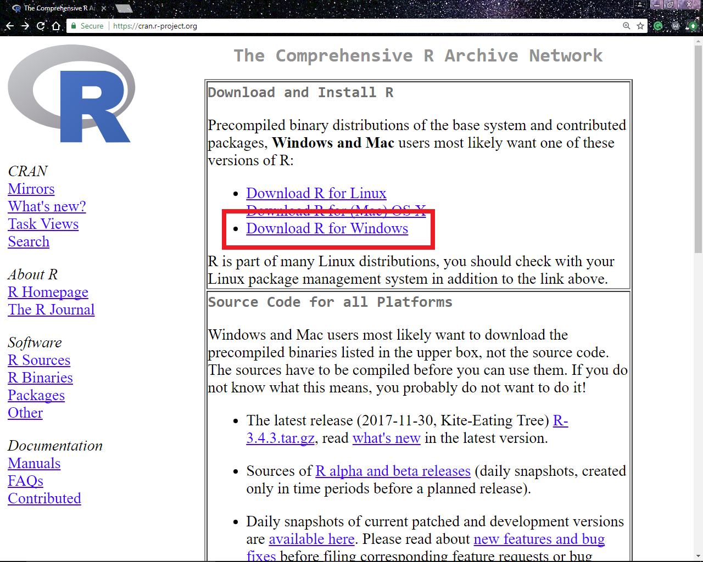
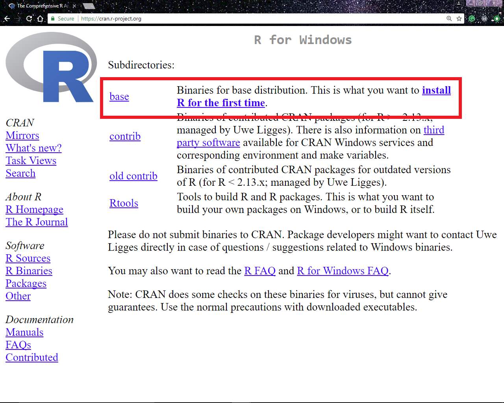
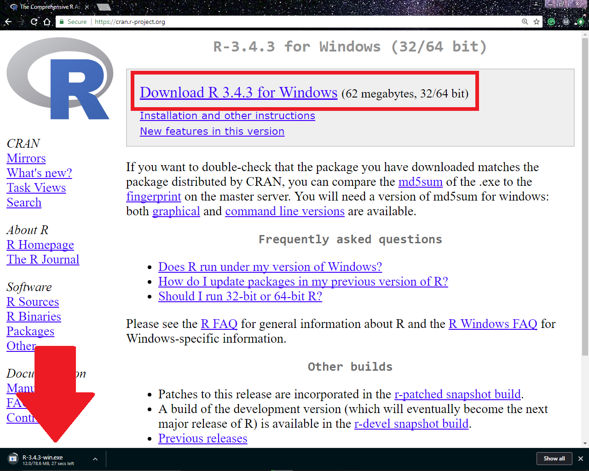
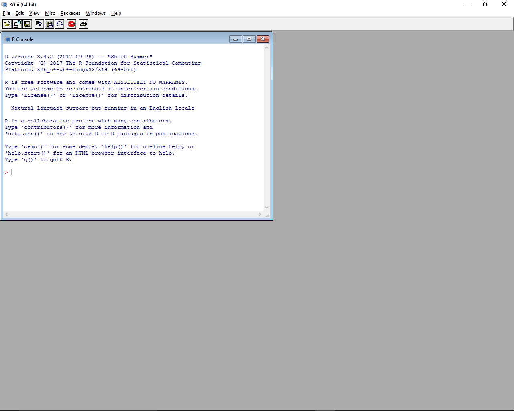
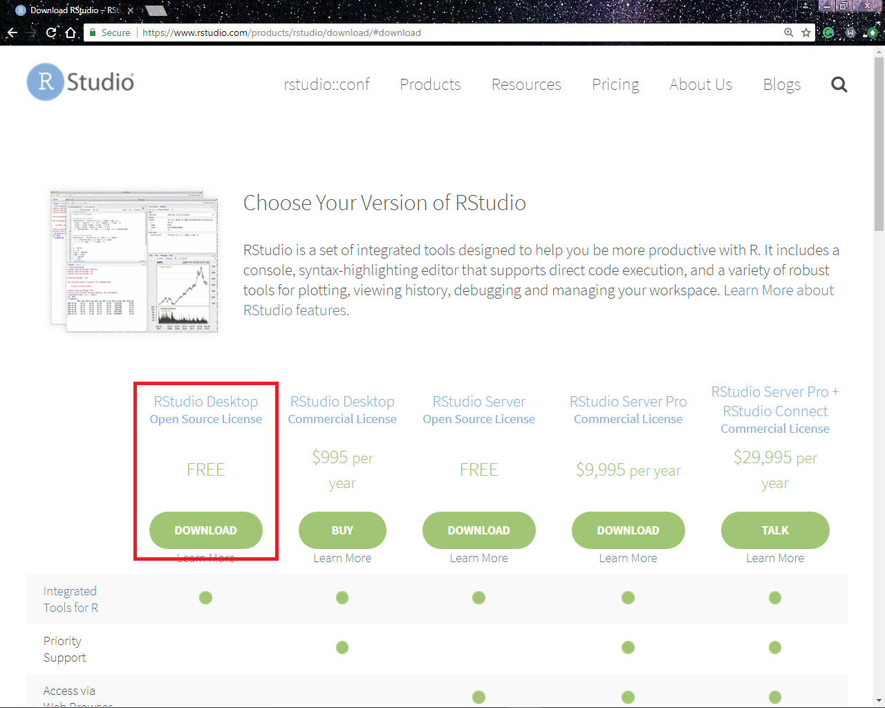
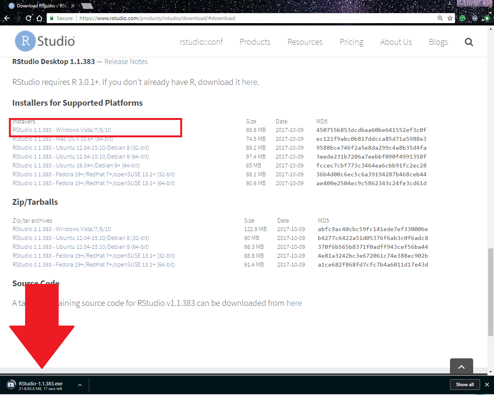
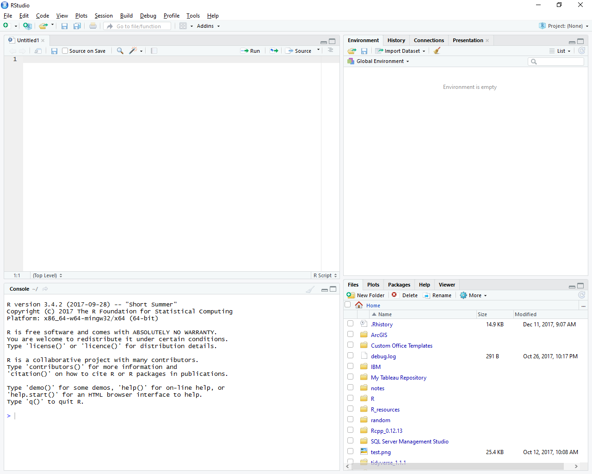

# template elements
<div class="header"></div>
<div class="footer"></div>
</img>
</img>


# presentation
R Workshop
========================================================
type: slide-body
css: ../css/style.css
<h3 style="color: #789">Module 1: Introduction to R</h3>  
2018-01-01  
Bobae Kang  
<small>(Bobae.Kang@illinois.gov)</small>  


Introducing ... R!
========================================================
type:section

```
[1] "Hellow World!"
```


<p style="font-size:0.5em; text-align: center; color: #777;">
Source: <a href="https://www.r-project.org/logo/">r-project.org</a>
</p>


What is R?
========================================================
> "R is a language and environment for statistical computing and graphics." - The R Foundation

* *Built for* data analysis and visualization
* One of the the most popular choices of programming language among academic researchers and data scientists


========================================================

<p style="font-size:0.5em; text-align: center; color: #777;">
Source: David Robinson, 2017, <a href="https://stackoverflow.blog/2017/10/10/impressive-growth-r/">"The Impresseive Growth of R"</a>
</p>


Why R?
========================================================

<p style="font-size:0.5em; text-align:center; color: #777;">
Source: <a href="https://www.flickr.com/">flickr.com</a>
</p>

========================================================
<p style="text-align:center">(Because ... DUH!)</p>

<p style="font-size:0.5em; text-align: center; color: #777;">
Source: <a href="https://www.reactiongifs.com/">Reaction GIFs</a>
</p>

And more reasons
========================================================
* Open source (free!)
* Built for statistical analysis
* Reproducible and transparent
* Extensible through powerful third-party libraries
* Enabling researchers to tackle a variety of tasks using a *single* platform


Comparisons
========================================================
type:section


R vs Excel
========================================================
* License cost
* Speed
* Scalability
* Complex and advanced analysis
* Visualization


R vs SPSS
========================================================
* License cost (again)
* Syntax
* Visualization
* Presentation


R vs Tableau
========================================================
* License cost (DUH!)
* Cleaning data
* Complex and advanced analysis


========================================================
type:section

<p style="font-size:0.5em; text-align: center; color: #777;">
Source: <a href="https://www.rstudio.com//">RStudio</a>
</p>


What is RStudio? Why use it?
========================================================
* Best Integrated Development Environment (IDE) for R
* Powerful and convenient features
* Interactive workflow
* Open source (again!)
* ... and many more!


========================================================

<p style="font-size:0.5em; text-align: center; color: #777;">
Source: <a href="https://www.wikimedia.org//">Wikimedia.org</a>
</p>


Basic Setup
========================================================
type:section

<p style="font-size:0.5em; text-align: center; color: #777;">
Source: <a href="https://www.wikimedia.org//">Wikimedia.org</a>
</p>


Installing R
========================================================
* Visit https://cran.r-project.org/
* Or simply google "download R" to find the link to download page.
* *Installation requires the Administrator account*; talk to DoIT!


========================================================



========================================================



========================================================



========================================================



Installing RStudio
========================================================
* Visit https://www.rstudio.com/products/rstudio/download/
* Or simply google "download Rstudio" to find the link to download page.
* Agin, *installation requires the Administrator account*; talk to DoIT!


========================================================



========================================================



========================================================



Workshop Overview
========================================================
type:section

<p style="font-size:0.5em; text-align: center; color: #777;">
Source: <a href="https://www.wikimedia.org//">Wikimedia.org</a>
</p>


Module 2
========================================================
<h2>R basics</h2>
* Fundamental building blocks of R programming.
* Libraries and packages
* `tidyverse` framework
* Recommended R style guide


Module 3
========================================================
<h2>Data manipulation</h2>
* Importing/exporting data
* Essential `dpylr` and `tidyr` commends
* Working with character strings
* Working with `Date` objects


Module 4
========================================================
<h2>Data visualization</h2>
* Base R plots
* `ggplot2` package
* Plotting maps
* Interactive plots


Module 5
========================================================
<h2>Statistical analysis</h2>


Module 6
========================================================
<h2>Presentations and beyond</h2>
* R Markdown and R Notebook
* R Presentation and `ioslides`
* Shiny applications
* ... and more!


Questions?
========================================================
type: section

<p style="font-size:0.5em; text-align:center; color: #777;">
Source: <a href="https://tenor.com/view/beyonce-question-gif-5966034">tenor.com</a>
</p>

