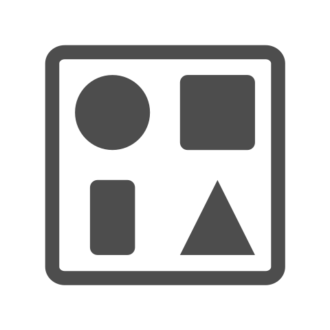
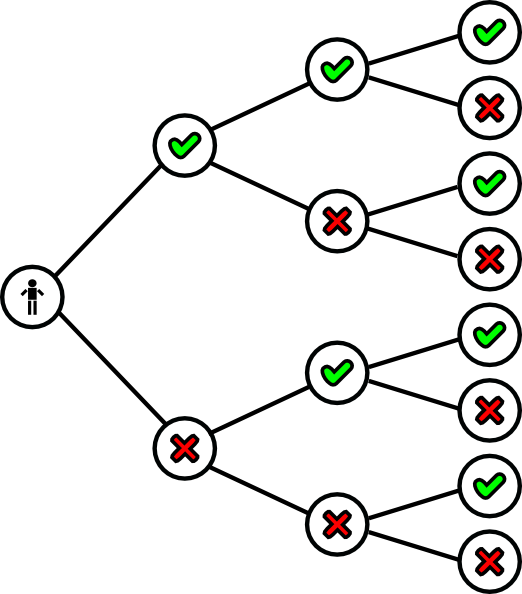
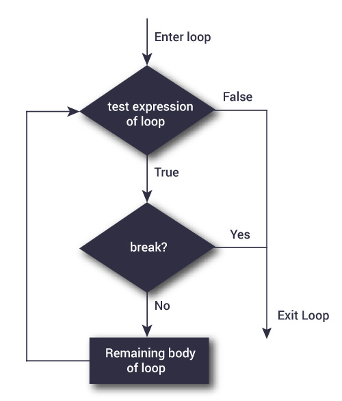
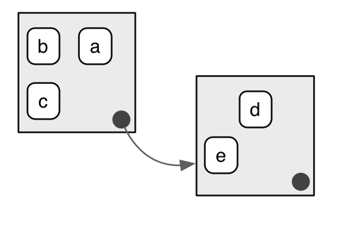

# template elements
<div class="header"></div>
<div class="footer"></div>
</img>
</img>
<div class="buttons">
<a href="../index.html">
  <button type="button">Home</button>
</a>
<a href="../modules.html">
  <button type="button">Modules</button>
</a>
<a href="../notes/module2_notes1.html">
  <button type="button">Notes</button>
</a>
</div>
<link href="https://fonts.googleapis.com/css?family=Oswald" rel="stylesheet">


# presentation
R Workshop
========================================================
type: slide-body
css: ../css/style_slides.css
<h3 style="color: #789">Module 2: R basics (1)</h3>  
2018-03-22  
Bobae Kang  
<small>(Bobae.Kang@illinois.gov)</small>  


Agenda
========================================================
<div style="text-align:center; margin-top:10%;">
<ul style="list-style: none">
<li style="color: #00061a; font-size: 1.1em; font-weight:700">
  Part 1: Fundamentals of R programming</li>
<li>
  Part 2: Gearing up for data analysis</li>
</div>


Fundamentals of R Programming
========================================================
type:section

```r
print("Hello World!")
```

```
[1] "Hello World!"
```
  

Key concepts
========================================================
* Obejcts
* Expressions
* Functions
* Environments


R Objects
========================================================
type: section

<p style="font-size:0.5em; text-align: center; color: #777;">
Source: <a href="https://commons.wikimedia.org/wiki/File:Antu_object-group-calligra.svg">Wikimedia Commons</a>
</p>


Key object types
========================================================
* Vectors (`c()`)
* Lists (`list()`)
* Factors (`factor()`)
* Data frame (`data.frame()`)


Basic ("atomic") vector types
========================================================
* `logical`: Boolean values of `TRUE` and `FALSE`
* `double`: floating-point numbers representing real numbers
* `integer`: integers
* `complex`: complex numbers
* `character`: string of alphanumeric letters


========================================================

```r
# this is a logical vector
logical_vector <- c(TRUE, FALSE, T, F)

is.logical(logical_vector)
```

```
[1] TRUE
```

```r
class(logical_vector)
```

```
[1] "logical"
```


========================================================

```r
# this is a double (numeric)  vector
double_vector <- c(1, 2, 3)

is.double(double_vector)
```

```
[1] TRUE
```

```r
class(double_vector)
```

```
[1] "numeric"
```

```r
# this is an integer (numeric) vector
integer_vector <- c(1L, 2L ,3L)

is.integer(integer_vector)
```

```
[1] TRUE
```

```r
class(integer_vector)
```

```
[1] "integer"
```


========================================================

```r
# this is a character vector
character_vector <- c("a", "b", "c")

is.character(character_vector)
```

```
[1] TRUE
```

```r
class(character_vector)
```

```
[1] "character"
```


========================================================

```r
# an object with a single element is also a vector!
x <- 1
y <- "Am I a vector?"

is.vector(x)
```

```
[1] TRUE
```

```r
is.vector(y)
```

```
[1] TRUE
```


Accessing vector elements
========================================================
* Use index with `[]` to access an element in a vector:


```r
fruits <- c("apple", "banana", "clementine")
first_fruit <- fruits[1]

print(first_fruit)
```

```
[1] "apple"
```

```r
second_fruit <- fruits[2]

print(second_fruit)
```

```
[1] "banana"
```


========================================================
* We can also assign a new value to the accessed vector element


```r
# giving a new value to an existing element
fruits[1] <- "apricot"

print(fruits)
```

```
[1] "apricot"    "banana"     "clementine"
```

* Or create a new element


```r
# creating a new element
fruits[4] <- "dried mango"

fruits
```

```
[1] "apricot"     "banana"      "clementine"  "dried mango"
```


========================================================
* Multiple elements can be accessed, using *a vector of indices*


```r
first_and_third_fruits <- fruits[c(1, 3)]

print(first_and_third_fruits)
```

```
[1] "apricot"    "clementine"
```

* Or using *the colon operator* for a sequence


```r
first_thru_third_fruits <- fruits[1:3]

print(first_thru_third_fruits)
```

```
[1] "apricot"    "banana"     "clementine"
```


========================================================
* Vector elements can be accessed *conditionally* as well


```r
my_vector <- c(1, 2, 3, 4, 5)

# print only elements less than 3 
print(my_vector[my_vector < 3])
```

```
[1] 1 2
```

```r
# assign 0 to such elements
my_vector[my_vector < 3] <- 0

print(my_vector)
```

```
[1] 0 0 3 4 5
```


Lists
========================================================
* An R list, created by `list()` function, can contain elements of different types

```r
my_list <- list("abc", 125, FALSE, c("Hello", "World"))

print(my_list)
```

```
[[1]]
[1] "abc"

[[2]]
[1] 125

[[3]]
[1] FALSE

[[4]]
[1] "Hello" "World"
```


Naming list elements
========================================================

```r
names(my_list) <- c("character", "numeric", "logical", "character vector")

my_list
```

```
$character
[1] "abc"

$numeric
[1] 125

$logical
[1] FALSE

$`character vector`
[1] "Hello" "World"
```


Accessing list elements
========================================================
* Elements in a list can be accessed using their indices or names

```r
# using index (this returns a list element, NOT the actual content)
my_list[4]
```

```
$`character vector`
[1] "Hello" "World"
```


```r
# using name (this returns the content itself)
my_list$`character vector`
```

```
[1] "Hello" "World"
```


========================================================
* In order to access the content of a list element using the index approach, we must use `[[]]` instead

```r
my_list[[1]]
```

```
[1] "abc"
```


```r
# the result is the same with accessing an element using name
identical(my_list[[1]], my_list$character)
```

```
[1] TRUE
```


```r
# in contrast:
identical(my_list[1], my_list$character)
```

```
[1] FALSE
```


Lists to vector
========================================================
* A list can be "unlisted", i.e., converted into a vector

```r
new_list <- list(1:5)
to_vector <- unlist(new_list)

# this is a list
print(new_list)
```

```
[[1]]
[1] 1 2 3 4 5
```

```r
# this is a vector
print(to_vector)
```

```
[1] 1 2 3 4 5
```


R Expressions
========================================================
type: section

<p style="font-size:0.5em; text-align: center; color: #777;">
Source: <a href="http://www.clker.com/clipart-16340.html">clker.com</a>
</p>


Expressions
========================================================
* Executable pieces of code
* Consisting of:
    * objects
    * operators
    * control structures
    * functions


Operators
========================================================
* Arithmetic operators
* Logical operators
* Relational operators
* Assignment operators
* Miscellaneous operators
* Others
    * User-defined operators
    * From third-party pacakges


Arithmetic operators
========================================================

|Operator    |Description      |Example                |
|:-----------|:----------------|:----------------------|
|`+`         |Addition         |`1 + 1`    (returns 2) |
|`-`         |Substraction     |`3 - 2`  (returns 1)   |
|`*`         |Multiplication   |`3 * 4`  (returns 12)  |
|`/`         |Division         |`5 / 2`  (returns 2.5) |
|`^` or `**` |Exponentiation   |`2**4`  (returns 16)   |
|`%%`        |Modulus          |`5 %% 2`  (returns 1)  |
|`%/%`       |Integer division |`5 %/% 2`  (returns 2) |


Logical operators
========================================================

|Operator     |Description                                       |Example                                                             |
|:------------|:-------------------------------------------------|:-------------------------------------------------------------------|
|`&`          |Element-wise logical AND                          |`c(TRUE, TRUE) & c(TRUE, FALSE)`<br>returns `TRUE` `FALSE`          |
|&#124;       |Element-wise logical OR                           |`c(TRUE, FALSE)` &#124; `c(FALSE, FALSE)`<br>returns `TRUE` `FALSE` |
|`!`          |Logical NOT                                       |`!c(TRUE, FALSE)`<br>returns `TRUE`                                 |
|`&&`         |Logical AND<br>(considers the first element only) |`c(TRUE, TRUE) && c(FALSE, TRUE)`<br>returns `FALSE`                |
|&#124;&#124; |Logical OR<br>(considers the first element only)  |`c(TRUE, TRUE)` &#124;&#124; `c(FALSE, TRUE)`<br>returns `TRUE`     |


Relational operators
========================================================

|Operator |Description              |Example                  |
|:--------|:------------------------|:------------------------|
|`>`      |Greater than             |`3 > 1` returns `TRUE`   |
|`<`      |Less than                |`3 < 1` returns `FALSE`  |
|`==`     |Equal to                 |`2 == 2` returns `TRUE`  |
|`>=`     |Greater than or equal to |`3 >= 4` returns `FALSE` |
|`<=`     |Less than or equal to    |`4 <= 4` returns `TRUE`  |
|`!=`     |Not equal to             |`2 != 3` returns `TRUE`  |


Assignment operators
========================================================

|Operator    |Description              |Example                                                                             |
|:-----------|:------------------------|:-----------------------------------------------------------------------------------|
|`<-` or `=` |Left assignment          |`a <- "Hello"` assigns `"Hello"` to the object `a`                                  |
|`->`        |Right assignment         |The use of `->` is mostly discouraged                                               |
|`<<-`       |Left scoping assignment  |Search for the variable in the parent<br>environments takes place before assignment |
|`->>`       |Right scoping assignment |Ditto                                                                               |


Miscellaneous operators
========================================================

|Operator |Description                          |Example                                                    |
|:--------|:------------------------------------|:----------------------------------------------------------|
|`:`      |Colon operator to generate sequences |`1:10` generates a vector of integer sequence from 1 to 10 |
|`?`      |Help function to see documentation   |`?some_function` is equivalent to `help(some_function)`    |
|`%in%`   |"In" operator                        |`1 %in% c(1,2,3)` returns `TRUE`                           |
|`%*%`    |Matrix multiplication                |                                                           |


Other operators
========================================================
* Operators can be defined by users
* Some third party packages offer custom operators
    * e.g. the "pipe" operator (`%>%`) from `magrittr` package (also available through `dplyr` pacakge)


Flow Control
========================================================
* Conditionals
* Loops


Conditionals
========================================================
* `if` statement
* Basic structure
    * if ( condition ) { expression }


```r
a <- TRUE

if (a) {
  print("Hello World!")
}
```

```
[1] "Hello World!"
```


Multiple conditions
========================================================
* `if`-`else` statement
* allows for multiple conditions


```r
a <- 1
b <- 2

if (a > b) {
  print("a is larger than b.")
} else if (a < b) {
  print("a is smaller than b.")
} else {
  print("a and b are equal!")
}
```

```
[1] "a is smaller than b."
```


ifelse function
========================================================

```r
ifelse(test_expression, true_value, false_value)
```
* Element-wise if-else condition
* Condition is tested for each and every element of a vector 
* Example:


```r
a <- c(1,2,3,4)
ifelse(a < 3, "Less than 3", "Not less than 3")
```

```
[1] "Less than 3"     "Less than 3"     "Not less than 3" "Not less than 3"
```


Loops
========================================================
* `while` loops


```r
while ( condition ) {
  expression
}
```

* `for` loops


```r
for (element in iterable_object) {
  expression
}
```


while loop
========================================================

<p style="font-size:0.5em; text-align: center; color: #777;">
Source: <a href="https://www.datamentor.io/r-programming/while-loop">DataMentor</a>
</p>

========================================================

```r
while (condition) {
  expression
}
```

* If the given `condition` is satisfied (i.e. evaluates as `TRUE`), then the following `expression` is executed.
* Onces the `expression` is executed, the `condition` is re-evaluated.
* The `expression` is repetitively executed as long as the `condition` is satisfied.
    * beware of infinite loop!


========================================================

```r
count <- 0

while (count < 5) {
  print(count)
  count = count + 1  # increase count by 1 at each iteration
}
```

```
[1] 0
[1] 1
[1] 2
[1] 3
[1] 4
```


for loop
========================================================

<p style="font-size:0.5em; text-align: center; color: #777;">
Source: <a href="https://www.datamentor.io/r-programming/for-loop">DataMentor</a>
</p>


========================================================

```r
for (element in iterable_object) {
  expression
}
```

* Requires an iterable object (e.g. vector or list).
* Iterates over all elements of the given object in order.
* At each step of iteration, can use the given element for the `expression` if appropriate.


========================================================

```r
fruits <- c("apple", "banana", "clementine")

# iterate over elements directly
for (fruit in fruits) {
  print(paste("I love ", fruit, "!", sep=""))
}
```

```
[1] "I love apple!"
[1] "I love banana!"
[1] "I love clementine!"
```


```r
flavors <- c("chocolate", "vanilla", "cookie dough")

# iterate over elements indirectly
for (i in 1:length(flavors)) {
  flavor <- flavors[i]
  print(paste("Do you want some", flavor, "ice cream?"))
}
```

```
[1] "Do you want some chocolate ice cream?"
[1] "Do you want some vanilla ice cream?"
[1] "Do you want some cookie dough ice cream?"
```


break statement
========================================================

<p style="font-size:0.5em; text-align: center; color: #777;">
Source: <a href="https://www.datamentor.io/r-programming/break-next">DataMentor</a>
</p>


========================================================

```r
# with for loop
for (element in iterable_object) {
  if (break_condition) {
    break
  }
  expression
}

# with while loop
while (loop_condition) {
  if (break_condition) {
    break
  }
  expression
}
```
* `break` can be used to "break out" of a loop based on a break condition


next statement
========================================================

<p style="font-size:0.5em; text-align: center; color: #777;">
Source: <a href="https://www.datamentor.io/r-programming/break-next">DataMentor</a>
</p>


========================================================

```r
# with for loop
for (element in iterable_object) {
  if (next_condition) {
    next
  }
  expression
}

# with while loop
while (loop_condition) {
  if (next_condition) {
    next
  }
  expression
}
```
* `next` can be used to skip a step in a loop based on a next condition


R Functions
========================================================
type: section

<p style="font-size:0.5em; text-align:center; color: #777;">
Source: <a href="https://www.wikimedia.org">Wikimedia Commons</a>
</p>


Functions
========================================================
* Functions are "call-able" objects
    * can be called or invoked by following `()`
    * can be manipulated in the same way as any other object
* Three elements of a function (or function closure)
    1. an argument list (a.k.a. parameters; optional)
    2. body
    3. function environment
    
    
Why use functions
========================================================
* Encapsulate repeated operations
    * Simplify code (clearner and more concise)
    * Avoid unintended bugs/errors
    * Enhance reproducibility


========================================================
**Define a function**

```r
my_function <- function(arg1, arg2) {
  
  # body exist in a local environment
  body expression1
  body expression2
  body expression3

}
```

**Call a function**

```r
my_function(arg1 = input1, arg2 = input2)
```


========================================================
**Examples**

```r
# a custom function for adding two numbers
add_nums <- function(num1, num2) {
  num1 + num2
}

add_output <- add_nums(3, 5) # assign the function output to a variable

print(add_output)
```

```
[1] 8
```


```r
# a custom function without arguments
print_hello_world <- function() {
  print("Hello world")
}

print_hello_world()
```

```
[1] "Hello world"
```


========================================================
**Function with a default argument value**

```r
add_nums_2 <- function(num1, num2 = 5) {
  num1 + num2
}

add_nums_2(3) # call a function using the default value for num2
```

```
[1] 8
```
* A function can be given default values to its arguments
* Default values can be something that are expected to be used most often when calling the function


R Environments
========================================================
type: section

<p style="font-size:0.5em; text-align: center; color: #777;">
Source: Hadley Wickham, 2017, <a href="http://adv-r.had.co.nz/Environments.html"><span style="font-style: italic">Advanced R</span></a>
</p>


Environments
========================================================
* Simply put, an environment is a place to store variables.
* All variables (as bindings of symbols and objects) exist in a specific environment.
    * More precisely, *objects* live in memory outside all environment;
    * It is the *symbols* and the *associations* of the symbols (variable names) and objects to which the symbols point/refer that an environment contains.
* Environments can have nested structure.


Nesting of environments
========================================================
* Variables in a parent environment are accessible in a child environment
* Variables in a child environment are *NOT* accessible in a parent environment


<p style="font-size:0.5em; text-align: center; color: #777;">
Source: Hadley Wickham, 2017, <a href="http://adv-r.had.co.nz/Environments.html"><span style="font-style: italic">Advanced R</span></a>
</p>


The global environment
========================================================
* The interactive workspace for the given R session.
* Its immediate parent is the environment of the package that is imported last.
* Can be accessed using `globalenv()`, which works like a named list

```r
some_variable <- 1 # a variable in the global environment
global_env <-globalenv() # the environment itself can be assigned to a variable

# the following two are identical 
identical(some_variable, global_env$some_variable)
```

```
[1] TRUE
```

Local environments
========================================================
* Local environments are created by
    * any function calls
    * `new.env()`
* Can be used to protect the global environment from arbitrarily created variables


Lexical scoping
========================================================
Searching for an object in R follows the lexical scoping rules.  
* First, R looks for the object in the current environment  
* If the object is not found in the current environment, R moves up to its parent environment.  
* The process is repeated until the object is found or the outermost environment (`emptyenv()`) is reached.


<p style="font-size:0.5em; text-align:center; color: #777;">
Source: Hadley Wickham, 2017, <a href="http://adv-r.had.co.nz/Environments.html"><span style="font-style: italic">Advanced R</span></a>
</p>


Questions?
========================================================
type: section

<p style="font-size:0.5em; text-align:center; color: #777;">
Source: <a href="https://tenor.com/view/mario-question-block-super-mario-gif-7732885">tenor.com</a>
</p>


========================================================
References
<ul style="font-size: 0.6em">
  <li>DataMentor. (n.d.). <a href="https://www.datamentor.io/r-programming/"><span style="font-style:italic">R Tutorials</span></a></li>
  <li>R Core Team. (2017). <a href="https://cran.r-project.org/doc/manuals/R-intro.html">"An Introduction to R"</a>.</li>
  <li>R Core Team. (2017). <a href="https://cran.r-project.org/doc/manuals/R-lang.html">"R Language Definition"</a>.</li>
  <li>Wickham, H. (2017). <a href="http://adv-r.had.co.nz/"><span style="font-style:italic"> Advanced R</span></a>.</li>
</ul>


========================================================
type: section

<p style="font-size:0.5em; text-align:center; color: #777;">
Source: <a href="https://www.wikimedia.org">Wikimedia Commons</a>
</p>
