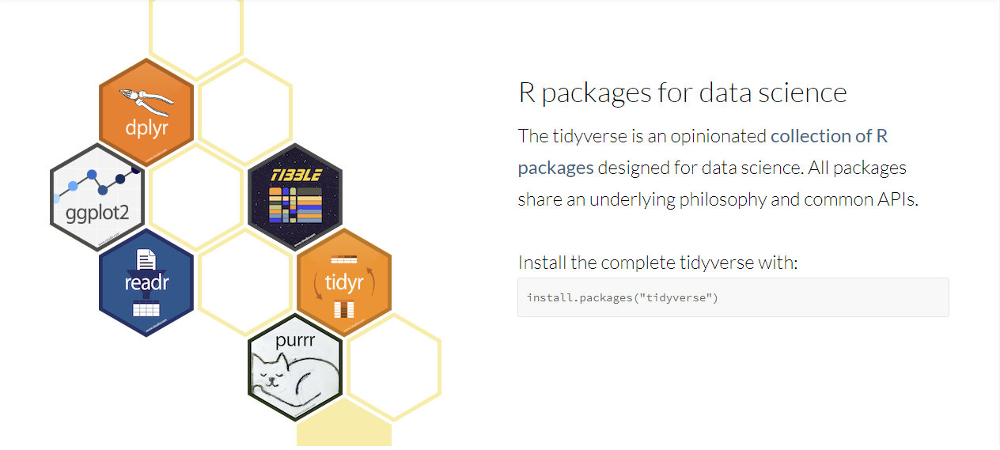

# template elements
<div class="header"></div>
<div class="footer"></div>
</img>
</img>
<div class="buttons">
<a href="../index.html">
  <button type="button">Home</button>
</a>
<a href="../modules.html">
  <button type="button">Modules</button>
</a>
<a href="../notes/module2_notes2.html">
  <button type="button">Notes</button>
</a>
</div>


# presentation
R Workshop
========================================================
type: slide-body
css: ../css/style_slides.css
<h3 style="color: #789">Module 2: R basics (2)</h3>  
2018-01-01  
Bobae Kang  
<small>(Bobae.Kang@illinois.gov)</small>  


Agenda
========================================================
<div style="text-align:center; margin-top:10%;">
  <p>Session 1: Fundamental building blocks of R programming</p>
  <p style="color: #00061a; font-size: 1.1em; font-weight:700">
    Session 2: Gearing up for data analysis in R</p>
</div>


Gearing Up for Data Analysis in R
========================================================
type:section

<div style="font-size:0.5em; text-align:center; color: #777;">
Source: <a href="https://www.wikimedia.org/">Wikimedia.org</a>
</div>

  
R Data Frame
========================================================
type: section

```
[1] "Look, a data frame!"
```

```
  column1 column2 column3 column4 column5
1      11      12      13      14      15
2      21      22      23      24      25
3      31      32      33      34      35
4      41      42      43      44      45
5      51      52      53      54      55
```


What is a data frame?
========================================================
* A tabular representation of data where each column is a vector of some type.
    * think of Excel spreadsheets, SPSS tables, etc.!
* Can be seen as a *list of vectors* of *the same length*, but with additional functionalities for data analysis!
    * accessing data in a data frame works similarly
    * a list can be easily converted into a data frame using `as.data.frame()` (... and vice versa, with `as.list()`)


Example: ISP crime data 
========================================================
I have created an R package `icjiar`, which comes with some sample datasets, including a data frame of ISP UCR data (`ispcrime`). Let's take a look:


```r
library(icjiar)

class(ispcrime)         # the class of ispcrime object is "data.frame"
```

```
[1] "data.frame"
```

```r
is.data.frame(ispcrime) # check if iris is a data.frame; TRUE, as expected
```

```
[1] TRUE
```


========================================================

```r
str(ispcrime) # reports the "structure" of the data frame 
```

```
'data.frame':	510 obs. of  12 variables:
 $ year         : int  2011 2011 2011 2011 2011 2011 2011 2011 2011 2011 ...
 $ county       : Factor w/ 102 levels "Adams","Alexander",..: 1 2 3 4 5 6 7 8 9 10 ...
 $ violentCrime : int  218 119 6 59 7 42 13 8 12 1210 ...
 $ murder       : int  0 0 1 0 0 0 0 0 0 5 ...
 $ rape         : int  37 14 0 24 1 4 0 1 1 127 ...
 $ robbery      : int  15 4 0 8 0 3 0 0 0 208 ...
 $ aggAssault   : int  166 101 5 27 6 35 13 7 11 870 ...
 $ propertyCrime: int  1555 290 211 733 38 505 56 206 119 5332 ...
 $ burglary     : int  272 92 58 152 14 90 14 38 41 1384 ...
 $ larcenyTft   : int  1241 183 147 563 22 405 41 165 71 3756 ...
 $ MVTft        : int  36 11 5 14 1 8 1 2 3 164 ...
 $ arson        : int  6 4 1 4 1 2 0 1 4 28 ...
```


========================================================

```r
head(ispcrime, 5) # returns the first n rows of the data frame (default 6)
```

```
  year    county violentCrime murder rape robbery aggAssault propertyCrime
1 2011     Adams          218      0   37      15        166          1555
2 2011 Alexander          119      0   14       4        101           290
3 2011      Bond            6      1    0       0          5           211
4 2011     Boone           59      0   24       8         27           733
5 2011     Brown            7      0    1       0          6            38
  burglary larcenyTft MVTft arson
1      272       1241    36     6
2       92        183    11     4
3       58        147     5     1
4      152        563    14     4
5       14         22     1     1
```


========================================================

```r
dim(ispcrime)  # returns the dimension of the data frame (row  column)
```

```
[1] 510  12
```

```r
nrow(ispcrime)  # returns the number of rows in the data frame
```

```
[1] 510
```

```r
ncol(ispcrime)  # returns the number of columns in the data frame
```

```
[1] 12
```

```r
colnames(ispcrime)  # returns a vector containing the column names 
```

```
 [1] "year"          "county"        "violentCrime"  "murder"       
 [5] "rape"          "robbery"       "aggAssault"    "propertyCrime"
 [9] "burglary"      "larcenyTft"    "MVTft"         "arson"        
```


========================================================

```r
ispcrime$year # access a column by name
ispcrime[[1]] # access the first column by index
ispcrime[, 1] # yet another way to access the first column!
```

```
  [1] 2011 2011 2011 2011 2011 2011 2011 2011 2011 2011 2011 2011 2011 2011
 [15] 2011 2011 2011 2011 2011 2011 2011 2011 2011 2011 2011 2011 2011 2011
 [29] 2011 2011 2011 2011 2011 2011 2011 2011 2011 2011 2011 2011 2011 2011
 [43] 2011 2011 2011 2011 2011 2011 2011 2011 2011 2011 2011 2011 2011 2011
 [57] 2011 2011 2011 2011 2011 2011 2011 2011 2011 2011 2011 2011 2011 2011
 [71] 2011 2011 2011 2011 2011 2011 2011 2011 2011 2011 2011 2011 2011 2011
 [85] 2011 2011 2011 2011 2011 2011 2011 2011 2011 2011 2011 2011 2011 2011
 [99] 2011 2011 2011 2011 2012 2012 2012 2012 2012 2012 2012 2012 2012 2012
[113] 2012 2012 2012 2012 2012 2012 2012 2012 2012 2012 2012 2012 2012 2012
[127] 2012 2012 2012 2012 2012 2012 2012 2012 2012 2012 2012 2012 2012 2012
[141] 2012 2012 2012 2012 2012 2012 2012 2012 2012 2012
```


========================================================

```r
ispcrime[1, ]  # access the first row by index
```

```
  year county violentCrime murder rape robbery aggAssault propertyCrime
1 2011  Adams          218      0   37      15        166          1555
  burglary larcenyTft MVTft arson
1      272       1241    36     6
```

```r
ispcrime[1, 1] # access a specific cell (first row of the first column)
```

```
[1] 2011
```


Creating a data frame
========================================================
* Using `data.frame()`
    * Using existing vectors as arguments
    * Simultanesouly creating vectors and assigning column names to them  
* Coercing a list using `as.data.frame()`


Using data.frame()
========================================================
Using existing vectors

```r
fruits <- c("apple", "banana", "clementine")
animals <- c("dogs", "cats", "llamas")
icecream_flavors <- c("chocolate", "vanila", "cookie dough")

df1 <- data.frame(fruits, animals, icecream_flavors)

print(df1)
```

```
      fruits animals icecream_flavors
1      apple    dogs        chocolate
2     banana    cats           vanila
3 clementine  llamas     cookie dough
```


Using data.frame()
========================================================
Simultaneously creating vectors and assigning names

```r
df2 <- data.frame(
  fruits = c("apple", "banana", "clementine"),
  animals = c("dogs", "cats", "llamas"),
  icecream_flavors = c("chocolate", "vanila", "cookie dough")
)

print(df2)
```

```
      fruits animals icecream_flavors
1      apple    dogs        chocolate
2     banana    cats           vanila
3 clementine  llamas     cookie dough
```


Converting a list using as.data.frame()
========================================================

```r
lt <- list(
  fruits = c("apple", "banana", "clementine"),
  animals = c("dogs", "cats", "llamas"),
  icecream_flavors = c("chocolate", "vanila", "cookie dough")
)

df3 <- as.data.frame(lt)

print(df3)
```

```
      fruits animals icecream_flavors
1      apple    dogs        chocolate
2     banana    cats           vanila
3 clementine  llamas     cookie dough
```


Transforming a data frame
========================================================
* change column names
* add / modify / remove columns
* add / modify / remove rows
* modify cell values


========================================================
**Change column names**

```r
colnames(df1) <- c("my_fruits", "my_animals", "my_flavors")

print(df1)
```

```
   my_fruits my_animals   my_flavors
1      apple       dogs    chocolate
2     banana       cats       vanila
3 clementine     llamas cookie dough
```

========================================================
**Add columns**

```r
# using $ index
df1$my_colors <- c("red", "green", "orange")

# using cbind() function
my_cities <- c("Chicago", "New Work", "Los Angeles")
df1 <- cbind(df1, my_cities)

print(df1)
```

```
   my_fruits my_animals   my_flavors my_colors   my_cities
1      apple       dogs    chocolate       red     Chicago
2     banana       cats       vanila     green    New Work
3 clementine     llamas cookie dough    orange Los Angeles
```


========================================================
**Modify columns**

```r
df1[["my_colors"]] <- c("maroon", "blue", "purple")
df1$my_cities <- c("Chicago", "London", "Paris")

df1
```

```
   my_fruits my_animals   my_flavors my_colors my_cities
1      apple       dogs    chocolate    maroon   Chicago
2     banana       cats       vanila      blue    London
3 clementine     llamas cookie dough    purple     Paris
```


========================================================
**Remove columns**

```r
# assinging NULL
df1$my_colors <- NULL

df1
```

```
   my_fruits my_animals   my_flavors my_cities
1      apple       dogs    chocolate   Chicago
2     banana       cats       vanila    London
3 clementine     llamas cookie dough     Paris
```

```r
# subsetting
df1 <- df1[, 1:3]  # or c("my_fruits", "my_animals", "my_flavors")

df1
```

```
   my_fruits my_animals   my_flavors
1      apple       dogs    chocolate
2     banana       cats       vanila
3 clementine     llamas cookie dough
```


========================================================
**Add rows**

```r
new_row <- data.frame(
  my_fruits = "strawberry",
  my_animals = "monkeys",
  my_flavors = "butter pecan"
)
df1 <- rbind(df1, new_row)

df1
```

```
   my_fruits my_animals   my_flavors
1      apple       dogs    chocolate
2     banana       cats       vanila
3 clementine     llamas cookie dough
4 strawberry    monkeys butter pecan
```


========================================================
**Remove rows**

```r
# subsetting
df1 <- df1[1:3, ]

df1
```

```
   my_fruits my_animals   my_flavors
1      apple       dogs    chocolate
2     banana       cats       vanila
3 clementine     llamas cookie dough
```


========================================================
**Modify cells**

```r
# this doesn't work ... why?
df1$my_flavors[1] <- "mint chocolate chip"

df1
```

```
   my_fruits my_animals   my_flavors
1      apple       dogs         <NA>
2     banana       cats       vanila
3 clementine     llamas cookie dough
```

```r
# because the column is a factor and only
# new values of the existing levels can be added
df1$my_flavors
```

```
[1] <NA>         vanila       cookie dough
Levels: chocolate cookie dough vanila butter pecan
```


========================================================

```r
# first we coerce the column into character class
df1$my_flavors <- as.character(df1$my_flavors)

# now works!
df1$my_flavors[1] <- "mint chocolate chip"

df1
```

```
   my_fruits my_animals          my_flavors
1      apple       dogs mint chocolate chip
2     banana       cats              vanila
3 clementine     llamas        cookie dough
```


Extending data frame
========================================================
* In practice, R's original `data.frame` is rarely used since better alternatives are available.
    * `tibble`
    * `data.table`
* Both alternatives are extension of the original `data.frame`
    * either can be manipulated just like a data frame


tibble
========================================================

```
# A tibble: 5 x 5
  column1 column2 column3 column4 column5
    <dbl>   <dbl>   <dbl>   <dbl>   <dbl>
1    11.0    12.0    13.0    14.0    15.0
2    21.0    22.0    23.0    24.0    25.0
3    31.0    32.0    33.0    34.0    35.0
4    41.0    42.0    43.0    44.0    45.0
5    51.0    52.0    53.0    54.0    55.0
```

* Part of the `tidyverse` framework (we'll come back to this)
* More easily understood `tidyverse` syntax
* Refined print method
* Coercing a data frame into a tibble can be done with `as_tibble()` from `tibble` package 

<div style="font-size:0.75em; text-align:center">See <a href="http://r4ds.had.co.nz/tibbles.html">here</a> for more on tibble</div>


data.table
========================================================

```
   column1 column2 column3 column4 column5
1:      11      12      13      14      15
2:      21      22      23      24      25
3:      31      32      33      34      35
4:      41      42      43      44      45
5:      51      52      53      54      55
```
* Made available via `data.frame` package.
* Highly optimized for larger tables (e.g. >100K rows).
* Compact syntax for advanced slicing and dicing of tablular data.
* Coercing a data frame into a data table can be done with `as.data.table()` 

<div style="font-size:0.75em; text-align:center">See <a href="https://cran.r-project.org/web/packages/data.table/vignettes/datatable-intro.html">here</a> for more on data.table</div>


R Add-On Packages
========================================================
type:section

<div style="font-size:0.5em; text-align:center; color: #777;">
Source: <a href="https://www.datacamp.com/">DataCamp</a>
</div>


What are add-on packages?
========================================================
> The capabilities of R are extended through user-created packages, which allow specialized statistical techniques, graphical devices, import/export capabilities, reporting tools [...], etc.<br><br>- "R (programming language)", Wikipedia


Using packages
========================================================

```r
# first we should install the desired package
install.packages("some_package")

# then we import the package to use its functionalities
library(some_package)
```


Two ways of installing packages
========================================================
* From CRAN (Comprehensive R Archive Network)
    * tested and trusted
    * using `install.packages("package")`
* From specific Github repositories (i.e., development versions)
    * latest versions with cutting-edge features 
    * using `install_github("author/package")`
        * `install_github()` is available via `devtools` package.


Tidyverse Framework
========================================================
type:section

<div style="font-size:0.5em; text-align:center; color: #777;">
Source: <a href="https://www.tidyverse.org/">tidyverse.org</a>
</div>


Tidy approach to data science
========================================================
Tidy data is data where:
> 1. Each variable is in a column
> 2. Each observation is a row
> 3. Each value is a cell.


========================================================

<div style="font-size:0.5em; text-align:center; color: #777;">
Source: Hadley Wickham, 2017, <a href="http://r4ds.had.co.nz/"><span style="font-style:italic">R for Data Science</span></a>
</div>
<div style="font-size:0.75em; text-align:center; margin-top:5%;">
See <a href="http://r4ds.had.co.nz/tidy-data.html">here</a> for more on tidy data
</div>


Untidy data?
========================================================
Anything that is not tidy!
* Multiple variables in a single column
* Multiple observations in a single row
* Multiple rows for a single observation
* Multiple values in a single cell
* Multiple cells for a single value

========================================================
**Untidy example 1**

```
     year/county violentCrime/propertyCrime
1     2011/Adams                   218/1555
2 2011/Alexander                    119/290
3      2011/Bond                      6/211
4     2011/Boone                     59/733
5     2011/Brown                       7/38
6    2011/Bureau                     42/505
```

**Untidy example 2**

```
   index year    county typeViolent valueViolent
1      1 2011     Adams      murder            0
2      1 2011     Adams        rape           37
3      1 2011     Adams     robbery           15
4      1 2011     Adams  aggAssault          166
5      2 2011 Alexander      murder            0
6      2 2011 Alexander        rape           14
7      2 2011 Alexander     robbery            4
8      2 2011 Alexander  aggAssault          101
9      3 2011      Bond      murder            1
10     3 2011      Bond        rape            0
```


Tidyverse core packages
========================================================
* `ggplot2` for data visualization
* `dplyr` for data manipulation
* `tidyr` for creating "tidy data"
* `readr` for data import/export
* `purrr` for loop operations
* `tibble` for data representation


Good Code, Bad Code
========================================================
type:section

<div style="font-size:0.5em; text-align:center; color: #777;">
Source: <a href="https://www.nytimes.com/">The New York Times</a>
</div>


Why style guide?
========================================================
> The goal [of the style guide] is to make our R code easier to read, share, and verify.  - Google's R Style guide

* Readability
* Productivity
* Reproducibility


Which style guide?
========================================================
* Currently, there is no single style guide adopted by the R community as *the* standard.
    * [Google's R Style guide](https://google.github.io/styleguide/Rguide.xml)
    * [Tidyverse style guide](http://style.tidyverse.org/)


Personal recommendation
========================================================
* Start with the tidyverse style guide
* Consider adding extra rules *only if* they will help your team to better collaborate and maintain code
* Keep the changes to minimum so that code remains accessible to others, including future teammates and even your future self!


Object naming
========================================================
* Be descriptive yet concise
    * somewhat dependent on the shared knowledge on the subject matter
* Use underscore for names consisting of multiple words
* Nouns for variables, verbs for functions
* Avoid re-using common names for functions and variables
    * Using "reserved words" to assign objects will throw errors


========================================================
**Naming a variable (e.g. for firearm arrests)**

```r
# Good
firearm_arrests
fa_arr

# Bad
arrests_with_firearm_charges  # too verbose
firearmArrests                # violating underscore convention
FireArm_Arrests               # mixing underscore with other way of naming
farr                          # not descriptive enough
x                             # not descriptive at all
```

**Naming a function (e.g. for counting arrests)**

```r
# Good
count_arr <- function(x) { ... }

# Bad
num_arr <- function(x) { ... }  # noun for a function
do_arr  <- function(x) { ... }  # not descriptive enough
count   <- function(x) { ... }  # too generic (common name)
```

========================================================
**Reserved words in R**

```r
if else repeat while function for  
in next break  # used in loops, conditions, functions

TRUE FALSE  # logical values

NULL  # undefined

Inf  # infinity

NaN  # Not a Number

NA  # not available (missing)

NA_integer_ NA_real_
NA_complex_ NA_character_  # NA for atomic vector types

...  # dot method for one function to pass arguments to another
```

Whitespaces for readable code
========================================================
* Add a space
    * around operators (`+`, `-`, `<`, `=`, etc.)
        * Exceptions include `:`, `::`, and `:::`  
    * after a comma (but not before--like in regular English)
    * before a left paranthesis `(`, except when it is a function call
* Extra spacing for alignment of code
* Indentation for clarifying hierarchy


========================================================
**Adding spaces**

```r
# Good
greetings <- paste("Hello", "World!", sep = " ")
df[2, ]
x <- 1:10 
base::Random() # calling a function with specifying the package

# Bad
greetings<-paste("Hello","world!",sep="")
df[ 2,]
x<- 1 : 10
base :: Random ()
```


========================================================
**Extra spacing**

```r
# for aligning function arguments
some_function (
  first_argument   = value_1
  another_argument = value_2
  example          = value_3
)

# for aligning variable assignments
numbers        <- c(1, 2, 3)
roman_numerals <- c("I", "II", "III")
letters        <- c("a", "b", "c")        
```


========================================================
**Indentation**

```r
# Good
if (x > 0) {
  i = 0
  while (i < 10) {
    message("Wait, I'm in a loop")  
    i <- i + 1
  }
  message("x is positive.")
} else {
  message("x is not positive")
}

# Bad
if (y > 0) {
    j = 0
while (j < 10) {
message("Wait, I'm in a loop")  
j <- j + 1
    }
      message("y is positive.")
} else {
message("y is not positive")
}
```


Comments for intelligible code 
========================================================
* Use comments (code after the `#` symbol) for clarification
    * add two spaces before starting a comment if the comment comes after an expression
* However, whenever possible, use *descriptive names* to reduce the need for clarification and avoid verbosity!
* Example of unnecesary comment:

```r
# the following code calculates the average of some numbers
numbers <- c(1, 3, 5)  # assign a vector of numbers to numbers object
average <- sum(numbers) / length(numbers)  # divide the sum of numbers vecotr by its length to get the average
```


Most importantly...
========================================================
* Be consistent!
* Be concise!
* Be clear!


Questions?
========================================================
type: section

<div style="font-size:0.5em; text-align:center; color: #777;">
Source: <a href="http://www.poke-blast-news.net/">Pokemon Blast News</a>
</div>
