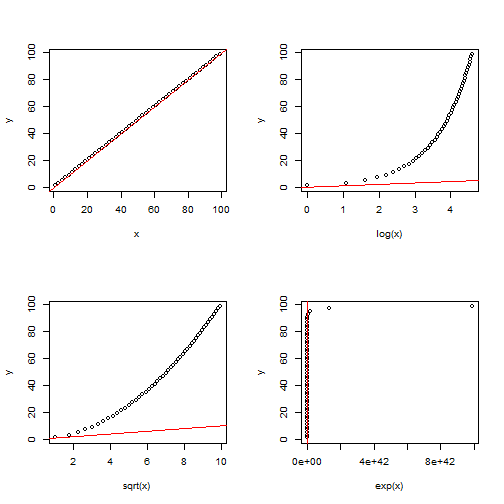
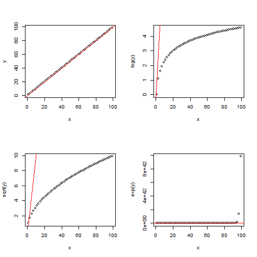

# template elements
<div class="header"></div>
<div class="footer"></div>
</img>
</img>
<div class="buttons">
<a href="../index.html">
  <button type="button">Home</button>
</a>
<a href="../modules.html">
  <button type="button">Modules</button>
</a>
<a href="../notes/module5_notes1.html">
  <button type="button">Notes</button>
</a>
</div>
<link href="https://fonts.googleapis.com/css?family=Oswald" rel="stylesheet">


# presentation
R Workshop
========================================================
type: slide-body
css: ../css/style_slides.css
<h3 style="color: #789">Module 5: Statistical modeling with R (1)</h3>  
2018-04-11  
Bobae Kang  
<small>(Bobae.Kang@illinois.gov)</small>  


Agenda
========================================================
<div style="text-align:center; margin-top:10%;">
<ul style="list-style: none">
<li style="color: #00061a; font-size: 1.1em; font-weight:700">
  Part 1: Basics of statistical modeling</li>
<li>
  Part 2: Options for advanced modeling</li>
</div>


Basic Descriptive Statistics
========================================================
type:section

<p style="font-size:0.5em; text-align:center; color: #777;">
Source: <a href="http://vadlo.com/cartoons.php?id=196">Vadlo.com</a>
</p>


Quick summary stats
========================================================

```r
summary(data)
```
* Base R's `summary()` function is a quick way to get descriptive statistics on each columan of a tabular data object.
    * For numerical columns, we get minimum, 1st quartile, median, mean, 3rd quartie and maximum values, as well as the count of missing value (`NA`).
    * For categorical variables (e.g. `factor`), we can frequencies for each level as well as the count of missing value (`NA`). 
* `summary()` is also used to get the "summary" of a fitted model object (e.g. `lm`) as well, as we will see shortly.


========================================================

```r
summary(ispcrime)
```

```
      year            county     violentCrime       murder       
 Min.   :2011   Adams    :  5   Min.   :    0   Min.   :  0.000  
 1st Qu.:2012   Alexander:  5   1st Qu.:   19   1st Qu.:  0.000  
 Median :2013   Bond     :  5   Median :   42   Median :  0.000  
 Mean   :2013   Boone    :  5   Mean   :  501   Mean   :  7.026  
 3rd Qu.:2014   Brown    :  5   3rd Qu.:  133   3rd Qu.:  1.000  
 Max.   :2015   Bureau   :  5   Max.   :33348   Max.   :566.000  
                (Other)  :480   NA's   :7       NA's   :7        
      rape            robbery          aggAssault      propertyCrime   
 Min.   :   0.00   Min.   :    0.0   Min.   :    0.0   Min.   :     0  
 1st Qu.:   1.00   1st Qu.:    0.0   1st Qu.:   15.0   1st Qu.:   133  
 Median :   6.00   Median :    2.0   Median :   33.0   Median :   349  
 Mean   :  41.29   Mean   :  172.3   Mean   :  280.4   Mean   :  2913  
 3rd Qu.:  22.00   3rd Qu.:   13.0   3rd Qu.:  102.0   3rd Qu.:  1190  
 Max.   :1986.00   Max.   :16095.0   Max.   :15129.0   Max.   :178902  
 NA's   :7         NA's   :7         NA's   :7         NA's   :7       
    burglary         larcenyTft           MVTft             arson        
 Min.   :    0.0   Min.   :     0.0   Min.   :    0.0   Min.   :   0.00  
 1st Qu.:   35.5   1st Qu.:    85.5   1st Qu.:    3.0   1st Qu.:   1.00  
 Median :   79.0   Median :   258.0   Median :   10.0   Median :   2.00  
 Mean   :  589.3   Mean   :  2084.9   Mean   :  215.2   Mean   :  23.45  
 3rd Qu.:  268.0   3rd Qu.:   852.0   3rd Qu.:   30.0   3rd Qu.:   8.50  
 Max.   :38485.0   Max.   :116145.0   Max.   :22879.0   Max.   :1418.00  
 NA's   :7         NA's   :7          NA's   :7         NA's   :7        
```


Numerical variables
========================================================
* Central tendency
* Variability
* Shape
* Outliers


Central tendency
========================================================
* In statistics, central tendency is concerned with the "center" of a distribution. The following three are the common measures of central tendency:
  * "mean" for the arithmetic mean
  * "median" for the 50th percentile
  * "mode" for the most frequent value
* R has built-in functions for the first two: `mean()` and `median()`
  

========================================================

```r
mean(ispcrime$violentCrime)
```

```
[1] NA
```

```r
median(ispcrime$violentCrime)
```

```
[1] NA
```
<p style="text-align:center">... wait, what?</p>


========================================================

```r
mean(ispcrime$violentCrime, na.rm = TRUE)
```

```
[1] 500.9702
```

```r
median(ispcrime$violentCrime, na.rm = TRUE)
```

```
[1] 42
```
* `NA` is known to be "contagious" in R, making any operation with missing values return `NA`
* `na.rm` is an argument with a boolean input to control whether `NA` values are removed/excluded in calculation


Variability
========================================================
* Variability (or dispersion) in statistics is concerned with the extent to which a distribution is spreaded out.
* There exist various measures for variability and R has built-in functions for many of them:
  * range: `min()`, `max()`, `range()`
  * percentiles: `fivenum()`, `IQR()`, `quantile()`
  * variance: `var()`, `sd()`


========================================================
**Range**

```r
min(ispcrime$violentCrime, na.rm = TRUE)
```

```
[1] 0
```

```r
max(ispcrime$violentCrime, na.rm = TRUE)
```

```
[1] 33348
```

```r
range(ispcrime$violentCrime, na.rm = TRUE)
```

```
[1]     0 33348
```
* Range is the interval between the minium nad maximum values.


========================================================
**Percentiles**

```r
fivenum(ispcrime$violentCrime, na.rm = TRUE)
```

```
[1]     0    19    42   133 33348
```

```r
IQR(ispcrime$violentCrime, na.rm = TRUE)
```

```
[1] 114
```
* `fivenum()` returns what is called Tukey's five number summary (minumum, 1st quartile, median, 3rd qurtile, maximum) for the input data
* `IQR()` returns the inter-quartile range, which is the difference between the 1st quartile (25%) and 3rd quartile (75%)


========================================================

```r
# default: equal to fivenum()
quantile(ispcrime$violentCrime, probs = seq(0, 1, 0.25), na.rm = TRUE)
```

```
   0%   25%   50%   75%  100% 
    0    19    42   133 33348 
```

```r
quantile(ispcrime$violentCrime, probs = seq(0, 1, 0.1), na.rm = TRUE)
```

```
     0%     10%     20%     30%     40%     50%     60%     70%     80% 
    0.0     5.0    13.0    24.0    32.0    42.0    57.0    90.0   246.2 
    90%    100% 
  668.4 33348.0 
```
* The default setting output of `quantile()` is equal to `fivenum()` output
* However, `quantile()` can use `probs` arugment to get more flexible output


========================================================
**Variance**

```r
var(ispcrime$violentCrime, na.rm = TRUE)
```

```
[1] 9463013
```

```r
sd(ispcrime$violentCrime, na.rm = TRUE)
```

```
[1] 3076.201
```
* `var()` returns the sample variance of the given data:
    * $s^2 = (\sum{x - \bar{x}}^2)/(n-1)$
* `sd()` returns the standard deviation of the given data:
    * $s = \sqrt{(\sum{x - \bar{x}}^2)/(n-1)}$


========================================================

```r
variables <- ispcrime %>% select(violentCrime, propertyCrime)
var(variables, na.rm = TRUE)
```

```
              violentCrime propertyCrime
violentCrime       9463013      46803865
propertyCrime     46803865     234761775
```
* When multiple variables are given as its input, `var()` returns a covariance matrix
    * In such cases, `cov()`can be used instead; however, `cov()` has no `na.rm` argument to remove missing values


Shape
========================================================
* The skewness and kurtosis (fatness/thinness) of a distribution are called the "shape" of the distribution.
* The `moments` package offers the following functions to meaasure the shape of a distribution:
    * `skewness()`
    * `kurtosis()`
    * See `moments` package [documentation](https://cran.r-project.org/web/packages/moments/moments.pdf)


Outliers
========================================================
* Outliers are observations or data points that are far from most other observations and disproportinately affect key summary statistics
* The `outliers` package offers useful functions to detect and measure outliers in data.
    * See `outliers` package [documentation](https://cran.r-project.org/web/packages/outliers/outliers.pdf)


Categorical variables
========================================================
* Frequency table is one of the most common ways to summarize the distribution of a catagorical variable
* Frequency tables can be made using table functions
    * `table()` for generating frequency tables
    * `prop.table()` for tables of proportions
    * `xtabs()` for creating frequency tables using formula
    * `ftable()` for creating "flat" contingency tables


Table functions
========================================================

```r
table(...)
prop.table(x, margin = NULL)
ftable(x)
xtabs(formula, data, ...)
```
* `table()` takes one or more data vectors of same length
    * Each input data can be named
    * Use `as.data.frame()` to turn a `table` into a data frame 
* `prop.table()` and `ftable()` takes a `table` object
* `xtabs` use formula to generate a frequency table
    * If a data frame is provided as the `data` input, its column names can be used directly in formula


========================================================
<br>

```r
my_data <- ispcrime %>%
  left_join(regions) %>%
  select(
    region,
    viol = violentCrime,
    prop = propertyCrime
  ) %>%
  mutate(
    high_viol = ifelse(viol > mean(viol, na.rm = TRUE), 1, 0),
    high_prop = ifelse(prop > mean(prop, na.rm = TRUE), 1, 0)
  )

my_tbl <- table(
  region = my_data$region,
  hviol = my_data$high_viol
)
```
***
<br>

```r
my_tbl
```

```
          hviol
region       0   1
  Central  206  24
  Cook       0   5
  Northern  60  25
  Southern 175   8
```

```r
as.data.frame(my_tbl)
```

```
    region hviol Freq
1  Central     0  206
2     Cook     0    0
3 Northern     0   60
4 Southern     0  175
5  Central     1   24
6     Cook     1    5
7 Northern     1   25
8 Southern     1    8
```


========================================================

```r
prop.table(my_tbl, 1) # each row adds up to 1 
```

```
          hviol
region              0          1
  Central  0.89565217 0.10434783
  Cook     0.00000000 1.00000000
  Northern 0.70588235 0.29411765
  Southern 0.95628415 0.04371585
```

```r
prop.table(my_tbl, 2) # each column adds up to 1
```

```
          hviol
region              0          1
  Central  0.46712018 0.38709677
  Cook     0.00000000 0.08064516
  Northern 0.13605442 0.40322581
  Southern 0.39682540 0.12903226
```


========================================================
<br>

```r
my_tbl2 <- table(
  region = my_data$region,
  hviol = my_data$high_viol,
  hprop = my_data$high_prop
)

# with ftable
ftable(my_tbl2)
```

```
               hprop   0   1
region   hviol              
Central  0           197   9
         1             1  23
Cook     0             0   0
         1             0   5
Northern 0            55   5
         1             0  25
Southern 0           173   2
         1             0   8
```
*** 
<br>

```r
# without ftable
my_tbl2
```

```
, , hprop = 0

          hviol
region       0   1
  Central  197   1
  Cook       0   0
  Northern  55   0
  Southern 173   0

, , hprop = 1

          hviol
region       0   1
  Central    9  23
  Cook       0   5
  Northern   5  25
  Southern   2   8
```


========================================================

```r
# one-dimension
xtabs(~ region, my_data)
```

```
region
 Central     Cook Northern Southern 
     230        5       85      190 
```

```r
# two-dimension
xtabs(~ region + high_viol, my_data)
```

```
          high_viol
region       0   1
  Central  206  24
  Cook       0   5
  Northern  60  25
  Southern 175   8
```


Basic Inferential Statistics
========================================================
type:section

<p style="font-size:0.5em; text-align:center; color: #777;">
Source: <a href="http://vadlo.com/cartoons.php?id=407">Vadlo.com</a>
</p>


Student's t-test
========================================================

```r
t.test(x, y = NULL, alternative = c("two.sided", "less", "greater"),
       mu = 0, conf.level = 0.95, ...)
t.test(formula, data, subset, na.action, ...)
```
* The null hypothesis assumes normal distribution
* The tested null hypothesis is no difference in mean and the alternative hypothesis can one of the three options, with the default of "two.sided"
* One sample t-test is conducted with only `x` input is given
    * The mean of `x` is compared against the `mu` value (default 0)
* Two sample t-test can be conducted by either supplying `x` and `y` inputs or using `formula` (`y ~ x`) with `data` input


========================================================

```r
ispcrime2 <- left_join(ispcrime, regions)
viol_crime_north <- (filter(ispcrime2, region == "Northern"))$violentCrime
viol_crime_south <- (filter(ispcrime2, region == "Southern"))$violentCrime
t.test(viol_crime_north, viol_crime_south)
```

```

	Welch Two Sample t-test

data:  viol_crime_north and viol_crime_south
t = 4.4064, df = 105.49, p-value = 2.534e-05
alternative hypothesis: true difference in means is not equal to 0
95 percent confidence interval:
 176.7132 465.8398
sample estimates:
mean of x mean of y 
 438.2000  116.9235 
```


Wilcox tests
========================================================

```r
wilcox.test(x, y = NULL, alternative = c("two.sided", "less", "greater"),
            mu = 0, conf.level = 0.95, ...)
wilcox.test(formula, data, subset, na.action, ...)
```
* The null hypothesis does NOT assume normality
* One sample Wilcox test (rank-sum test) is conducted with only `x` input is provided
* Two sample Wilcox test (singed-rank test) can be conducted by either supplying `x` and `y` inputs or using `formula` (`y ~ x`) with `data` input


Analysis of Variance
========================================================

```r
aov(formula, data, qr = TRUE, ...)
```
* `formula` is of the following format: `value ~ subgroup`
* `summary()` has a method for `aov` class that returns a refined print result
* `model.tables()` has a method for `aov` class for reporting table of means or table of effects


========================================================

```r
aov_by_region <- aov(formula = violentCrime ~ region, data = ispcrime2)
print(aov_by_region)
```

```
Call:
   aov(formula = violentCrime ~ region, data = ispcrime2)

Terms:
                    region  Residuals
Sum of Squares  4657351567   93080910
Deg. of Freedom          3        499

Residual standard error: 431.8969
Estimated effects may be unbalanced
7 observations deleted due to missingness
```

```r
summary(aov_by_region)
```

```
             Df    Sum Sq   Mean Sq F value Pr(>F)    
region        3 4.657e+09 1.552e+09    8323 <2e-16 ***
Residuals   499 9.308e+07 1.865e+05                   
---
Signif. codes:  0 '***' 0.001 '**' 0.01 '*' 0.05 '.' 0.1 ' ' 1
7 observations deleted due to missingness
```


========================================================

```r
model.tables(aov_by_region, type = "means")
```

```
Tables of means
Grand mean
         
500.9702 

 region 
    Central  Cook Northern Southern
        170 30848    438.2    116.9
rep     230     5     85.0    183.0
```

```r
model.tables(aov_by_region, type = "effects")
```

```
Tables of effects

 region 
    Central  Cook Northern Southern
       -331 30347   -62.77     -384
rep     230     5    85.00      183
```


Other statistical tests
========================================================

```r
# Test of equal proprtions
prop.test(x, n, p, ...)

# Chi-square test of indepndence/goodness-of-fit
chisq.test(x, y = NULL, ...)

# Shapiro-Wilk test of normality
shapiro.test(x)

# One- or two-sample Kolmogorov-Smirnov test
ks.test(x, y, ..., alternative = "two.sided", exact = NULL)

# F-test to compare variances
var.test(x, y, ratio = 1, alternative = "two.sided",
         conf.level = 0.95, ...)
var.test(formula, data, subset, na.action, ...)

# Test of correlation between paired samples
cor.test(x, y, alternative = "two.sided", conf.level = 0.95,
         method = c("pearson", "kendell", "spearman"), ...)
```


Linear models
========================================================
type:section
<p style="font-size:1.5em">
$$y_i = \beta_0 + \beta_1 x_i + \varepsilon_i$$
<br>
$$\boldsymbol{\text{y}} = \boldsymbol{\text{X}}^{\text{T}}\boldsymbol{\beta} + \boldsymbol{\varepsilon}$$
</p>


The lm() function
========================================================

```r
lm(formula, data, subset, na.action, ...)
```
* `lm()` is used to fit linear models, according to the `formula` input.
* `data` is an optional argument, which can take a data frame
    * If `data` input is provided, its column names can be used directly in the formula


R formula
========================================================

```r
formula <- y ~ x1 + x2
```
* The response variable is placed on the left-hand side of the tilde symbol (`~`), and the explanatory variables on the right-hand side
    * Adding multiple explanatory variables can be done using `+` symbol
* Simply use `y ~ .` to include all other columns additively as explanatory variables


Model summary
========================================================

```r
lmfit <- lm(formula, data)

print(lmfit) # not recommended
summary(lmfit)
```
* `lm()` output is an object of `lm` class
* Simply printing an `lm` object gives only minimal information on the fitted model
* `summary()` function with a model input (e.g. `lm`) prints a more comprehensive model summary


========================================================

```r
my_lmfit <- lm(violentCrime ~ propertyCrime, ispcrime)
class(my_lmfit)
```

```
[1] "lm"
```

```r
my_lmfit
```

```

Call:
lm(formula = violentCrime ~ propertyCrime, data = ispcrime)

Coefficients:
  (Intercept)  propertyCrime  
     -79.7683         0.1994  
```


========================================================

```r
summary(my_lmfit)
```

```

Call:
lm(formula = violentCrime ~ propertyCrime, data = ispcrime)

Residuals:
    Min      1Q  Median      3Q     Max 
-2239.5    -2.2    57.0    78.3  3992.9 

Coefficients:
                Estimate Std. Error t value Pr(>|t|)    
(Intercept)   -79.768287  16.496961  -4.835 1.77e-06 ***
propertyCrime   0.199367   0.001059 188.303  < 2e-16 ***
---
Signif. codes:  0 '***' 0.001 '**' 0.01 '*' 0.05 '.' 0.1 ' ' 1

Residual standard error: 363.5 on 501 degrees of freedom
  (7 observations deleted due to missingness)
Multiple R-squared:  0.9861,	Adjusted R-squared:  0.986 
F-statistic: 3.546e+04 on 1 and 501 DF,  p-value: < 2.2e-16
```


Model evaluation
========================================================

```r
logLik(object, ...)
AIC(object, ..., k = 2)
BIC(object, ...) # equivalent to AIC with k = log(n)
```
* There are measures of model fit other than $R^2$.
* For a model fitted by maximum likelihood algorithm:
    * `logLik()` for log-liklehood value
    * `AIC()` for Akaike Information Criterion (with default `k`)
    * `BIC()` for Bayesian Information Criterion
* Read [this Wikipedia article](https://en.wikipedia.org/wiki/Maximum_likelihood_estimation) for more on maximum likelihood estimation

Extending lm() formula
========================================================
* Transformations
* Interaction terms
* Polynomials
* Polynomial splines


Transformations
========================================================

```r
scale(y) ~ log(x1) + sqrt(x2) + ...
```
* We can transform formula terms on either side of `~` by applying a function to each term
* Common transformations include:
    * `log()`: natural log (cf. `log2` and `log10`)
    * `exp()`: exponentiate
    * `sqrt()`: square root
    * `scale()`: rescale data such that the mean is 0 and the standard deviation is 1 


========================================================
<br>
**Transforming `x`**
<br>


***
<br>
**Transforming `y`**
<br>



Interactions
========================================================

```r
y ~ x1 + x2 + x1:x2
y ~ x1 * x2
```
* `x1:x2` takes the interactions of all terms in `x1` and `x2`
* `x1*x2` is equivalent to `x1:x2` *and* the original terms `x1` and `x2` 
* It is recommended to use an interaction term with all the original terms


Polynomials
========================================================

```r
y ~ ploy(x, degree = n)
y ~ x + I(x^2) + I(x^3) + ...
```
* `poly()` generates the n-th degree polynimals of the input `x`
* `ploy(x, 3)` is equivalent to using `x + I(x^2) + I(x^3)`
    * `I()` ensures the `^` with a symbol is used as an arithmetic operator


Polynomial splines
========================================================

```r
library(splines) # part of R "base pacakges"
y ~ ns(x, ...)
```

```
y ~ ns(x, ...)
```

```r
y ~ bs(x, degree = n, ...)
```

```
y ~ bs(x, degree = n, ...)
```
* `ns()` is used for the natural cubic splines
* `bs()` is used for the n-th degree polynomial splines
    * equivalent to `bs(x, degree = 3)`


broom package
========================================================
* `broom` is a `tidyverse` package for "tidying up" statistical model outputs in R, i.e., converting them into tidy data frames.
* `broom` functions:
  * `glance()`
  * `tidy()`
  * `augment()`
* Visit `broom` [GitHub repository](https://github.com/tidyverse/broom) and "`broom` as well as `dplyr`" [vignette](https://cran.r-project.org/web/packages/broom/vignettes/broom_and_dplyr.html) for more


broom functions
========================================================

```r
glance(x, ...)
tidy(x, ...)
augment(x, ...)
```
* `glance()` takes a model object and returns a concise one-row summary of the model.
* `tidy()` takes a model object and returns a `data.frame` with the coeffcient estimation results
* `augment()` takes a model object and returns a `data.frame` for each observation with additional columns such as predictions, residuals and cluster assignments


========================================================

```r
glance(my_lmfit)
```

```
  r.squared adj.r.squared    sigma statistic p.value df    logLik      AIC
1 0.9860675     0.9860396 363.4653  35457.96       0  2 -3678.253 7362.506
       BIC deviance df.residual
1 7375.168 66185630         501
```

```r
tidy(my_lmfit)
```

```
           term    estimate   std.error  statistic      p.value
1   (Intercept) -79.7682868 16.49696109  -4.835332 1.771126e-06
2 propertyCrime   0.1993675  0.00105876 188.302852 0.000000e+00
```

```r
# check the class of each output
c(class(glance(my_lmfit)), class(glance(my_lmfit)))
```

```
[1] "data.frame" "data.frame"
```


========================================================

```r
head(augment(my_lmfit))
```

```
  .rownames violentCrime propertyCrime   .fitted  .se.fit     .resid
1         1          218          1555 230.24816 16.26976 -12.248156
2         2          119           290 -21.95172 16.44233 140.951715
3         3            6           211 -37.70175 16.45666  43.701747
4         4           59           733  66.36808 16.36964  -7.368081
5         5            7            38 -72.19232 16.48949  79.192322
6         6           42           505  20.91229 16.40542  21.087706
         .hat   .sigma      .cooksd  .std.resid
1 0.002003718 363.8282 1.142258e-06 -0.03373209
2 0.002046448 363.7739 1.545129e-04  0.38819703
3 0.002050017 363.8234 1.487927e-05  0.12035979
4 0.002028394 363.8285 4.184743e-07 -0.02029235
5 0.002058203 363.8113 4.905554e-05  0.21810593
6 0.002037270 363.8274 3.442885e-06  0.05807767
```

```r
class(augment(my_lmfit))
```

```
[1] "data.frame"
```


modelr package
========================================================
* `modelr` is a `tidyverse` package that provides helper functions for statistical modeling in R
  * partitioning and sampling
  * model quality metrics
  * interacting with models
* Visit `modelr` [GitHub repository](https://github.com/tidyverse/modelr) and the ["Model Basics" chapter](http://r4ds.had.co.nz/model-basics.html) in *R for Data Science* for more


Partitioning and sampling
========================================================

```r
resample(data, idx)
resample_partition(data, p)
bootstrap(data, n, id = ".id")
```


Model quality metrics
========================================================

```r
rmse(model, data)
mae(model, data)
qae(model, data, probs = c(0.05, 0.25, 0.5, 0.75, 0.95))
rsquare(model, data)
```
* `rmse()` returns the root mean squared error
* `mae()` returns the mean abosolute error
* `qae()` returns quantiles of absolute error
* `rsquare()` returns the $R^2$ value, i.e. the variance of the predictions divided by the variance of the reponse


Interacting with models
========================================================

```r
add_predictions(data, model, var = "pred")
add_residuals(data, model, var = "resid")
```
* `add_predictions()` adds a new column to a data frame for predicted values based on a model
* `add_residuals()` adds a new column to a data frame for residuals based on a model


========================================================

```r
ispcrime_subset <- select(ispcrime, year:violentCrime, propertyCrime)
ispcrime_subset2 <- ispcrime_subset %>%
  add_predictions(my_lmfit) %>%
  add_residuals(my_lmfit)

head(ispcrime_subset2)
```

```
  year    county violentCrime propertyCrime      pred      resid
1 2011     Adams          218          1555 230.24816 -12.248156
2 2011 Alexander          119           290 -21.95172 140.951715
3 2011      Bond            6           211 -37.70175  43.701747
4 2011     Boone           59           733  66.36808  -7.368081
5 2011     Brown            7            38 -72.19232  79.192322
6 2011    Bureau           42           505  20.91229  21.087706
```


Generalized linear models
========================================================
type:section
<p style="font-size:1.5em">
$$\text{E}[\boldsymbol{\text{Y}}] = \mu = g^{-1}(\boldsymbol{\text{X}\beta})$$
<br>
$$\text{Var}[\boldsymbol{\text{Y}}] = \text{V}[\mu] = \text{V}[g^{-1}(\boldsymbol{\text{X}}\boldsymbol{\beta})]$$
</p>


GLM basics
========================================================
* GLM is extends the linear model to fit response variables with error distribution other than a gaussian distribution
* Three components of GLM:
    * A probability distribution from the exponential family
    * A linear predictor, $\eta = \boldsymbol{\text{X}\beta}$
    * A link function $g$, such that $\text{E}[\boldsymbol{\text{Y}}] = \mu = g^{-1}(\eta)$


The glm() function
========================================================

```r
glm(formula, family = gaussian, data, ...)
```
* `formula` is the same formula we have seen all along
* `family` input specifies the link function $g$
    * the default is `gaussian(link = "identity")` for the linear model
* `glm()` function returns a `glm` class object
    * Use `summary()` to inspect the model estimation results


========================================================
**`family` objects**

|family             |Default link function  |Use                                                                     |
|:------------------|:----------------------|:-----------------------------------------------------------------------|
|`gaussian`         |`(link = "identity")`  |Linear model for continous outcome<br>(ordinary linear regression; OLS) |
|`binomial`         |`(link = "logit")`     |Logit model for binary outcome<br>(logistic regression)                 |
|`poisson`          |`(link = "log"`)       |Poisson model for count outcome                                         |
|`Gamma`            |`(link = "inverse")`   |...                                                                     |
|`inverse.gaussian` |`(link = "1/mu^2")`    |...                                                                     |
|`quasi`            |`(link = "identitiy")` |...                                                                     |
|`quasibinomial`    |`(link = "logit")`     |...                                                                     |
|`quasipoisson`     |`(link = "log")`       |...                                                                     |


Logit model
========================================================

```r
glm(formula, family = binomial, data, ...)
```
* A logit model, i.e. logistic regression, can be fitted using `glm()` with `family = binomial`
* The response variable must range between 0 and 1 (an error will be thrown otherwise)


Poisson model
========================================================

```r
glm(formula, family = poisson, data, ...)
```
* A possion model can be fitted using `glm()` with `family = poisson`
* The response variable must not include negative values (an error will be thrown otherwise)


Better ways?
========================================================
There are thrid-party packages to provide additional fuctions and/or different interfaces to existing statistical analysis functions. Although I have little exposure to them, the following two might be worth checking:

* `psych` package
    * See [this package vignette](https://cran.r-project.org/web/packages/psych/vignettes/intro.pdf) by the package author
* `jmv` package
    * See [this package documentation page](https://www.jamovi.org/jmv/)


Resources
========================================================
* Kabacoff, R. ["Statistics"](https://www.statmethods.net/stats/index.html). *Quick-R*.
* Lane D. et al. [*Online Statistics: A Multimedia Course of Study*](http://onlinestatbook.com/2/index.html).
* Prabhakaran, S. [r-statistics.co](http://r-statistics.co/).
* UCLA Institute for Digital Research and Education. ["R"](https://stats.idre.ucla.edu/r/).
* University of Cincinnati. ["Descriptive analytics"](http://uc-r.github.io/descriptive). *UC Business Analytic R Programming Guide*.
* University of Cincinnati. ["Predictive analytics"](http://uc-r.github.io/predictive). *UC Business Analytic R Programming Guide*.
* Wollschlaeger, D. [*RExRepos*](http://dwoll.de/rexrepos/index.html).
* Yau, C. ["Elementary Statistics with R"](http://www.r-tutor.com/elementary-statistics). *R Tutorial*.


Questions?
========================================================
type: section

<p style="font-size:0.5em; text-align:center; color: #777;">
Source: <a href="https://giphy.com/gifs/kpop-bts-8lPSqcjcNjymIOS4Pm">Giphy</a>
</p>


========================================================
References
<ul style="font-size: 0.6em; list-style-type:none">
  <li>Lane D. et al. (n.d.). <a href="http://onlinestatbook.com/2/index.html"><span style="font-style:italic">Online Statistics: A Multimedia Course of Study</span></a>.</li>
  <li>Prabhakaran, S. (n.d.). <a href="http://r-statistics.co/Statistical-Tests-in-R.html">"Statistic Tests"</a>. <i>r-statistics.co</i>.</li>
  <li><a href="https://github.com/tidyverse/broom">tidyverse/broom Github repository</a></li>
  <li><a href="https://github.com/tidyverse/modelr">tidyverse/modelr Github repository</a></li>
  <li>University of Cincinnati. <i><a href="http://uc-r.github.io/">UC Business Analytics R Programming Guide</a></i></li>
  <li>Wikipedia contributors. (2018). <a href="https://en.wikipedia.org/wiki/Generalized_linear_model">"Generalized linear model"</a>. <i>Wikipedia, The Free Encyclopedia</i>.</li>
</ul>


========================================================
type: section

<p style="font-size:0.5em; text-align:center; color: #777;">
Source: <a href="https://www.wikimedia.org">Wikimedia.org</a>
</p>
