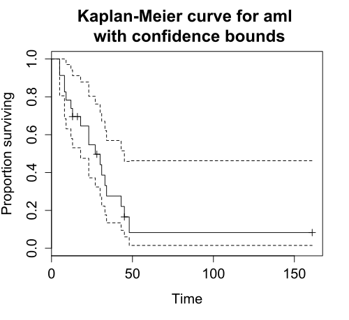
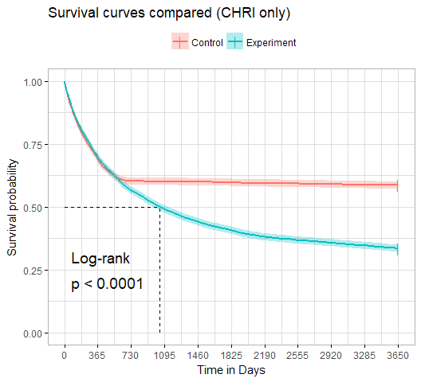
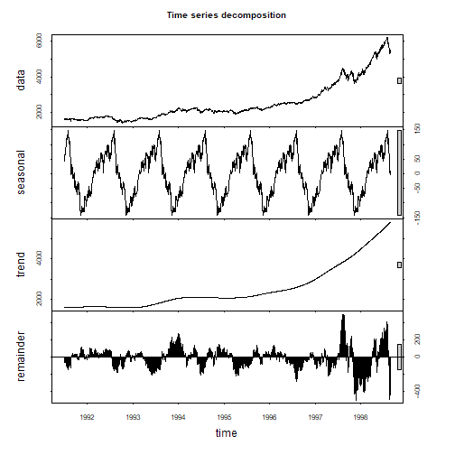
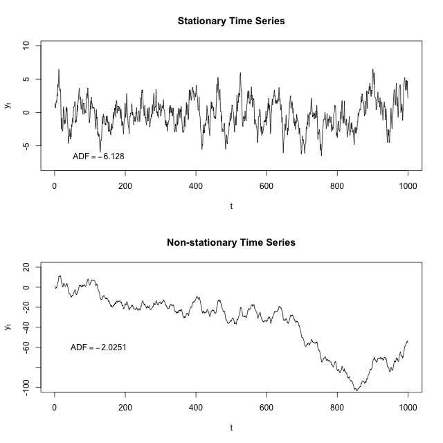
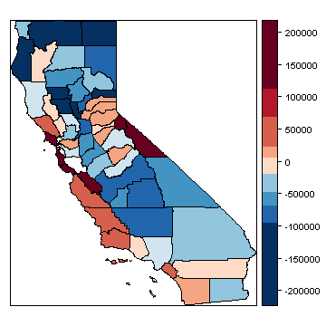

# template elements
<div class="header"></div>
<div class="footer"></div>
</img>
</img>
<div class="buttons">
<a href="../index.html">
  <button type="button">Home</button>
</a>
<a href="../modules.html">
  <button type="button">Modules</button>
</a>
<a href="../notes/module5_notes2.html">
  <button type="button">Notes</button>
</a>
</div>
<link href="https://fonts.googleapis.com/css?family=Oswald" rel="stylesheet">


# presentation
R Workshop
========================================================
type: slide-body
css: ../css/style_slides.css
<h3 style="color: #789">Module 5: Statistical modeling with R (2)</h3>  
2018-04-11  
Bobae Kang  
<small>(Bobae.Kang@illinois.gov)</small>  


Agenda
========================================================
<div style="text-align:center; margin-top:10%;">
<ul style="list-style: none">
<li>
  Part 1: Basics of statistical modeling</li>
<li style="color: #00061a; font-size: 1.1em; font-weight:700">
  Part 2: Options for advanced modeling</li>
</div>


========================================================
type:section

<p style="font-size:0.5em; text-align: center; color: #777;">
Source: <a href="https://commons.wikimedia.org/wiki/File:DIN_4844-2_Warnung_vor_einer_Gefahrenstelle_D-W000.svg">Wikimedia Commons</a>
</p>


Survival analysis
========================================================
type:section

<p style="font-size:0.5em; text-align:center; color: #777;">
Source: <a href="https://commons.wikimedia.org/wiki/File:Kaplan-Meier_curve_for_aml_with_confidence_bounds.svg">Wikimedia Commons</a>
</p>


What is Survival analysis?
========================================================
> "Survival analysis is used to analyze data in which the time until the event is of interest. The response variable is the time until that event and is often called a failure time, survival time, or event time."<br>- Harrell Jr. (2015).

* The response variable is a non-negative discrete/continuous random variable


Survival analysis basics
========================================================
* Failure/event
* Censoring
* Survival function
* Hazard function


Failure/event
========================================================
* Failure, or event, refers to an event of interest where the time, $T$, from the beginning of observation to the occurence of an event is measured and available for modeling.
* Examples of event include:
    * Death
    * Recidivism (rearrest, reconviction, or reincarceration)
    * Disease occurence/recurrence


Censoring
========================================================
* Observations are called censored when the information about their survival time is
incomplete.
* The most common form of censoring is right-censoring
    * The final endpoint is only known to exceed a particular value.
    * Most likely occurs due to the end of the study/observation period


Survival function
========================================================
* The survival function $S(t)$ is the probability that the time of event/failure is later than some specified time $t$

$$S(t) = \text{Pr}(T > t),\quad 0 < t < \infty$$


Hazard function
========================================================
* The hazard function $\lambda(t)$ is the event rate at time $t$, conditional on survival (i.e. no event) until time $t$ or later:

$$\lambda(t) = \lim_{dt\to0} \frac{\text{Pr}(t \leq T < t + dt)}{S(t)dt} = \frac{S'(t)}{S(t)}$$


Packages on survival analysis
========================================================
* `survival` package
* `survminer` package for visualization
    * Resources:
        * [Package website](http://www.sthda.com/english/rpkgs/survminer/)
        * [GiHub repo](https://github.com/kassambara/survminer)


Basic survival models
========================================================
* Kaplan-Meier estimator
* Cox proportioanl hazards model


Kaplan-Meier estimator
========================================================
* Most widely used nonparametric estimator of the survival function
* KM estiamor $\hat{S}(t)$ is the product over the failure times of the conditional probabilities of surviving to the next failure time
    * $d_i$ is the number of subjects who fail at time $t$
    * $n_i$ is the number of subjects at risk at time $t$

$$\hat{S}(t) = \prod_{t_i \leq t} \Big( 1 - \frac{d_i}{n_i} \Big)$$


Surv function and Surv class
========================================================

```r
survival::Surv(time, time2, event, type, ...)
```
* `time` is the follow up time for the right censored data
    * for interval censored data, `time` is the starting time and `time2` is the ending time
* `event` is the status indicator, where 0 = alive (i.e., event not occured), 1 = dead (i.e., event occured)
* `type` is a character string of the censoring type
    * E.g. "right", "left", and "interval"
* Returns a `Surv` class object, used to fit survival models


survfit function
========================================================

```r
survival::survfit(formula/model, data, ...)
```
* `survfit` returns a survival curve
    * Uses KM estimator if with `formula`
    * Based on the model, if with `model` (e.g. Cox model)
* `formula` for the KM estimator must have the `Surv` object as the response variable
    * E.g. `Surv(time, status) ~ x`
* `data` is optional; if provided, the columns of the input data frame can be used in the formula


Proportional hazards model
========================================================
$$\lambda(t|\boldsymbol{\text{x}}_i) = \lambda_0(t)\psi_i = \lambda_0(t)\text{exp}(\boldsymbol{\text{x}}_i^{\text{T}}\beta)$$

* The model assumes that the unique effect of a change in a covariate is multiplicative w.r.t. the hazard rate 
    * $\boldsymbol{\text{x}}_i$ denotes the covariate values for subject $i$
    * The estimated coefficient is interpreted in a releative sense


coxph function
========================================================

```r
survival::coxph(formula, data, ...)
```
* `formula` must have the `Surv` object as the response variable
* `data` is optional; if provided, the columns of the input data frame can be used in the formula


Plotting survival curve
========================================================

```r
plot(survfit)
survminer::ggsurvplot(survfit, data, ...)
```
* `survival` package offers `plot` methods for `survfit` objects
    * Uses the base R plotting
* `survminer` package offers an alternative way to plot survival curves
    * `ggsurvplot()` has `ggplot2`-like API and makes `ggplot2` themes available


========================================================



Other resources
========================================================
* Diez, D. M. (2013). ["Survival Analysis in R"](https://www.openintro.org/download.php?file=survival_analysis_in_R).
* Econometrics Academy. (2013). ["Survival Analysis"](https://sites.google.com/site/econometricsacademy/econometrics-models/survival-analysis).
* Rickert, J. (2017). ["Survival Analysis with R"](https://rviews.rstudio.com/2017/09/25/survival-analysis-with-r/) on *R Views*.
* Moore, D. R. (2016). *Applied Survival Analysis Using R*.


Time series analysis
========================================================
type:section

<p style="font-size:0.5em; text-align:center; color: #777;">
Source: <a href="https://commons.wikimedia.org/wiki/File:Stationarycomparison.png">Wikimedia Commons</a>
</p>


What is time series analysis?
========================================================
* A time series is a set of observations measured sequentially through time.
* Time series examples:
    * Annual crime count for multiple years
    * Changes in stock prices
* Time series analysis involves modeling such time series data, often for making forecasts


Time series basics
========================================================
* Decomposition
* Seasonality
* Stationarity
* Differencing


========================================================
**Decomposition**
* Separating a time series into trend, seasonal effects, and remaining variability.

**Seasonality**
* Also called seasonal variation
* Similar and recurrent patterns of behavior in data at particular times of the given period
* Generally annual in period, but could be monthly, weekly, daily, or any other kind of periods


========================================================



========================================================
**Stationarity**
* A common assumption underlying any time series analysis techniques
* A stationary process is a stochastic process of which the mean, covariance and autocorrelation structure do not change over time

**Differencing**
* A technique to make the series stationary, de-trend, and control the auto-correlations.


========================================================

<p style="font-size:0.5em; text-align:center; color: #777;">
Source: <a href="https://en.wikipedia.org/wiki/Stationary_process">"Stationary process"</a>, Wikipedia
</p>


Packages on time series analysis
========================================================
* `stats` package (part of R "base packages")
* `tseries` pacakge
* `forcast` package
    * [Package website](http://pkg.robjhyndman.com/forecast/index.html)
    * Hyndman, R. & Athanasopoulos, G. (2018). [*Forecasting: Principles and Practice*](https://otexts.org/fpp2/). (online textbook)


Basic time series analysis
========================================================
* Tieme seires decomposition
* Autocorrelation function plots
* Partial autocorrelation function plots


Time series decomposition
========================================================
* A time series $y_t$ can be decoposed into three components:
    * The seasonal component $S_t$
    * The trend-cylce $T_t$
    * The remainder $R_t$
* Additive model: $\quad y_t = S_t + T_t + R_t$
* Multiplicative model: $\quad y_t = S_t \times T_t \times R_t$
    * Can be rewrtten as $\quad \text{ln } y_t = \text{ln } S_t + \text{ln } T_t + \text{ln } R_t$


decompose and stl functions
========================================================

```r
decompose(x, type = c("additive", "multiplicative"), ...)
stl(x, s.window, ...)
```
* `stats` offer two functions for time series decomposition
* `decompose()` uses moving averages
    * Seasonal component can be additive or multiplicative
* `stl()` uses LOESS (local regression)
    * `stl` is often recommended for time series decomposition
    * `s.window` is the span of the LOESS window for seasonal extraction (must be odd and at least 7)


ACF and PACF plots
========================================================
* ACF and PACF plots of a differenced series offer a heuristic way to choose specifications for ARIMA models
* See this ["Guide"](ftp://ftp.boulder.ibm.com/software/analytics/spss/support/Stats/Docs/Statistics/Miscellaneous/Guide_to_ACF_PACF_plots.pdf) for how to use ACF and PACF plots for selecting models to fit
    * Nonstationary series: ACF with many significant lags
    * Autoregressive processes: Exponentially declining ACF and one or more significant lags of the PACF
    * Moving average processes: ACF and PACF with the pattern opposite to that of autoregressive processes


acf and pacf functions
========================================================

```r
acf(x, lag.max = NULL, plot = TRUE,
           type = c("correlation", "covariance", "partial"), ...)
pacf(x, lag.max = NULL, plot = TRUE, ...)
```
* `x` is a univariate time series
* `type = "correlation"` is the default for an ACF plot
* `pacf()` is equivalent to `acf()` with `type = "partial"`


Basic time series models
========================================================
* Autoregressive (AR) model
* Moving average (MA) model
* ARMA model
* ARIMA model


AR model
========================================================
$$X_t = Z_t + \sum_{i=1}^p \phi_i X_{t-i},$$
$$\text{rewritten as }\phi(B)X_t = Z_t$$

* $\{X_t\}$ is an autoregressive process of order $p$, $\text{AR}(p)$
    * $Z_t$ is a white noise (stationary) with mean 0 and the constant variance
    * $\phi_i$ is the autoregressive parameter for the $i^{th}$ order
    * $\phi(B)X_t = 1 - \phi_1B - ... - \phi_pB^p$


MA model
========================================================
$$X_t = Z_t + \sum_{i=1}^q \theta_i X_{t-i},$$
$$\text{rewritten as }X_t =\theta(B)Z_t$$

* $\{X_t\}$ is an moving average process of order $q$, $\text{MA}(q)$
    * $Z_t$ is a white noise
    * $\theta(B) = 1 + \theta_1B + ... + \theta_qB^q$
    

ARMA and ARIMA model
========================================================
* Combining $\text{AR}(p)$ and $\text{MA}(q)$, we get $\text{ARMA}(p, q)$:

$$\phi(B)X_t =\theta(B)Z_t$$


* Differencing non-stationary data can generate stationarity needed to fit AR, MA, and ARMA models
* With $d^{th}$ differences, we get $\text{ARIMA}(p, d, q)$:

$$\phi(B)(1-B)^dX_t =\theta(B)Z_t$$


arima function
========================================================

```r
arima(x, order = c(0L, 0L, 0L), seasonal = list(order, period) ...)
```
* `x` is a vector of a univariate time series
* `order` is a sepcification of the (p, d, q) for ARIMA model, in that order
* `seasonal` is a specification of the seasonal part of ARIMA model, consists of `order` and `period`


Other resources
========================================================
* Coghlan, A. (2017). ["A Little Book of R for Time Series"](http://a-little-book-of-r-for-time-series.readthedocs.io/en/latest/index.html).
* Econometrics Academy. (2013). ["Time Series ARIMA Models"](https://sites.google.com/site/econometricsacademy/econometrics-models/time-series-arima-models).
    * Vidoe lectures; using `stats` and `tseries` packages
* Prabhakaran, S. ["Time Series Analysis"](http://r-statistics.co/Time-Series-Analysis-With-R.html) on [r-statistics.co](http://r-statistics.co/).
* Shumway, R. & Stoffer, D. (2017). *Time Series Analysis and Its Applications: With R Examples*. (4th ed.). (textbook)


Spatial regression analysis
========================================================
type:section

<p style="font-size:0.5em; text-align:center; color: #777;">
Source: <a href="http://rspatial.org/analysis/rst/7-spregression.html#spatial-error-model">R Spatial</a>
</p>


What is spatial regression analysis?
========================================================
* Spatial regression analysis is for modeling data with spatial dependence
* Spatial dependence refers to the spatial relationship of variable values or locations
* Spatial regression seeks to capture the effect of spatial dependence in the statistical modeling efforts


Spatial regression basics
========================================================
* Neighbours
* Spatial weights


Neighbors
========================================================
* Neighbors of a spatial data point are other data points that are proximate to the focal data point
* Neighbors may be defined in different ways:
    * Contiguity-based (rook and queen contiguity)
    * Distance-based
    * K-nearest neighbors
* Try [this Shiny application](http://personal.tcu.edu/kylewalker/spatial-neighbors-in-r.html) by Klye E. Walker to see how the neighboring structure changes with different definitions


spatial weights
========================================================
* Spatial weights represent the significance of neighbors
    * Not all neighbors are equally important
* For geospaital data expressed in polygons (e.g. counties), contiguity-based neighbors are used to construct spatial weights
    * Rook contiguity weights
    * Queen contiguity weights
    * Block weights
    * Higher order contiguity


Spatial pacakges in R
========================================================
* Currently, there are two major packages to create and manipulate spatial objects: `sp` and `sf`
* `sp` is a mature package but its objects have un-tidy structures
    * First released on CRAN in 2005
    * 130+ pacakges on CRAN are currently dependent on `sp`
* `sf` is a new package better suited for tidy framework
    * First released on CRAN in 2016
    * `sf` is an R implementation of the "Simple Features Access" standard (ISO 19125) for geospatial data
    

spdep package
========================================================
* To my knowledge, the most comprehensive package for spatial regression analysis in R
* `spdep` functions use `sp` spatial objects
* Resources:
    * Package `spdep` [reference manual](https://cran.r-project.org/web/packages/spdep/spdep.pdf).
    * Bivand R. (2017). ["Creating Neighbours."](https://cran.r-project.org/web/packages/spdep/vignettes/nb.pdf)
    * Bivand R. (2017). ["The Problem of Spatial Autocorrelation: forty years on."](https://cran.r-project.org/web/packages/spdep/vignettes/CO69.pdf)


Creating neighbors and weights matrix
========================================================
* `spdep` offers `*2nb` functions to create neighbors (`nb` object)
  * `poly2nb` for continuity-based neighbors
  * `knn2nb` for distance-based neighbors
  * `tri2nb` for grid-based neighbors
  * `cell2nb` for grid neighbors
* `nb2listw` function is used to generate a list of spatial weights (`listw` object) from an `nb` object


========================================================
**`poly2nb` function**

```r
spdep::ploy2nb(pl, row.names = NULL, queen = TRUE, ...)
```
* `pl` is a list of polygons (e.g. `SpatialPolygons` class)
* If `queen` is `TRUE`, polygons with a single shared boundary point are considered neighbors; if `FALSE`, more than two shared poitns are needed 

**`nb2listw` function**

```r
spdep::nb2listw(neighbours, ...)
```
* `nb2listw` functions takes a neighbours object of class `nb` and returns a spatial weights list (`listw`)


Basics of spatial modeling
========================================================
* Morans' I
* Lagrange multplier tests
* Spatial autorgressive lag model
* Spatial autoregressive error model


Moran's I
========================================================
$$I = \frac{\boldsymbol{\text{e}}^\text{T}\boldsymbol{\text{W}}\boldsymbol{\text{e}}/S_0}{\boldsymbol{\text{e}}^\text{T}\boldsymbol{\text{e}}/n} = \frac{\boldsymbol{\text{e}}^\text{T}\boldsymbol{\text{W}}\boldsymbol{\text{e}}/S_0}{\hat{\sigma}^2_{ML}}$$

* One of the most commonly used statistic for spatial autocorrelation
    * $S_0$ is the sum of the weights
    * $\boldsymbol{\text{e}}$ is a vector of OLS residulas
* A non-constructive test (no specific model as an alternative)

$$I_z = \frac{I - \text{E}[I]}{\sqrt{\text{Var}[I]}} \sim N(0, 1)$$


moran.test and lm.morantest
========================================================

```r
spdep::moran.test(x, listw, ...)
spdep::lm.morantest(model, listw, ...)
```
* `moran()` takes a numeric vector of data and a spatial weights list (`listw`) created by `nb2listw`
* `lm.morantest()` takes a `lm` object and a spatial weights list
* A small `p-value` suggests special autocorrelation


Lagrange multiplier tests
========================================================
* Separate LM tests exist for lag model and error modal
    * The null hypothesis is no spatial autocorrelation
        * $H_0: \rho = 0$ for spatial lag model
        * $H_0: \lambda = 0$ for spatial error model
* "Robust" LM test are used when LM tests both lag model and error model reject the null


lm.LMtests function
========================================================

```r
spdep::lm.LMtests(model, listw, test = "LMerr")
```
* `lm.LMtests()` takes a `lm` model and a spatial weights list
* Available `test` inputs include:
    * "LMerr" and "LMlag" for spatial error and spatial lag model 
    * "RLMerr" and "RLMlag" for robust LM tests
    * "SARMA" for spatial ARMA model


Spatial lag model
========================================================
$$\boldsymbol{\text{y}} = \rho\boldsymbol{\text{W}}\boldsymbol{\text{y}} + \boldsymbol{\text{X}}\beta + \boldsymbol{\text{u}}$$

* Spatial lag model models spatial autoregression on 
* $\boldsymbol{\text{W}}\boldsymbol{\text{y}}$ is a spatial lag term
* $\rho$  is a spatial autoregressive parameter
* $\boldsymbol{\text{u}}$ is an error term


Spatial error model
========================================================
$$\boldsymbol{\text{y}} = \boldsymbol{\text{X}}\beta + \boldsymbol{\text{u}}, \text{where}$$
$$\boldsymbol{\text{u}} = \lambda\boldsymbol{\text{W}}\boldsymbol{\text{u}} + \varepsilon$$

* $\boldsymbol{\text{W}}$ is a weights matrix
* $\lambda$  is a spatial autoregressive parameter
* $\varepsilon$ is an idiosyncratic error term


lagsarlm and errorsarlm function
========================================================

```r
spdep::lagsarlm(formula, data, listw, ...)
spdep::errorsarlm(formula, data, listw, ...)
```
* `formula` and `data` works like in `lm()`
* `listw` is a spatial weights matrix


Other resources
========================================================
* Anselin, L. (2007). [*Spatial Regression Analysis in R: A Workbook*](http://www.csiss.org/gispopsci/workshops/2011/PSU/readings/W15_Anselin2007.pdf).
* Econometrics Academy. (2013). ["Spatial Econometrics"](https://sites.google.com/site/econometricsacademy/econometrics-models/spatial-econometrics).
* Lovelace, R. et al. (2018).[*Geocomputation with R*](https://geocompr.robinlovelace.net/).
* Sarmiento-Barbieri, I. ["An Introduction to Spatial Econometrics in R"](http://www.econ.uiuc.edu/~lab/workshop/Spatial_in_R.html).
* Hijmans, R. (2016). [*R Spatial*](http://rspatial.org/intr/index.html).


Machine learning
========================================================
type:section

<p style="font-size:0.5em; text-align:center; color: #777;">
Source: <a href="https://commons.wikimedia.org/wiki/File:Kernel_Machine.png">Wikimedia Commons</a>
</p>


What is machine learning?
========================================================
> "A computer program is said to learn from experience E with respect to some class of tasks T and performance measure P if its performance at tasks in T, as measured by P, improves with experience E."<br>-Tom M. Matchell 

* Machine learning (ML) is a key factor of the recent success of artificial intelligence (AI) algorithms and applications
* ML can be thought as the automated optimization of model parameters through iteratively reducing the difference between the model outputs and the input data


Types of ML
========================================================
* Supervised learning
    * Classification (categorical target variable)
    * Regression (numerical target variable)
* Unsupervised learning
    * Clustering
* Reinforcement learning


Basic ML workflow
========================================================
* Collect data
* Prepare data (normalization, handling missing values, etc.)
* Divide data into training and test sets
* Train a learner (model) using the training set
* Evaluate the learner using the test set


Common ML algorithms
========================================================
<br>
* Linear regression
* Logistic regression
* Decision tree
    * Random forest
* Support vector machine (SVM)

***

<br>
* Naive Bayes
* K-Nearest Neighbors
* K-Means Clustering
* Artificial neural network
    * "Deep learning"


Packages on ML
========================================================
<br>
* `caret` pacakage
    * Classification And REgression Training
    * Resources:
      * [Package vignette PDF](https://cran.r-project.org/web/packages/caret/vignettes/caret.pdf)
      * [Online textbook](http://topepo.github.io/caret/index.html)
      * [GitHub repo](https://github.com/topepo/caret)

***

<br>
* `mlr` pacakge
    * Machine Learning in R
    * Resources:
      * [Package vignette HTML](https://cran.r-project.org/web/packages/mlr/vignettes/mlr.html)
      * [Tutorial website](https://mlr-org.github.io/mlr-tutorial/devel/html/)
      * [GitHub repo](https://github.com/mlr-org/mlr/)


Other resources
========================================================
* Andrew Ng's ["Machine Learning" course](https://www.coursera.org/learn/machine-learning) on Coursera
* James, G. et al. (2013). *An Introduction to Statistical Learning*. (textbook)
    * [Website with a link to free textbook](http://www-bcf.usc.edu/~gareth/ISL/)
    * Examples in R code
* Google's [*Machine Learning Crash Course*](https://developers.google.com/machine-learning/crash-course/)
    * Examples in Python code


Questions?
========================================================
type: section

<p style="font-size:0.5em; text-align:center; color: #777;">
Source: <a href="https://giphy.com/gifs/just-blinking-3ELtfmA4Apkju">Giphy</a>
</p>


References
========================================================
<ul style="font-size: 0.6em; list-style-type:none">
  <li>Allignol A. & Latouche, A. (2018). <a href="https://cran.r-project.org/web/views/Survival.html">"CRAN Task View: Survival Analysis"</a>.</li>
  <li>Anselin, L. & Rey, S. (2014). <i>Modern Spatial Econometrics in Practice</i>.</li>
  <li>Bivand, Roger. (2018). <a href="https://cran.r-project.org/web/views/Spatial.html">"CRAN Task View: Analysis of Spatial Data"</a>.</li>
  <li>Fox, J. (2016). <a href="https://cran.r-project.org/web/views/SocialSciences.html">"CRAN Task View: Statistics for the Social Sciences"</a>.</li>
  <li>Harrell, F. Jr. (2015). <i>Regression Modeling Strategies</i> (2nd ed.).<li>
  <li>Hyndman, R. J. (2018). <a href="https://cran.r-project.org/web/views/TimeSeries.html">"CRAN Task View: Time Series Analysis"</a>.</li>
  <li>NIST/SEMATECH. (2013). <a href="http://www.itl.nist.gov/div898/handbook/"><span style="font-style:italic">e-Handbook of Statistical Methods</span></a>.</li>
  <li>Reference manuals for the aforementioned R packages.</li>
  <li>Wikipedia articles on relevant topics.</li>
</ul>
