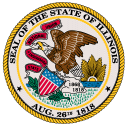
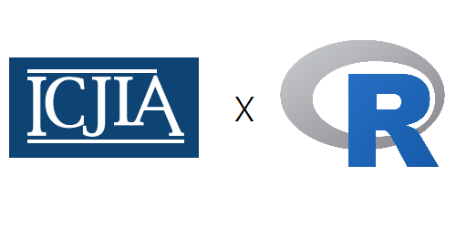

# template elements

</img>
</img>

<a href="../index.html">
  <button type="button">Home</button>
</a>
<a href="../modules.html">
  <button type="button">Modules</button>
</a>
<a href="../notes/module1_notes.html">
  <button type="button">Notes</button>
</a>

# presentation
R Workshop
========================================================
type: slide-body
css: ../css/style_slides.css
<h3 style="color: #789">Module 6: Sharing your analysis and more (1)</h3>  
2018-01-01  
Bobae Kang  
<small>(Bobae.Kang@illinois.gov)</small>  

Agenda
========================================================

  

    Session 1: 

  
Session 2: 

(slides in development)
========================================================
type:section

