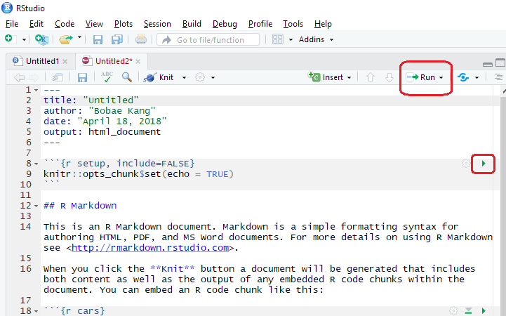

# template elements
<div class="header"></div>
<div class="footer"></div>
</img>
</img>
<div class="buttons">
<a href="../index.html">
  <button type="button">Home</button>
</a>
<a href="../modules.html">
  <button type="button">Modules</button>
</a>
<a href="../notes/module6_notes1.html">
  <button type="button">Notes</button>
</a>
</div>
<link href="https://fonts.googleapis.com/css?family=Oswald" rel="stylesheet">


# presentation
R Workshop
========================================================
type: slide-body
css: ../css/style_slides.css
<h3 style="color: #789">Module 6: "To Infinity and Beyond" (1)</h3>  
2018-04-18  
Bobae Kang  
<small>(Bobae.Kang@illinois.gov)</small>  


Agenda
========================================================
<div style="text-align:center; margin-top:10%;">
<ul style="list-style: none">
<li style="color: #00061a; font-size: 1.1em; font-weight:700">
  Part 1: Sharing your work</li>
<li>
  Part 2: Leveraging online resources</li>
</div>


R Markdown
========================================================
type:section

<p style="font-size:0.5em; text-align:center; color: #777;">
Source: <a href="https://rmarkdown.rstudio.com/authoring_quick_tour.html">R Markdown</a>
</p>


What is R Markdown?
========================================================
> "R Markdown is a file format for making dynamic documents with R. An R Markdown document is written in markdown (an easy-to-write plain text format) and contains chunks of embedded R code."<br><br> - Garret Grolemund from R Studio


Why use R Markdown?
========================================================
* Reproducible
* Multiple document formats
* Embedding R code chunks (and the outputs)


Getting started
========================================================
* Install `rmarkdown`
    * not necessary if using R Studio IDE
* Create a R markdown document
    * File > New File > R Markdown
* "Knit" the R markdown document into a file in the desired format


========================================================


========================================================


========================================================


========================================================


Basics
========================================================
* yaml header
* knit and preview outputs
* markdown
* code chucks


========================================================
**yaml header**


yaml options
========================================================
* Title, author, date
* output
  * output format
  * output options 
  * different output format has different options


========================================================
**knit and prevew**


========================================================
**knit options**


========================================================
**preview options**


========================================================
**markdown**


Markdown basics
========================================================
* Headers
* Font types (italic, bold, strikethrough, superscript)
* Lists (ordered, unordered)
* Hyperlinks
* Images
* Blackquotes
* Horizontal line/page break
* Math equations (using LaTeX)
* Code/R code (chunk, in-line)


========================================================
**Headers**
```
# Header 1

## Header 2

### Header 3
```
**Font types**
```
_italic_  __bold__

*italic*  **bold**


~~strikethrough~~


superscript^2^
```

========================================================
**Lists**
```
Unordered list  |  Ordered list
                | 
* Item 1        |  1. Item 1
    * Item 1a   |      1. Item 1a
* Item 2        |  2. Item 2
    + Item 2a   |      1. Item 2a
    - Item 2b   |      2. Item 2b
```
```
Mixed list

1. Item 1
    * Item 1a
* Item 2
    1. Item 2a
    + Item 2b
```

========================================================
**Hyperlinks**
```
[text with hyperlink](http://link.path)
```
**Images**
```


```


========================================================
**Blockquotes**
```
> A line of text following the "> " is a blockquote.
```
> A line of text following the "> " is a blockquote.

**Horizontal line/page break**
```
More then three asteriks or dashs

***

******

------
```

========================================================
**Math equations**
```
Inline math equations look like: $y = (x + 1)^2$
```
<div style="font-size:.8em;">
Inline math equations look like: $y = (x + 1)^2$
</div>
<br>

```
A block of math equations look like:

$$y = x^2 + 2x + 1$$
```
<div style="font-size:.8em;">
A block of math equations look like: $$y = x^2 + 2x + 1$$
</div>


========================================================
**R code chunk**


========================================================
**Insert a new code chunk**


* <small>keyboard shortcut: `Ctrl + Alt + i`</small>


========================================================
**Run code chunks**


* <small>keyboard shortcut: `Ctrl + Enter`</small>


knitr options
========================================================
* global options
* local options (per code chunk)


Images
========================================================
* insert images with `knitr::include_graphics()`
* image size
* image alignment


========================================================
**knitr::includ_graphics example**


Tables
========================================================
* Printing basic data frame object
* Better looking tables with `knitr::kable()`
* Interactive tables with `DT::datatable()`


========================================================
**default data frame example**


========================================================
**kable example**


========================================================
**datatable example**


Documents
========================================================
type:section

<p style="font-size:0.5em; text-align:center; color: #777;">
Source: <a href="https://www.wikimedia.org">Wikimedia Commons</a>
</p>

HTML documents
========================================================
```
---
title: 'Untitled'
output: html_document
---
```

R Notebooks
========================================================
```
---
title: 'Untitled'
output: html_notebook
---
```

htmlwidgets for R
========================================================


PDF documents
========================================================
```
---
title: 'Untitled'
output: pdf_document
---
```


tufte and tint
========================================================


Word documents
========================================================
```
---
title: 'Untitled'
output: word_document
---
```

Other formats
========================================================
* d
* d
* d

RPubs
========================================================


Presentations
========================================================
type:section

<p style="font-size:0.5em; text-align:center; color: #777;">
Source: <a href="https://www.wikimedia.org">Wikimedia Commons</a>
</p>

ioslides
========================================================
* example


revealjs
========================================================
* example


R Presentation
========================================================
* Not R Markdown


Other formats
========================================================
* slidy (`output: slidy_presentation`)
* beamer (`output: beamer_presentation`)
* [xaringan](https://github.com/yihui/xaringan) (`output: xaringan::moom_reader`)

Shiny
========================================================
type:section

<p style="font-size:0.5em; text-align:center; color: #777;">
Source: <a href="https://www.rstudio.com/">R Studio</a>
</p>

What is Shiny?
========================================================


Dashboards
========================================================


Interactive documents
========================================================


Getting started
========================================================


Shiny application
========================================================


Components
========================================================


Deployment
========================================================


Deploying via shinyapps.io
========================================================


Deploying via ShinyProxy
========================================================


shinydashboard
========================================================


shinyjs
========================================================


Websites
========================================================
type: section

<p style="font-size:0.5em; text-align:center; color: #777;">
Source: <a href="https://www.wikimedia.org">Wikimedia Commons</a>
</p>

Static websites
========================================================


Hosting on Github Pages
========================================================


Books
========================================================
* `bookdown` package


Blogs
========================================================
* `blogdown` package


Questions?
========================================================
type: section

<p style="font-size:0.5em; text-align:center; color: #777;">
Source: <a href=""></a>
</p>


========================================================
References
<ul style="font-size: 0.6em; list-style-type:none">
  <li><a href="#">1</a></li>
  <li><a href="#">2</a></li>
  <li><a href="#">3</a></li>
  <li><a href="#"></a></li>
</ul>


========================================================
type: section

<p style="font-size:0.5em; text-align:center; color: #777;">
Source: <a href="https://www.wikimedia.org">Wikimedia.org</a>
</p>
