# template elements
<div class="header"></div>
<div class="footer"></div>
</img>
</img>
<div class="buttons">
<a href="../index.html">
  <button type="button">Home</button>
</a>
<a href="../modules.html">
  <button type="button">Modules</button>
</a>
<a href="../notes/module6_notes2.html">
  <button type="button">Notes</button>
</a>
</div>
<link href="https://fonts.googleapis.com/css?family=Oswald" rel="stylesheet">


# presentation
R Workshop
========================================================
type: slide-body
css: ../css/style_slides.css
<h3 style="color: #789">Module 6: "To Infinity and Beyond" (2)</h3>  
2018-04-25  
Bobae Kang  
<small>(Bobae.Kang@illinois.gov)</small>  


Agenda
========================================================
<div style="text-align:center; margin-top:10%;">
<ul style="list-style: none">
<li>
  Part 1: Sharing your work</li>
<li style="color: #00061a; font-size: 1.1em; font-weight:700">
  Part 2: Leveraging online resources</li>
</div>


Why online resources?
========================================================
* We cannot know everything.
* In fact, no one knows everything!
* "Someone has already done it."

<p style="font-size:0.5em; text-align:center; color: #777;">
Source: <a href="http://www.azquotes.com/quote/1463403" target="_blank">AZ Quotes</a>
</p>


Before going online
========================================================
type:section

<p style="font-size:0.5em; text-align:center; color: #777;">
Source: <a href="https://commons.wikimedia.org/wiki/File:Wireless-icon.svg" target="_blank">Wikimedia Commons</a>
</p>


"The 15 minute rule"
========================================================
* First, try yourself. If you cannot solve it, *then* go online.

<blockquote class="twitter-tweet" data-lang="en"><p lang="en" dir="ltr">15 min rule: when stuck, you HAVE to try on your own for 15 min; after 15 min, you HAVE to ask for help.- Brain AMA <a href="https://t.co/MS7FnjXoGH">pic.twitter.com/MS7FnjXoGH</a></p>&mdash; Rachel Thomas (@math_rachel) <a href="https://twitter.com/math_rachel/status/764931533383749632?ref_src=twsrc%5Etfw">August 14, 2016</a></blockquote>
<script async src="https://platform.twitter.com/widgets.js" charset="utf-8"></script>


"Oops, my bad"
========================================================
* We all make typos. Check for typos!
    * RStudio does not check for typos automatically
    * But we can refer to an error caused by the typos
* Check if a package is loaded before using its functions
    * `Error in some_function() : could not find function "some_function"`


Help function
========================================================

```r
# these are equivalent
?some_function
help(some_function)
```
* Looking ino the documentation is often the best way to understand what a function is and how to use it.
* Using the `?` followed by the function name or `help()` brings out the documentation if available


Error messages and debugging
========================================================
* When an error is thrown, it comes with an error message
* Error messages often have rich information about what went wrong and where it went wrong
* If we are working with custom functions we defined, RStudio's debugging tools can help us to spot the source of an error in the script and debug it
    * See [this article](https://support.rstudio.com/hc/en-us/articles/200713843/) on debugging with RStudio
    * See [this video](https://vimeo.com/99375765/) by RStudio on introduction to debugging


Google
========================================================
type:section

<p style="font-size:0.5em; text-align:center; color: #777;">
Source: <a href="https://www.google.com/about/products/" target="_blank">Google.com</a>
</p>


How to google for questions
========================================================
* Be succinct and specific
    * The search term should be a set of keywords
    * Package names and/or function names are good keywords
    * Using the relevant error message as a serach term can help
* Look at questions/answers on platforms like:
    * Stack Overflow
    * Quora
* Refer to "official" resources if available


"Official" resources
========================================================
type:section

<p style="font-size:0.5em; text-align:center; color: #777;">
Source: <a href="https://www.r-project.org/logo/" target="_blank">R Project</a>
</p>


CRAN website
========================================================
* The Comprehensive R Archive Network (CRAN) has many resources for R and R packages, including the following 
    * Manuals
    * Task Views
    * Package pages


Manuals
========================================================
* CRAN offers the following manuals:
    * ["An Introduction to R"](https://cran.r-project.org/doc/manuals/R-intro.html)
    * ["R Data Import/Export"](https://cran.r-project.org/doc/manuals/R-data.html)
    * ["R Installation and Administration"](https://cran.r-project.org/doc/manuals/R-admin.html)
    * ["Writing R Extensions"](https://cran.r-project.org/doc/manuals/R-exts.html)
    * ["The R language definition"](https://cran.r-project.org/doc/manuals/R-lang.html) (draft)
    * ["R Internals"](https://cran.r-project.org/doc/manuals/R-ints.html)


========================================================
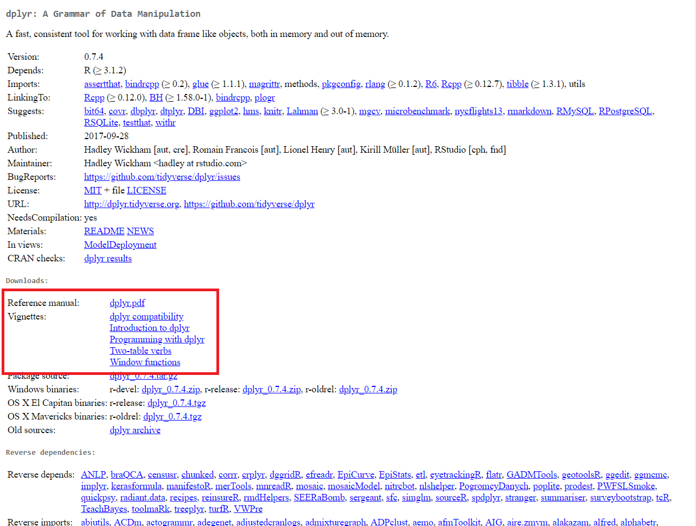


Task Views
========================================================
* A Task View offers a brief introduction to a particular topic and an annotated list of relevant R packages 
* CRAN has tasks views on a selection of topics, including:
    * [Machine learning & Statistical Learning](https://cran.r-project.org/web/views/MachineLearning.html)
    * [Multivariate Statistics](https://cran.r-project.org/web/views/Multivariate.html)
    * [Official Statistics & Survey Methodology](https://cran.r-project.org/web/views/OfficialStatistics.html)
    * [Statistics for the Social Sciences](https://cran.r-project.org/web/views/SocialSciences.html)
    * [Survival Analysis](https://cran.r-project.org/web/views/Survival.html)
    * [Time Series Analysis ](https://cran.r-project.org/web/views/TimeSeries.html)


========================================================
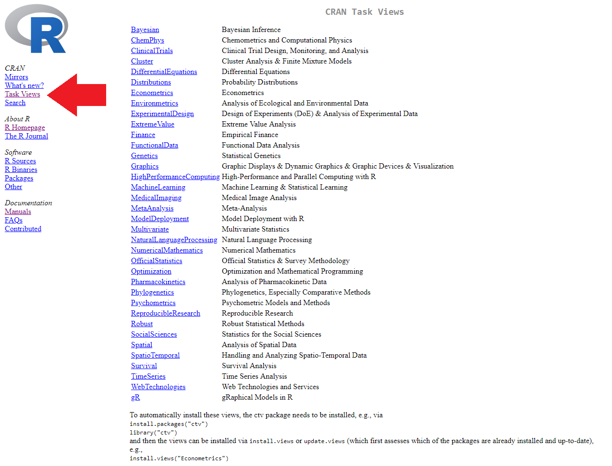


Package pages
========================================================
* Each contributed package that is listed on CRAN has a page
* A reference manual and vignettes can be found on the CRAN package page
* To directly get to the package page, try on your broswer:
    * "https://cran.project.org/package=[package-name]"
    * Replace [package-name] with any existing package name


========================================================
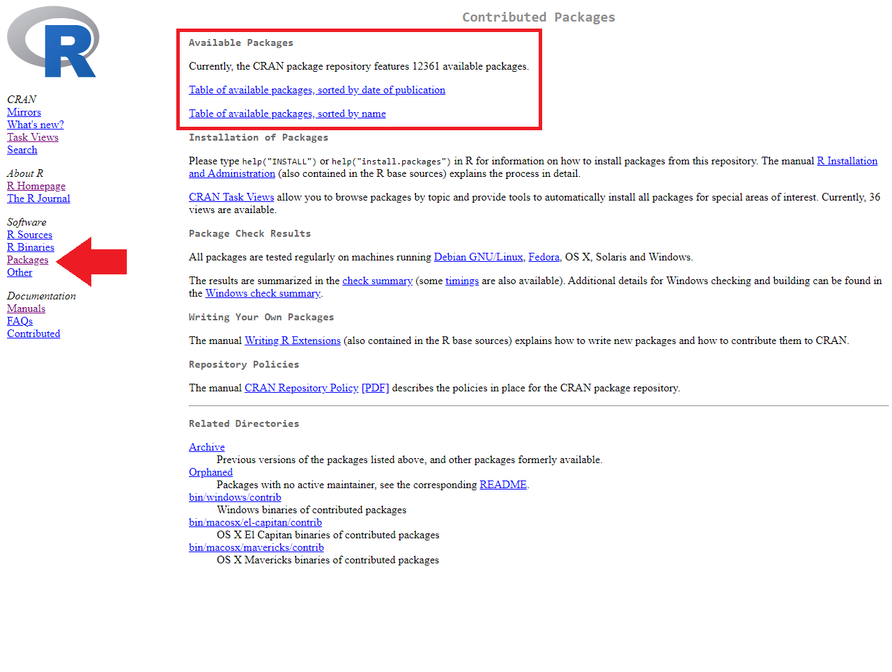


========================================================
**CRAN package page example (`dplyr`)**
<br><br>
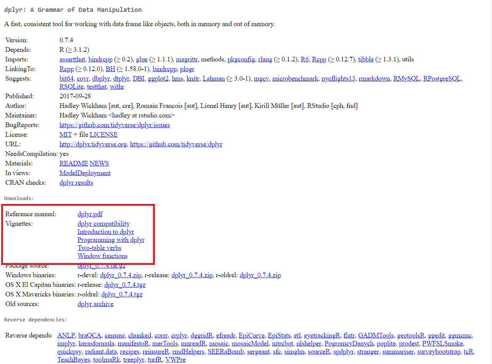


Pacakge reference manuals
========================================================
* Packages have reference manuals that contain documentation for all its contents (i.e. functions and datasets)
    * Basically, it is a collection of `help()` documentations in a pdf format
* Reference manual can also be found by googling
    * Try "package-name pdf" as your search term


Pacakge vignettes
========================================================
* Packages often have vignettes to introduce its contents
    * Some vignettes can be accessed via `vignette("package")` on console
    * Other vignettes are found on the pacakge page on CRAN
* Unfortunately, not all packages have vignettes.


RStudio website
========================================================
* RStudio's [website](https://www.rstudio.com/) offer many useful resources under "Resources" menu, including the following:
    * [Cheet sheets page](https://www.rstudio.com/resources/cheatsheets/) has download links to over 30 "cheat sheets" on R and R packages in the PDF format.
    * [Webinar & videos page](https://www.rstudio.com/resources/webinars/)


========================================================
<a href="https://www.rstudio.com/" target="_blank">
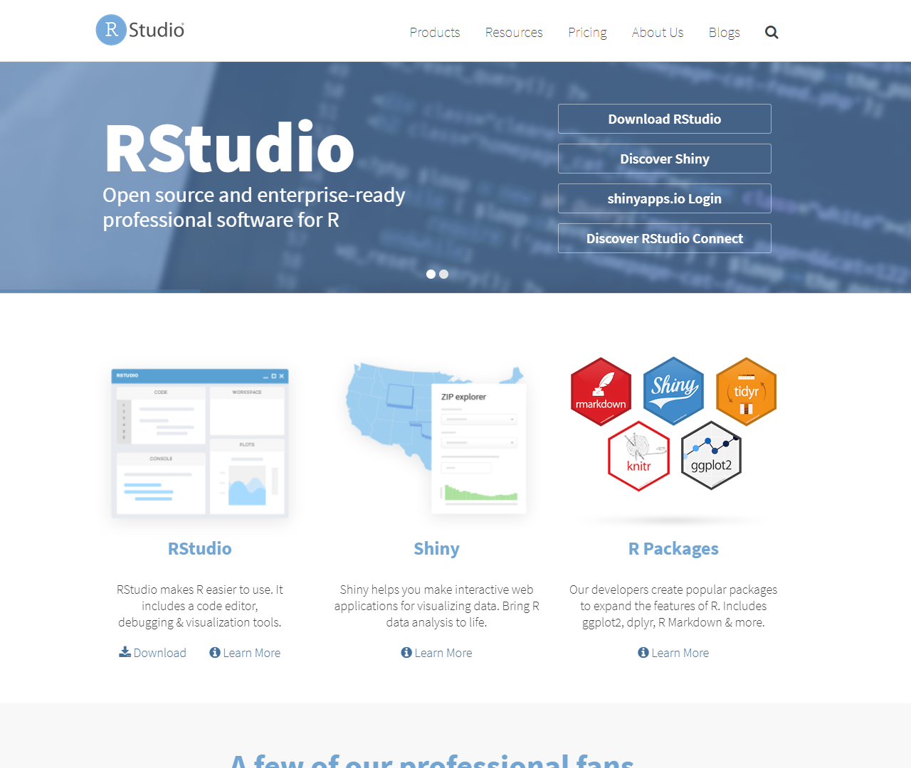
</a>


Cheet sheets
========================================================
* Currently, 13 RStudio cheat sheets are available, including:
    * "Data Transformation with dplyr"
    * "Data Import"
    * "Data Visualization with ggplot2"
    * "Date and times with lubridate"
    * "Work with strings with stringr"
* Currently, there are 15 user-made cheat sheats as well
* Some cheat sheats can also be found in RStudio IDE menu
    * "Help > Cheatsheets"


========================================================
<a href="https://www.rstudio.com/resources/cheatsheets/" target="_blank">
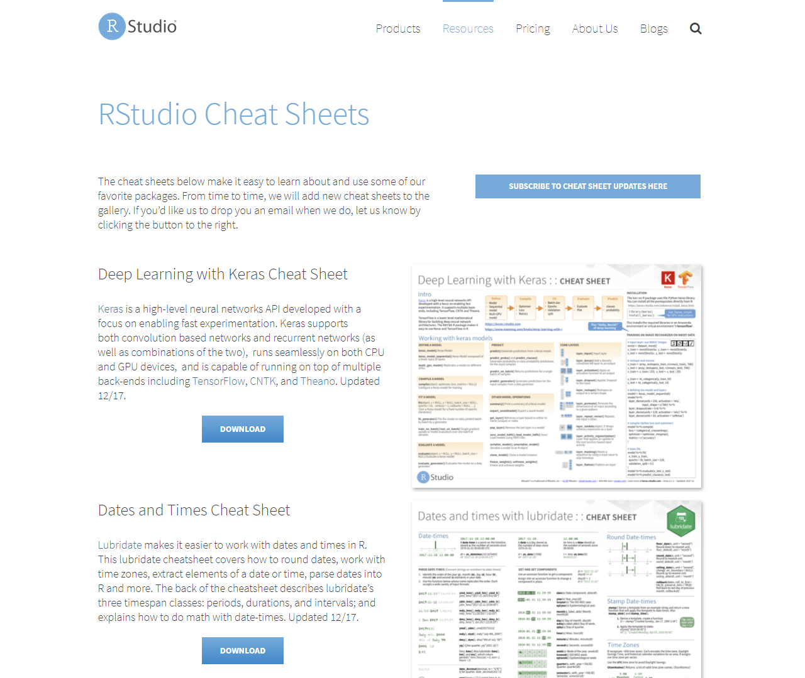
</a>


========================================================
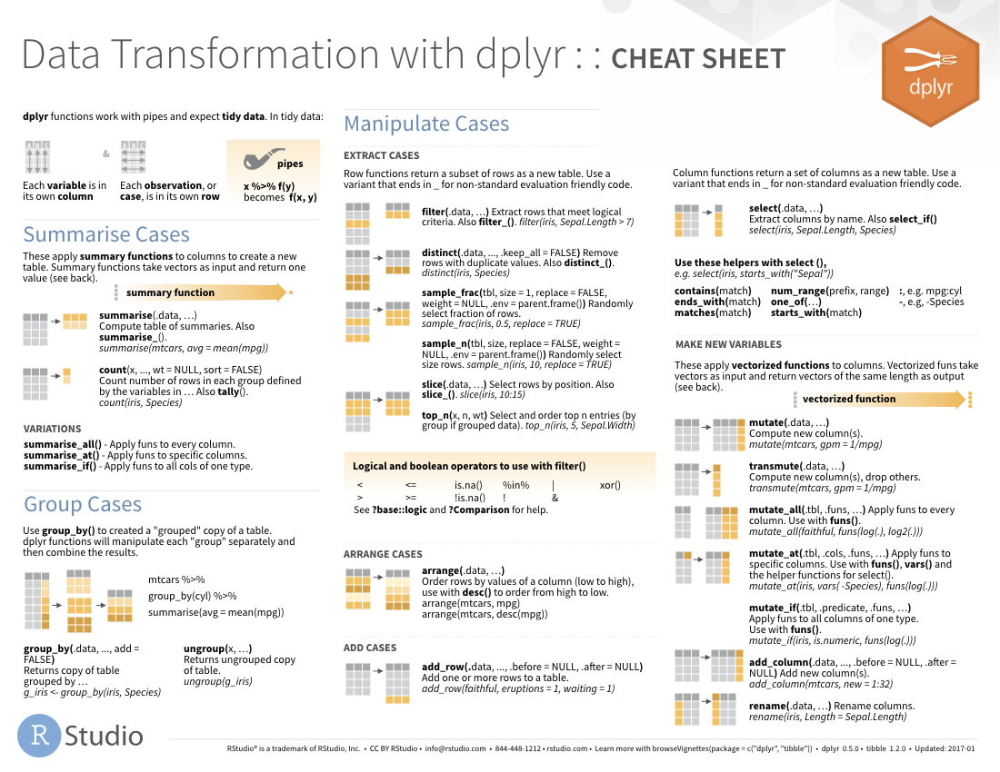


Webinar & videos
========================================================
* RStudio's webinars and videos offer materials covering a variety of subjects.
* Some materials are organized by topics, including:
    * "RStudio Essentials"
    * "Shiny Essentials" and "Advanced Shiny"
        * Some videos here are also available via Shiny website
    * "The Essentials of Data Science"
    * "Advanced Data Science"
* Materials from RStudio's annual conference, `rstudio::conf`, are also made available.


========================================================
<a href="https://www.rstudio.com/resources/webinars/" target="_blank">
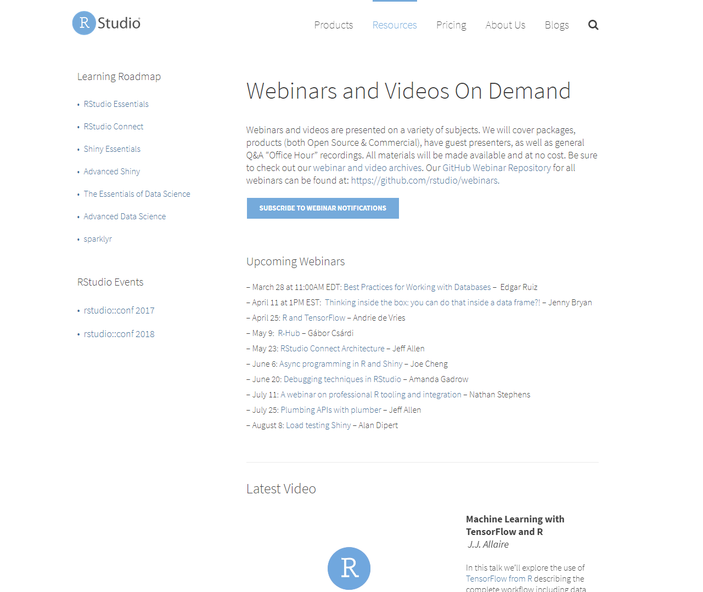
</a>


Tidyverse website
========================================================
* Tidyverse has its own [website](https://www.tidyverse.org/) to
    * introduce tidyverse packages
    * share updates and news on tidyverse, and
    * offer guides to training matarials
* There are also child websites for many of tidyverse packages
    * URL: "[package-name].tidyverse.org"


========================================================
<a href="https://www.tidyverse.org/" target="_blank">
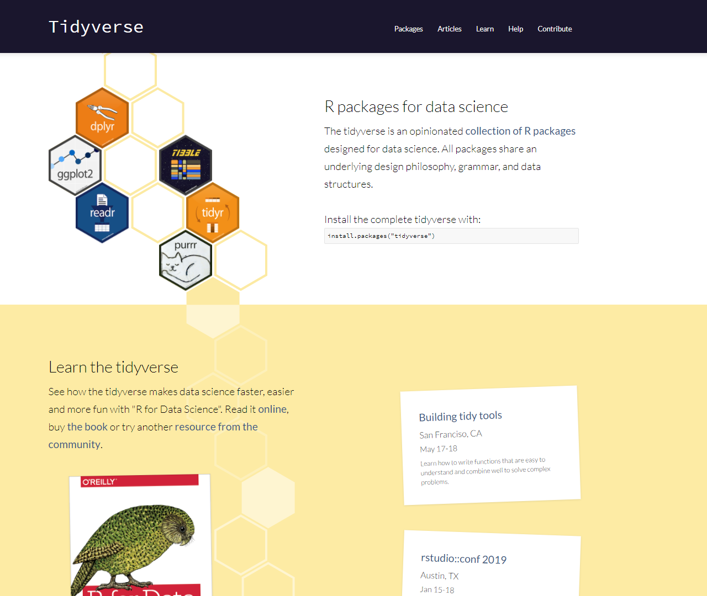
</a>


========================================================

|Pacakge     |Description                   |URL                             |
|:-----------|:-----------------------------|:-------------------------------|
|`ggplot2`   |For data visualization        |http://ggplot2.tidyverse.org/   |
|`dplyr`     |For data manpulation          |http://dplyr.tidyverse.org/     |
|`tidyr`     |For tidying up data           |http://tidyr.tidyverse.org/     |
|`readr`     |For data implort/export       |http://readr.tidyverse.org/     |
|`purrr`     |For better loops              |http://purrr.tidyverse.org/     |
|`tibble`    |For extending `data.frame`    |http://tibble.tidyverse.org/    |
|`stringr`   |For working with strings      |http://stringr.tidyverse.org/   |
|`forcats`   |For working with factors      |http://forcats.tidyverse.org/   |
|`readxl`    |For importing Excel files     |http://readxl.tidyverse.org/    |
|`haven`     |For SPSS, SAS, and Stata data |http://haven.tidyverse.org/     |
|`lubridate` |For working with datetimes    |http://lubridate.tidyverse.org/ |
|`magrittr   |For specialized pipe oprators |http://magrittr.tidyverse.org/  |


R Markdown website
========================================================
* RStudio has a separate [website](https://rmarkdown.rstudio.com/) focused on all things R Markdown. 
    * [Articles page](https://rmarkdown.rstudio.com/articles.html) offers a number of tutorials on creating various sorts of R Markdown documents
    * [Formats page](https://rmarkdown.rstudio.com/formats.html) provides links to reference matarials on various R Markdown formats and templates


========================================================
<a href="https://rmarkdown.rstudio.com" target="_blank">
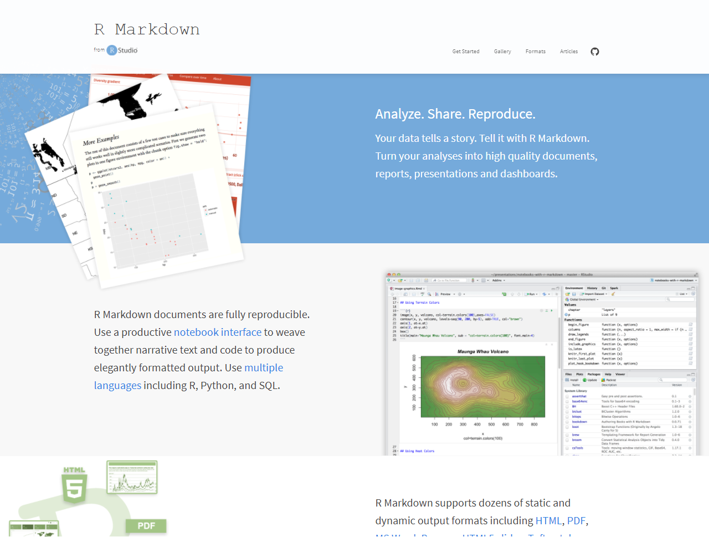
</a>


Shiny website
========================================================
* RStudio also has a separate [website](https://shiny.rstudio.com/) on everything Shiny
  * [Video & wrttien tutorial page](https://shiny.rstudio.com/tutorial/) has links to tutorial videos and articles on Shiny as well as recorded conference presentations and webinars   
  * [Articles page](https://shiny.rstudio.com/articles/) offers a list of web articles on building Shiny applications
  * [Reference page](https://shiny.rstudio.com/reference/shiny/) contains links to upgrade notes and function references for lastest as well as previous versions of the Shiny package


========================================================
<a href="https://shiny.rstudio.com/" target="_blank">
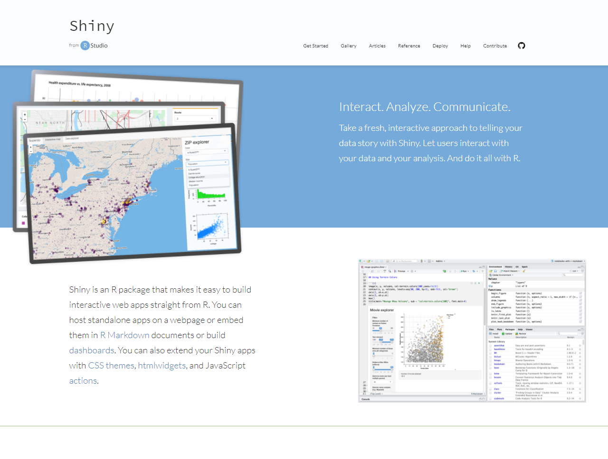
</a>


htmlwidgets website
========================================================
* *`htmlwidgets` for R* [website](http://www.htmlwidgets.org/) presents brief descriptions and examples for various packages for incorporating interactive widgets into R ecosystem
    * Currently ~100 widgets are registered
        * See its ["Gallery" page](http://gallery.htmlwidgets.org/)
    * Popular `htmlwidgets` packages include:
        * `plotly` and `highcharter` for interactive visualizations
        * `leaflet` for interactive maps
        * `DT` for interactive data tables
        

========================================================
<a href="http://www.htmlwidgets.org/" target="_blank">
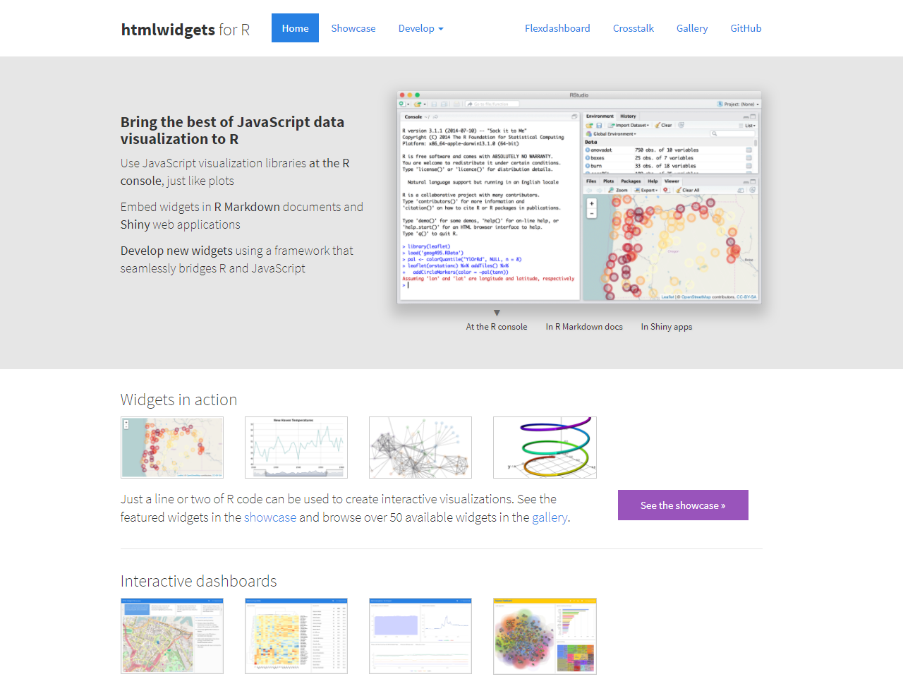
</a>


========================================================
<a href="http://gallery.htmlwidgets.org/" target="_blank">
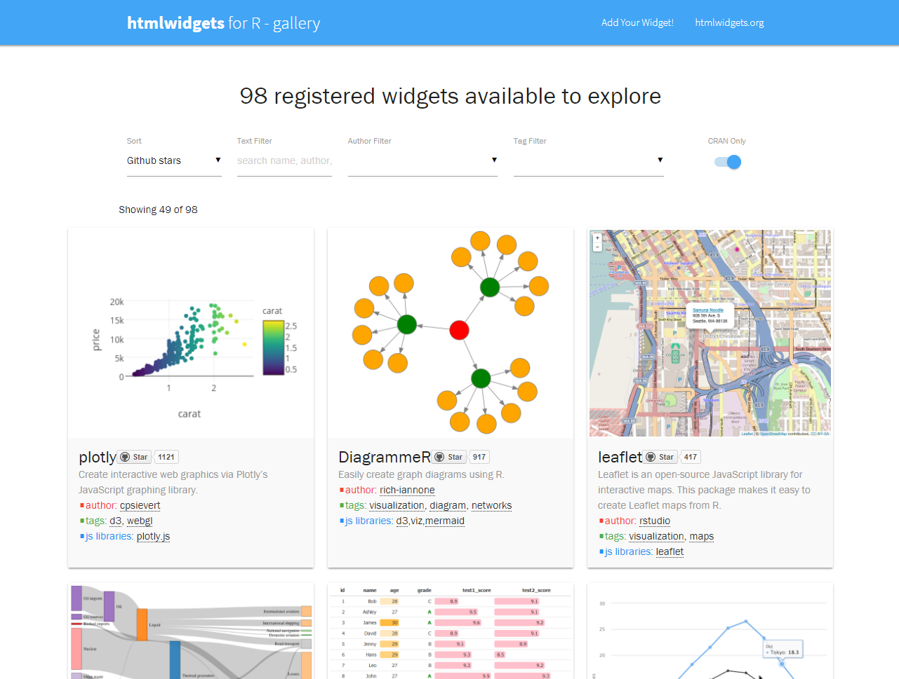
</a>


R Community
========================================================
type:section

<p style="font-size:0.5em; text-align:center; color: #777;">
Source: <a href="https://en.wikipedia.org/wiki/Community_(TV_series)" target="_blank">"Community (TV series)", Wikipedia</a>
</p>


R-bloggers
========================================================
* [*R-bloggers*](https://www.r-bloggers.com/) is a blog that collects and features articles and blog posts on R and programming in R from a variety of sources.
* The blog offers an excellent way to stay up-to-date on new packages and developments in the R community.
* Its posts cover new updates in R and major R packages, tutorials, information on upcoming events and conferences, and much more.


========================================================
<a href="https://www.r-bloggers.com/" target="_blank">
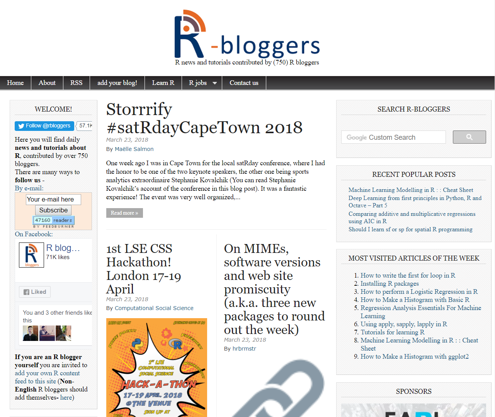
</a>


Online "books"
========================================================
* Healy, K. (2018). [*Data Visualization: A practical introduction*](http://socviz.co/index.html).
* Grolemund, G. and Wickham, H. (2017). [*R for Data Science*](http://r4ds.had.co.nz/).
* Lovelace, R. et al. (2018). [*Geocomputation in R*](https://bookdown.org/robinlovelace/geocompr/).
* Wickham, H. (2017). [*Advanced R*](http://adv-r.had.co.nz/).
* Wilke, C. (n.d.). [*Fundamentals of Data Visualization*](http://serialmentor.com/dataviz/).

Visit the `bookdown` package [website](https://bookdown.org/) to find many more free online books on R!


========================================================
**R for Data Science**
<br><br>

<p style="font-size:0.5em; text-align:center; color: #777;">
Source: <a href="http://r4ds.had.co.nz/" target="_blank">R for Data Science</a>
</p>


Helpful websites
========================================================
* Kabacoff, R. [*Quick-R*](https://www.statmethods.net/index.html).
* Prahbhakaran, S. [*r-statistics.co*](http://r-statistics.co/).
* U of Cincinnati. [*UC Business Analytics R Programming Guide*](http://uc-r.github.io/).
* Wollschlaeger, D. [*R Examples Repository*](http://dwoll.de/rexrepos/index.html).
* Yau, C. [*R Tutorial*](http://www.r-tutor.com/).

And, of course, this workshop's [website](bobaekang.github.io/icjia-r-workshop) :)


GitHub repositories
========================================================
type:section

<p style="font-size:0.5em; text-align:center; color: #777;">
Source: <a href="https://github.com/logos">GitHub</a>
</p>


What is GitHub?
========================================================
> "GitHub is a development platform inspired by the way you work. From open source to business, you can host and review code, manage projects, and build software alongside millions of other developers." - GitHub.com

* Most R packages are available as GitHub repositories, which can be "cloned" and downloaded if wanted.
* Many R package authors offer brief explanations and even quick tutorials for their packages on the GitHub repositories.


========================================================
**Github repository example (`dplyr`)**
<br><br>
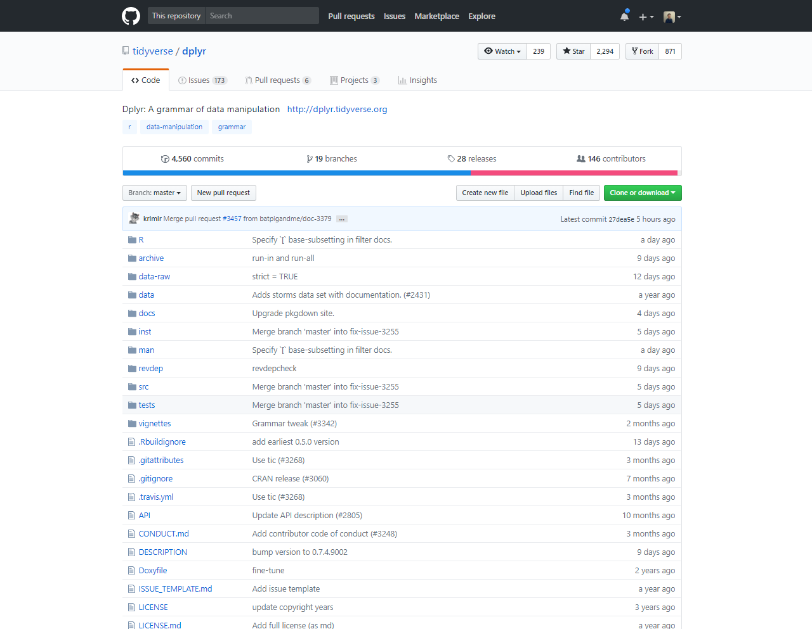


========================================================
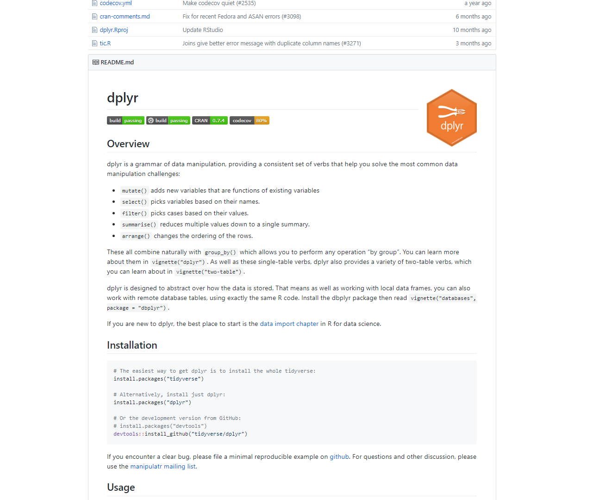


Online courses
========================================================
type:section

<p style="font-size:0.5em; text-align:center; color: #777;">
Source: <a href="http://worldview.stanford.edu/blog/edtech-2013" target="_blank">worldview.stanford.edu</a>
</p>


Popular sites
========================================================
* [DataCamp](https://www.datacamp.com/)
* [Coursera](https://www.coursera.org/)
* [edX](https://www.edx.org/)


DataCamp
========================================================
* Requires registration and log-in
* Some free courses are available, but most are paid courses with one free chapter
* Cost is $25/month with the annual plan or $29/month
    * Onces subscribed, all courses become available
* Offers 70+ courses on R
    * Each course is short (~4 hours) and focused on a specific topic
    * Ranging from basic to intermediate level


Coursera
========================================================
* Requires registration and log-in
* Offers courses, specializations and online degrees
    * Find out more about different options [here](https://about.coursera.org/)
* You can "audit" a course for free
    * Course Certificate and online support are available for a fee ($29-$99) 
* Notable contents
  * Data Science Specialization (10 courses)
  * Statistics with R Specialization (5 courses)


edX
========================================================
* Requires registration and log-in
* Courses are free and mostly self-paced
    * edX offer [verified certificate](https://www.edx.org/verified-certificate/) for individual courses and [XSeries certificate](https://www.edx.org/xseries/) for XSeries programs for a small fee
* Courses are usually organized in a college-course like format
* Perhaps better for learning basics on topics like:
    * Computer science and programming
    * Probability and statistics


Questions?
========================================================
type: section

<p style="font-size:0.5em; text-align:center; color: #777;">
Source: <a href="https://giphy.com/gifs/cheezburger-critters-flamingos-12mPcp41D9a1i0" target="_blank">Giphy</a>
</p>


========================================================
References
<ul style="font-size: 0.6em; list-style-type:none">
  <li>Soltoff, B. (n.d.). <a href="http://cfss.uchicago.edu" target="_blank"><i>Computing for Social Sciences</i></a>.</li>
</ul>


Wrapping up
========================================================
type: section


What's next (for you)?
========================================================
* Start using R for your work
    * Use the available workshop materials as a guide
* Start reading *R for Data Science* book
* Learn HTML/CSS for fully customizing your R Markdown documents and more
* Come talk to me if you need:
    * Help on your R code (Remember "the 15 minutes rule"!)
    * Recommendations for study materials


What's next (for this workshop)?
========================================================
* Video lectures for workshop modules
* A "Resources" page on the website
* Update the `icjiar` package
* Short articles on specific topics, such as:
    * Connecting to SQL server on RStudio
    * Git and GitHub for version control and collaboration
    * Using "Chrome DevTools" to inspect HTML documents
    * ... any suggestions?
* Regular ICJIA R user meeting?

Now let's get to it!
========================================================
type: section

<p style="font-size:0.5em; text-align:center; color: #777;">
Source: <a href="https://giphy.com/gifs/JIX9t2j0ZTN9S" target="_blank">Giphy</a>
</p>


========================================================

<p style="font-size:0.5em; text-align:center; color: #777;">
Source: <a href="https://giphy.com/gifs/reaction-friends-ehfWmij1MrqjS" target="_blank">Giphy</a>
</p>
