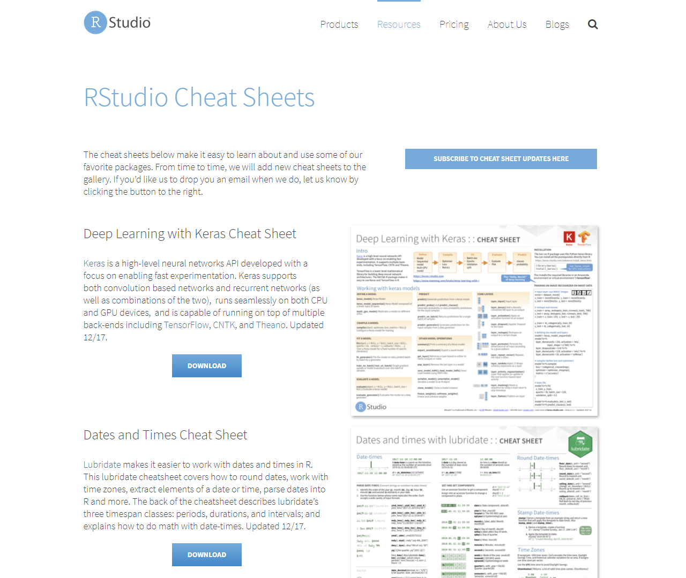

# template elements
<div class="header"></div>
<div class="footer"></div>
</img>
</img>
<div class="buttons">
<a href="../index.html">
  <button type="button">Home</button>
</a>
<a href="../modules.html">
  <button type="button">Modules</button>
</a>
<a href="../notes/module6_notes2.html">
  <button type="button">Notes</button>
</a>
</div>
<link href="https://fonts.googleapis.com/css?family=Oswald" rel="stylesheet">


# presentation
R Workshop
========================================================
type: slide-body
css: ../css/style_slides.css
<h3 style="color: #789">Module 6: "To Infinity and Beyond" (2)</h3>  
2018-04-18  
Bobae Kang  
<small>(Bobae.Kang@illinois.gov)</small>  


Agenda
========================================================
<div style="text-align:center; margin-top:10%;">
<ul style="list-style: none">
<li>
  Part 1: Sharing your work</li>
<li style="color: #00061a; font-size: 1.1em; font-weight:700">
  Part 2: Leveraging online resources</li>
</div>


Why online resources?
========================================================
* We cannot know everything.
* In fact, no one knows everything!
* "Someone has already done it."

<p style="font-size:0.5em; text-align:center; color: #777;">
Source: <a href="http://www.azquotes.com/quote/1463403">AZ Quotes</a>
</p>


Before going online
========================================================
type:section

<p style="font-size:0.5em; text-align:center; color: #777;">
Source: <a href="https://commons.wikimedia.org/wiki/File:Wireless-icon.svg">Wikimedia Commons</a>
</p>


"The 15 minute rule"
========================================================
* First, try yourself. If you cannot solve it, *then* go online.

<blockquote class="twitter-tweet" data-lang="en"><p lang="en" dir="ltr">15 min rule: when stuck, you HAVE to try on your own for 15 min; after 15 min, you HAVE to ask for help.- Brain AMA <a href="https://t.co/MS7FnjXoGH">pic.twitter.com/MS7FnjXoGH</a></p>&mdash; Rachel Thomas (@math_rachel) <a href="https://twitter.com/math_rachel/status/764931533383749632?ref_src=twsrc%5Etfw">August 14, 2016</a></blockquote>
<script async src="https://platform.twitter.com/widgets.js" charset="utf-8"></script>


"Oops, my bad"
========================================================
* We all make typos. Check for typos!
    * RStudio does not check for typos automatically
    * But we can refer to an error caused by the typos
* Check if a package is loaded before using its functions
    * `Error in some_function() : could not find function "some_function"`


Help function
========================================================

```r
# these are equivalent
?some_function
help(some_function)
```
* Looking ino the documentation is often the best way to understand what a function is and how to use it.
* Using the `?` followed by the function name or `help()` brings out the documentation if available


Error messages and debugging
========================================================
* When an error is thrown, it comes with an error message
* Error messages often have rich information about what went wrong and where it went wrong
* If we are working with custom functions we defined, RStudio's debugging tools can help us to spot the source of an error in the script and debug it
    * See [this article](https://support.rstudio.com/hc/en-us/articles/200713843) on debugging with RStudio
    * See [this video](https://vimeo.com/99375765) by RStudio on introduction to debugging


Google
========================================================
type:section

<p style="font-size:0.5em; text-align:center; color: #777;">
Source: <a href="https://www.google.com/about/products/">Google.com</a>
</p>


How to google for questions
========================================================
* Be specific and succint
    * The search term should be a set of keywords
    * Using the relevant error message as a serach term can help


"Official" resources
========================================================
type:section

<p style="font-size:0.5em; text-align:center; color: #777;">
Source: <a href="https://www.r-project.org/logo/">R Project</a>
</p>

CRAN
========================================================
* The Comprehensive R Archive Network (CRAN)
    * Manuals page
    * Task Views page
    * Packages page


Manuals
========================================================
* CRAN offers the following manuals:
    * ["An Introduction to R"](https://cran.r-project.org/doc/manuals/R-intro.html)
    * ["R Data Import/Export"](https://cran.r-project.org/doc/manuals/R-data.html)
    * ["R Installation and Administration"](https://cran.r-project.org/doc/manuals/R-admin.html)
    * ["Writing R Extensions"](https://cran.r-project.org/doc/manuals/R-exts.html)
    * ["The R language definition"](https://cran.r-project.org/doc/manuals/R-lang.html) (draft)
    * ["R Internals"](https://cran.r-project.org/doc/manuals/R-ints.html)


========================================================


Task Views
========================================================
* A Task View offers a brief introduction to a particular topic and an annotated list of relevant R packages 
* CRAN has tasks views on a selection of topics, including:
    * [Machine learning & Statistical Learning](https://cran.r-project.org/web/views/MachineLearning.html)
    * [Multivariate Statistics](https://cran.r-project.org/web/views/Multivariate.html)
    * [Official Statistics & Survey Methodology](https://cran.r-project.org/web/views/OfficialStatistics.html)
    * [Statistics for the Social Sciences](https://cran.r-project.org/web/views/SocialSciences.html)
    * [Survival Analysis](https://cran.r-project.org/web/views/Survival.html)
    * [Time Series Analysis ](https://cran.r-project.org/web/views/TimeSeries.html)


========================================================


Packages
========================================================
* Each contributed package that is listed on CRAN has a page
* A reference manual and vignettes can be found on the CRAN package page
* To directly get to the package page, try on your broswer:
    * "https://cran.project.org/package=[package-name]"
    * Replace [package-name] with any existing package name


========================================================


========================================================
**CRAN package page example (`dplyr`)**
<br><br>


Pacakge reference manuals
========================================================
* Packages have reference manuals that contain documentation for all its contents (i.e. functions and datasets)
    * Basically, it is a collection of `help()` documentations in a pdf format
* Reference manual can also be found by googling
    * Try "package-name pdf" as your search term


Pacakge vignettes
========================================================
* Packages often have vignettes to introduce its contents
    * Some vignettes can be accessed via `vignette("package")` on console
    * Other vignettes are found on the pacakge page on CRAN
* Unfortunately, not all packages have vignettes.


R Studio website
========================================================
* https://www.rstudio.com/
    * Cheet sheets [page](https://www.rstudio.com/resources/cheatsheets/)
    * Webinar & videos [page](https://www.rstudio.com/resources/webinars/)


========================================================
<a href="https://www.rstudio.com/">

</a>


Cheet sheets
========================================================
* Currently, 13 RStudio cheat sheets are available, including:
    * "Data Transformation with dplyr"
    * "Data Import"
    * "Data Visualization with ggplot2"
    * "Date and times with lubridate"
    * "Work with strings with stringr"
* Currently, there are 15 user-made cheat sheats as well
* Some cheat sheats can also be found in RStudio IDE menu
    * "Help > Cheatsheets"


========================================================
<a href="https://www.rstudio.com/resources/cheatsheets/">

</a>


========================================================


Webinar & vidoes
========================================================


Tidyverse website
========================================================
* https://www.tidyverse.org/


========================================================
<a href="https://www.tidyverse.org/">

</a>


R Markdown website
========================================================
* [Articles](https://rmarkdown.rstudio.com/articles.html)


========================================================
<a href="https://rmarkdown.rstudio.com">

</a>


Shiny website
========================================================
* https://shiny.rstudio.com/tutorial/
  * Video & wrttien tutorial [page](https://shiny.rstudio.com/tutorial/)
  * Articles [page](https://shiny.rstudio.com/articles/)
  * Reference [page](https://shiny.rstudio.com/reference/shiny/)


========================================================
<a href="https://shiny.rstudio.com/">

</a>


htmlwidgets website
========================================================
* http://www.htmlwidgets.org/


========================================================
<a href="http://www.htmlwidgets.org/">

</a>


Community support
========================================================
type:section


R-bloggers
========================================================
* https://www.r-bloggers.com/


========================================================
<a href="https://www.r-bloggers.com/">

</a>


Online "books"
========================================================
* Wickham H. and Grolemund G., [*R for Data Science*](http://r4ds.had.co.nz/)
* Wickham H., [*Advanced R*](http://adv-r.had.co.nz/)
* Wickham H., [*R Packages*](http://r-pkgs.had.co.nz/)
* U of Cincinnati, [*UC Business Analytics R Programming Guide*](http://uc-r.github.io/)
* Wikibooks, [*R Programming*](https://en.wikibooks.org/wiki/R_Programming)


R for Data Science
========================================================

<p style="font-size:0.5em; text-align:center; color: #777;">
Source: <a href="http://r4ds.had.co.nz/">R for Data Science</a>
</p>


UC R Programming Guide
========================================================


Notable websites
========================================================
* Yau, C. [*R Tutorial*](http://www.r-tutor.com/)
* Kabacoff, R. [*Quick-R*](https://www.statmethods.net/index.html)


GitHub repositories
========================================================
type:section

<p style="font-size:0.5em; text-align:center; color: #777;">
Source: <a href="https://github.com/logos">GitHub</a>
</p>


What is GitHub?
========================================================
> "GitHub is a development platform inspired by the way you work. From open source to business, you can host and review code, manage projects, and build software alongside millions of other developers." - GitHub.com

* Most R packages are available as GitHub repositories, which can be "cloned" and downloaded if wanted.
* Many R package authors offer brief explanations and even quick tutorials for their packages on the GitHub repositories.


Online courses
========================================================
type:section

<p style="font-size:0.5em; text-align:center; color: #777;">
Source: <a href="http://worldview.stanford.edu/blog/edtech-2013">worldview.stanford.edu</a>
</p>


Popular sites
========================================================
* [DataCamp](https://www.datacamp.com/)
* [Coursera](https://www.coursera.org/)
* [edX](https://www.edx.org/)
* [Udacity](https://www.udacity.com/)


Datacamp
========================================================
* Requires registration and log-in
* Some free courses are available, but most are paid courses with one free chapter
* Cost is $25/month with the annual plan or $29/month
    * Onces subscribed, all courses become available
* Offers 70+ courses on R
    * Each course is short (~4 hours) and focused on a specific topic
    * Ranging from basic to intermediate level


Coursera
========================================================
* Requires registration and log-in
* You can "audit" the course for free
    * Certification for course completion and online support become available onces you purchase the course 
* Notable contents
  * Data Science Specialization (10 courses)
  * Statistics with R Specialization (5 courses)


edX
========================================================


Udacity
========================================================


Questions?
========================================================
type: section

<p style="font-size:0.5em; text-align:center; color: #777;">
Source: <a href=""></a>
</p>


========================================================
References
<ul style="font-size: 0.6em; list-style-type:none">
  <li>Soltoff, B. (n.d.). <a href="http://cfss.uchicago.edu"><i>Computing for Social Sciences</i></a></li>
  <li><a href="#"></a></li>
</ul>
