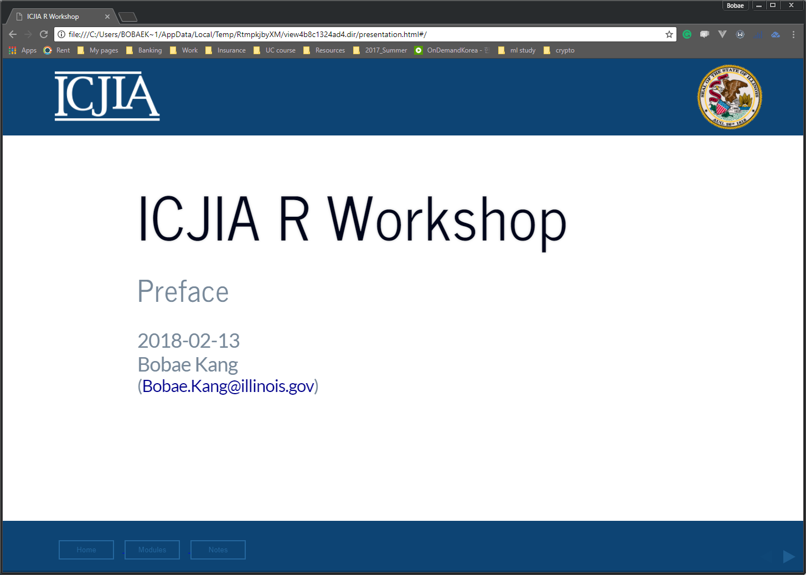
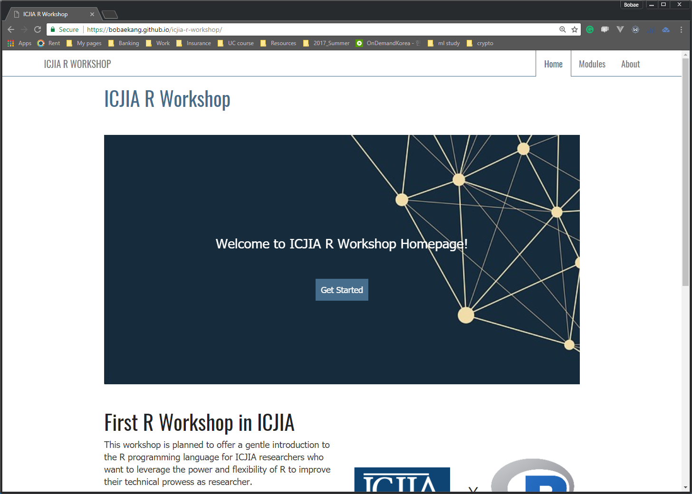

# template elements
<div class="header"></div>
<div class="footer"></div>
</img>
</img>
<div class="buttons">
<a href="../index.html">
  <button type="button">Home</button>
</a>
<a href="../modules.html">
  <button type="button">Modules</button>
</a>
<a href="#">
  <button type="button">Notes</button>
</a>
</div>

# presentation
ICJIA R Workshop
========================================================
type: slide-body
css: ../css/style_slides.css
<h3 style="color: #789; font-size:1.5em; font-weight:300;">Preface</h3>
2018-02-13
Bobae Kang
<small>(Bobae.Kang@illinois.gov)</small>


========================================================
type:section


========================================================

<p style="font-size:0.5em; text-align: center; color: #777;">
Source: <a href="https://pixabay.com/en/feedback-star-rating-user-rating-2800867/">Pixarbay.com</a>
</p>


A brief intro to ...
========================================================
type:section

<p style="font-size:0.5em; text-align: center; color: #777;">
Source: <a href="https://www.r-project.org/logo/">r-project.org</a>
</p>


What is R?
========================================================
> "R is a language and environment for statistical computing and graphics." - The R Foundation

* *Built for* data analysis and visualization
* One of the the most popular choices of programming language among academic researchers and data scientists


========================================================
* Open source (free!)
* Built for statistical analysis
* Reproducible and transparent
* Extensible through powerful third-party libraries
* Enabling researchers to tackle a variety of tasks using a *single* platform


========================================================

<p style="font-size:0.5em; text-align: center; color: #777;">
Source: <a href="https://timedotcom.files.wordpress.com/2013/10/13051149.jpg">Time Magazine</a>
</p>


Data manipulation
========================================================
type: section

<div style="font-size:0.5em; text-align:center; color: #777;">
Source: <a href="https://www.wikimedia.org/">Wikimedia.org</a>
</div>


========================================================


```r
# peak at the first rows of the data
head(ispcrime_tbl)
```

```
# A tibble: 6 x 12
   year county viol~ murd~  rape robb~ aggA~ prop~ burg~ larc~ MVTft arson
  <int> <fctr> <int> <int> <int> <int> <int> <int> <int> <int> <int> <int>
1  2011 Adams    218     0    37    15   166  1555   272  1241    36     6
2  2011 Alexa~   119     0    14     4   101   290    92   183    11     4
3  2011 Bond       6     1     0     0     5   211    58   147     5     1
4  2011 Boone     59     0    24     8    27   733   152   563    14     4
5  2011 Brown      7     0     1     0     6    38    14    22     1     1
6  2011 Bureau    42     0     4     3    35   505    90   405     8     2
```


========================================================

```r
# get a quick summary of each column
summary(ispcrime_tbl)
```

```
      year            county     violentCrime       murder       
 Min.   :2011   Adams    :  5   Min.   :    0   Min.   :  0.000  
 1st Qu.:2012   Alexander:  5   1st Qu.:   19   1st Qu.:  0.000  
 Median :2013   Bond     :  5   Median :   42   Median :  0.000  
 Mean   :2013   Boone    :  5   Mean   :  501   Mean   :  7.026  
 3rd Qu.:2014   Brown    :  5   3rd Qu.:  133   3rd Qu.:  1.000  
 Max.   :2015   Bureau   :  5   Max.   :33348   Max.   :566.000  
                (Other)  :480   NA's   :7       NA's   :7        
      rape            robbery          aggAssault      propertyCrime   
 Min.   :   0.00   Min.   :    0.0   Min.   :    0.0   Min.   :     0  
 1st Qu.:   1.00   1st Qu.:    0.0   1st Qu.:   15.0   1st Qu.:   133  
 Median :   6.00   Median :    2.0   Median :   33.0   Median :   349  
 Mean   :  41.29   Mean   :  172.3   Mean   :  280.4   Mean   :  2913  
 3rd Qu.:  22.00   3rd Qu.:   13.0   3rd Qu.:  102.0   3rd Qu.:  1190  
 Max.   :1986.00   Max.   :16095.0   Max.   :15129.0   Max.   :178902  
 NA's   :7         NA's   :7         NA's   :7         NA's   :7       
    burglary         larcenyTft           MVTft             arson        
 Min.   :    0.0   Min.   :     0.0   Min.   :    0.0   Min.   :   0.00  
 1st Qu.:   35.5   1st Qu.:    85.5   1st Qu.:    3.0   1st Qu.:   1.00  
 Median :   79.0   Median :   258.0   Median :   10.0   Median :   2.00  
 Mean   :  589.3   Mean   :  2084.9   Mean   :  215.2   Mean   :  23.45  
 3rd Qu.:  268.0   3rd Qu.:   852.0   3rd Qu.:   30.0   3rd Qu.:   8.50  
 Max.   :38485.0   Max.   :116145.0   Max.   :22879.0   Max.   :1418.00  
 NA's   :7         NA's   :7          NA's   :7         NA's   :7        
```


========================================================

```r
# filter to keep only counties starting with C for 2015
#   while creating and showing a new variable for total crime count
ispcrime_tbl %>%
  filter(substr(county, 1, 1) == "C", year == 2015) %>%
  mutate(totalCrime = violentCrime + propertyCrime) %>%
  select(year, county, totalCrime)
```

```
# A tibble: 12 x 3
    year county     totalCrime
   <int> <fctr>          <int>
 1  2015 Calhoun            NA
 2  2015 Carroll           176
 3  2015 Cass              154
 4  2015 Champaign        6486
 5  2015 Christian         292
 6  2015 Clark             103
 7  2015 Clay              191
 8  2015 Clinton           423
 9  2015 Coles             805
10  2015 Cook           153575
11  2015 Crawford          282
12  2015 Cumberland         42
```


========================================================

```r
# get annual average count of violent crime by county
ispcrime_tbl %>%
  group_by(county) %>%
  summarise(annualAvgCrime = sum(violentCrime, propertyCrime, na.rm = TRUE) / 5)
```

```
# A tibble: 102 x 2
   county    annualAvgCrime
   <fctr>             <dbl>
 1 Adams             1724  
 2 Alexander          385  
 3 Bond               190  
 4 Boone              426  
 5 Brown               39.0
 6 Bureau             480  
 7 Calhoun             13.8
 8 Carroll            196  
 9 Cass               109  
10 Champaign         6567  
# ... with 92 more rows
```


========================================================

```r
# merging regions data and count the number of rows by region
ispcrime_tbl %>%
  left_join(regions) %>%
  group_by(region) %>%
  count()
```

```
# A tibble: 4 x 2
# Groups: region [4]
  region       n
  <fctr>   <int>
1 Central    230
2 Cook         5
3 Northern    85
4 Southern   190
```


Data visualization
========================================================
type: section

<div style="font-size:0.5em; text-align:center; color: #777;">
Source: <a href="https://www.wikimedia.org/">Wikimedia.org</a>
</div>


========================================================


```r
# line plot of violent crime trend by region
ggplot(ispcrime_tbl2, aes(x = year, y = violentCrime, color = region)) +
  stat_summary(geom="line", fun.y="sum") +
  labs(title = "Violent crime trend by region", x = "Year", y = "Count") +
  theme_classic(base_size = 15)
```


========================================================

```r
# bar plot of violent crime mean count by region
ggplot(ispcrime_tbl2, aes(x = region, y = violentCrime, fill = region)) +
  stat_summary(geom="bar", fun.y="mean") +
  labs(title = "Violent crime count by region", x = "Region", y = "Count") +
  theme_classic(base_size = 15)
```


========================================================

```r
# histogram of violent crime count by county (excluding Cook)
ggplot(filter(ispcrime_tbl2, county != "Cook"), aes(x = violentCrime)) +
  geom_histogram(binwidth = 100) +
  facet_wrap(~ year) +
  labs(title = "Histogram of violent crime count by county per year",
       x = "Violent crime count", y = "Count") +
  theme_classic(base_size = 15)
```


Statistical modeling
========================================================
type: section

<div style="font-size:0.5em; text-align:center; color: #777;">
Source: <a href="https://pixabay.com/en/white-background-design-game-icon-2398914/">pixabay</a>
</div>


And more!
========================================================
type: section


Reports
========================================================


Slideshow
========================================================



Dashboard
========================================================
<a href="https://bobaekang.shinyapps.io/crime_data_profile_demo/">

</a>

Website
========================================================
<a href="https://bobaekang.github.io/icjia-r-workshop/">

</a>


Objectives
========================================================
type: section


Technical objectives
========================================================
* Import and manipulate tabular data files using R;
* Create simple data visualizations to extract insight from data using R;
* Perform basic statistical analysis using R;
* Generate a report on a simple data analysis task using R


Fundamental objectives
========================================================
* Understand the basic elements of the R programming language;
* Employ the programmatic approach to research and data analysis projects; and
* Leverage online resources to find solutions to specific questions on using R for a given task.


Structure
========================================================
type: section


Overall setup
========================================================
* Six modules
* One module per week
* Each module consists of two parts
    * except the first module on introduction
* All workshop materials (slides and notes) will be available
* I will be available, too,  for answering questions


Modules
========================================================
1. Introduction to R
2. R basics
3. Data analysis in R
4. Data visualization in R
5. Statistical modeling in R
6. Sharing your analysis and more


Questions?
========================================================
type: section

<div style="font-size:0.5em; text-align:center; color: #777;">
Source: <a href="http://gph.is/1Q50iOW">Giphy.com</a>
</div>
