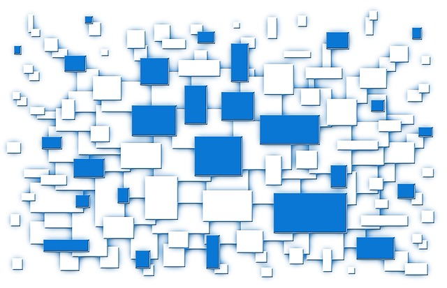

# template elements

</img>
</img>

<a href="../index.html">
  <button type="button">Home</button>
</a>
<a href="../modules.html">
  <button type="button">Modules</button>
</a>
<a href="#">
  <button type="button">Notes</button>
</a>

# presentation
ICJIA R Workshop
========================================================
type: slide-body
css: ../css/style_slides.css
<h3 style="color: #789; font-size:1.5em; font-weight:300;">Preface</h3>  
2018-02-13  
Bobae Kang  
<small>(Bobae.Kang@illinois.gov)</small>  

========================================================
type:section

========================================================

Source: <a href="https://pixabay.com/en/feedback-star-rating-user-rating-2800867/">Pixarbay.com</a>

A brief intro to ...
========================================================
type:section

Source: <a href="https://www.r-project.org/logo/">r-project.org</a>

What is R?
========================================================
> "R is a language and environment for statistical computing and graphics." - The R Foundation

* *Built for* data analysis and visualization
* One of the the most popular choices of programming language among academic researchers and data scientists

  
========================================================
* Open source (free!)
* Built for statistical analysis
* Reproducible and transparent
* Extensible through powerful third-party libraries
* Enabling researchers to tackle a variety of tasks using a *single* platform

========================================================

Source: <a href="https://timedotcom.files.wordpress.com/2013/10/13051149.jpg">Time Magazine</a>

Data manipulation
========================================================
type: section

Source: <a href="https://www.wikimedia.org/">Wikimedia.org</a>

Data visualization
========================================================
type: section

Source: <a href="https://www.wikimedia.org/">Wikimedia.org</a>

Statistical modeling
========================================================
type: section

Source: <a href="https://pixabay.com/en/white-background-design-game-icon-2398914/">pixabay</a>

And more!
========================================================
type: section

Reports
========================================================

Slideshow
========================================================

Dashboard
========================================================

Website
========================================================

Objectives
========================================================
type: section

Technical objectives
========================================================
* Import and manipulate tabular data files using R;
* Create simple data visualizations to extract insight from data using R;
* Perform basic statistical analysis using R;
* Generate a report on a simple data analysis task using R

Fundamental objectives
========================================================
* Understand the basic elements of the R programming language;
* Employ the programmatic approach to research and data analysis projects; and
* Leverage online resources to find solutions to specific questions on using R for a given task.

Structure
========================================================
type: section

Overall setup
========================================================
* Six modules
* One module per week
* Each module consists of two parts
    * except the first module on introduction
* All workshop materials (slides and notes) will be available
* I will be available, too,  for answering questions

Modules
========================================================
1. Introduction to R
2. R basics
3. Data analysis in R
4. Data visualization in R
5. Statistical modeling in R
6. Sharing your analysis and more

Questions?
========================================================
type: section

Source: <a href="http://gph.is/1Q50iOW">Giphy.com</a>

