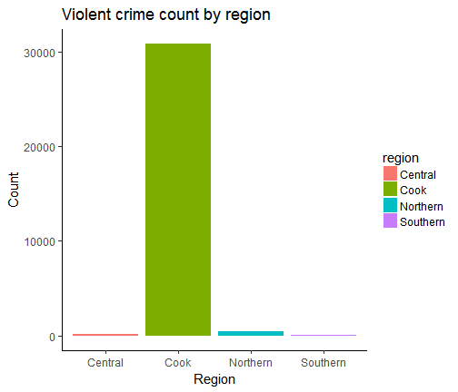
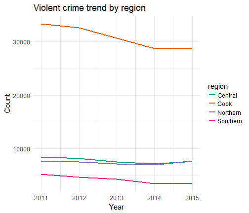
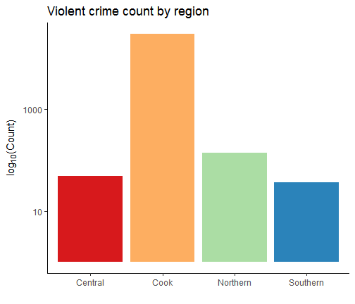
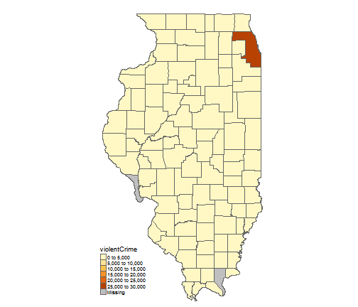

# template elements
<div class="header"></div>
<div class="footer"></div>
</img>
</img>
<div class="buttons">
<a href="../index.html">
  <button type="button">Home</button>
</a>
<a href="../modules.html">
  <button type="button">Modules</button>
</a>
<a href="../notes/presentation_notes.html">
  <button type="button">Notes</button>
</a>
</div>

# presentation
ICJIA R Workshop
========================================================
type: slide-body
css: ../css/style_slides.css
<h3 style="color: #789; font-size:1.5em; font-weight:300;">R&A Meeting Presentation</h3>
2018-02-13  
Bobae Kang  
<small>(Bobae.Kang@illinois.gov)</small>


========================================================
type:section


========================================================

<p style="font-size:0.5em; text-align: center; color: #777;">
Source: <a href="https://pixabay.com/en/feedback-star-rating-user-rating-2800867/">Pixarbay.com</a>
</p>


A brief intro to ...
========================================================
type:section

<p style="font-size:0.5em; text-align: center; color: #777;">
Source: <a href="https://www.r-project.org/logo/">r-project.org</a>
</p>


What is R?
========================================================
> "R is a language and environment for statistical computing and graphics." - The R Foundation

* *Built for* data analysis and visualization
* One of the the most popular choices of programming language among academic researchers and data scientists


========================================================
**Benefits of using R**
* Open source (free!)
* Built for statistical analysis
* Reproducible and transparent
* Extensible through powerful third-party packages
* Enabling researchers to tackle a variety of tasks using a *single* platform


========================================================

<p style="font-size:0.5em; text-align: center; color: #777;">
Source: <a href="https://timedotcom.files.wordpress.com/2013/10/13051149.jpg">Time Magazine</a>
</p>


Data manipulation
========================================================
type: section

<div style="font-size:0.5em; text-align:center; color: #777;">
Source: <a href="https://www.wikimedia.org/">Wikimedia.org</a>
</div>


========================================================


```r
# peak at the first rows of the data
head(ispcrime_tbl)
```

```
# A tibble: 6 x 12
   year county  violentCrime murder  rape robbery aggAssault propertyCrime
  <int> <fct>          <int>  <int> <int>   <int>      <int>         <int>
1  2011 Adams            218      0    37      15        166          1555
2  2011 Alexan~          119      0    14       4        101           290
3  2011 Bond               6      1     0       0          5           211
4  2011 Boone             59      0    24       8         27           733
5  2011 Brown              7      0     1       0          6            38
6  2011 Bureau            42      0     4       3         35           505
# ... with 4 more variables: burglary <int>, larcenyTft <int>,
#   MVTft <int>, arson <int>
```


========================================================

```r
# get a quick summary of violent crime and property crime
ispcrime_tbl %>%
  select(violentCrime, propertyCrime) %>%
  summary()
```

```
  violentCrime   propertyCrime   
 Min.   :    0   Min.   :     0  
 1st Qu.:   19   1st Qu.:   133  
 Median :   42   Median :   349  
 Mean   :  501   Mean   :  2913  
 3rd Qu.:  133   3rd Qu.:  1190  
 Max.   :33348   Max.   :178902  
 NA's   :7       NA's   :7       
```


========================================================

```r
# filter to keep only counties starting with C for 2015
#   while creating and showing a new variable for total crime count
ispcrime_tbl %>%
  filter(substr(county, 1, 1) == "C", year == 2015) %>%
  mutate(totalCrime = violentCrime + propertyCrime) %>%
  select(year, county, totalCrime)
```

```
# A tibble: 12 x 3
    year county     totalCrime
   <int> <fct>           <int>
 1  2015 Calhoun            NA
 2  2015 Carroll           176
 3  2015 Cass              154
 4  2015 Champaign        6486
 5  2015 Christian         292
 6  2015 Clark             103
 7  2015 Clay              191
 8  2015 Clinton           423
 9  2015 Coles             805
10  2015 Cook           153575
11  2015 Crawford          282
12  2015 Cumberland         42
```


========================================================

```r
# get annual average count of violent crime by county
ispcrime_tbl %>%
  group_by(county) %>%
  summarise(annualAvgCrime = sum(violentCrime, propertyCrime, na.rm = TRUE) / 5)
```

```
# A tibble: 102 x 2
   county    annualAvgCrime
   <fct>              <dbl>
 1 Adams             1724  
 2 Alexander          385  
 3 Bond               190  
 4 Boone              426  
 5 Brown               39.0
 6 Bureau             480  
 7 Calhoun             13.8
 8 Carroll            196  
 9 Cass               109  
10 Champaign         6567  
# ... with 92 more rows
```


========================================================

```r
# merging regions data and count the number of rows by region
ispcrime_tbl %>%
  left_join(regions) %>%
  group_by(region) %>%
  count()
```

```
# A tibble: 4 x 2
# Groups:   region [4]
  region       n
  <fct>    <int>
1 Central    230
2 Cook         5
3 Northern    85
4 Southern   190
```


Data visualization
========================================================
type: section

<div style="font-size:0.5em; text-align:center; color: #777;">
Source: <a href="https://www.wikimedia.org/">Wikimedia.org</a>
</div>


========================================================


```r
# bar plot of violent crime mean count by region
ggplot(ispcrime_tbl2, aes(x = region, y = violentCrime, fill = region)) +
  stat_summary(geom = "bar", fun.y = "mean") +
  labs(title = "Violent crime count by region", x = "Region", y = "Count") +
  theme_classic(base_size = 15)
```




========================================================

```r
# line plot of violent crime trend by region
ggplot(ispcrime_tbl2, aes(x = year, y = violentCrime, color = region)) +
  stat_summary(geom = "line", fun.y = "sum", size = 1) +
  labs(title = "Violent crime trend by region", x = "Year", y = "Count") +
  theme_minimal(base_size = 15) +
  scale_color_brewer(palette = "Dark2")
```




========================================================

```r
# histogram of violent crime count by county (excluding Cook)
ggplot(filter(ispcrime_tbl2, county != "Cook"), aes(x = violentCrime)) +
  geom_histogram(binwidth = 100) +
  facet_wrap(~ year) +
  labs(x = "Violent crime count", y = "Count") +
  theme_classic(base_size = 15)
```




========================================================

```r
# choropleth map of violent crime in 2015
qtm(counties,
  fill = "violentCrime",
  format = "World",
  frame = FALSE)
```




========================================================
**Other examples (1): Word cloud**

<div style="font-size:0.5em; text-align:center; color: #777;">
Source: <a href="http://www.r-graph-gallery.com/102-text-mining-and-wordcloud/">The R Graph Gallery</a>
</div>


========================================================
**Other examples (2): Parallel plot**

<div style="font-size:0.5em; text-align:center; color: #777;">
Source: <a href="">The R Graph Gallery</a>
</div>


========================================================
**Other examples (3): Network graph**

<div style="font-size:0.5em; text-align:center; color: #777;">
Source: <a href="https://cran.r-project.org/web/packages/ggCompNet/vignettes/examples-from-paper.html">The Comprehensive R Archive Network</a>
</div>


Statistical modeling
========================================================
type: section

<div style="font-size:0.5em; text-align:center; color: #777;">
Source: <a href="https://pixabay.com/en/white-background-design-game-icon-2398914/">pixabay</a>
</div>


========================================================
**Example - Simple linear model**

```r
lm_fit <- lm(violentCrime ~ propertyCrime, ispcrime)
summary(lm_fit)
```

```

Call:
lm(formula = violentCrime ~ propertyCrime, data = ispcrime)

Residuals:
    Min      1Q  Median      3Q     Max 
-2239.5    -2.2    57.0    78.3  3992.9 

Coefficients:
                Estimate Std. Error t value Pr(>|t|)    
(Intercept)   -79.768287  16.496961  -4.835 1.77e-06 ***
propertyCrime   0.199367   0.001059 188.303  < 2e-16 ***
---
Signif. codes:  0 '***' 0.001 '**' 0.01 '*' 0.05 '.' 0.1 ' ' 1

Residual standard error: 363.5 on 501 degrees of freedom
  (7 observations deleted due to missingness)
Multiple R-squared:  0.9861,	Adjusted R-squared:  0.986 
F-statistic: 3.546e+04 on 1 and 501 DF,  p-value: < 2.2e-16
```


========================================================


```r
# put model fit results in a data frame format
tidy(lm_fit)
```

```
           term    estimate   std.error  statistic      p.value
1   (Intercept) -79.7682868 16.49696109  -4.835332 1.771126e-06
2 propertyCrime   0.1993675  0.00105876 188.302852 0.000000e+00
```


========================================================

```r
# get predictions and residuals for each data point
ispcrime %>%
  select(year, county, propertyCrime, violentCrime) %>%
  add_predictions(lm_fit) %>%
  add_residuals(lm_fit) %>%
  head()
```

```
  year    county propertyCrime violentCrime      pred      resid
1 2011     Adams          1555          218 230.24816 -12.248156
2 2011 Alexander           290          119 -21.95172 140.951715
3 2011      Bond           211            6 -37.70175  43.701747
4 2011     Boone           733           59  66.36808  -7.368081
5 2011     Brown            38            7 -72.19232  79.192322
6 2011    Bureau           505           42  20.91229  21.087706
```


========================================================

```r
# plot the model fit
plot(violentCrime ~ propertyCrime, ispcrime)
abline(lm_fit)
```


========================================================

```r
# show diagnostic plots
par(mfrow=c(2, 2))
plot(lm_fit)
```


========================================================
**Generalized linear models**

```r
# examples of generalized linear models with glm()
logistic_reg <- glm(binary ~ x1 + x2, data = mydata, family = binomial())
poisson_reg <- glm(count ~ x1 + x2, data = mydata, family = poisson())
gamma_reg <- glm(y ~ x1 + x2, data = mydata, family = Gamma())
```

**Other advanced models**
<small>
* time series models (e.g. `stats` and `forecast` packages)
* spatial regression models (e.g. `spdep` and `spgwr` packages)
* survival analysis (e.g. `survival` package)
* network analysis (e.g. `network` and `igraph` packages)
* text analysis (e.g. `tm` and `tidytext` packages)
* machine learning (e.g. `caret` and `mlr` packages)
</small>


And more!
========================================================
type: section


Reports
========================================================
* HTML documents for web publishing
    * create interactive workflow using R Notebook
    * add interactive elements using `htmlwidgets` and/or `shiny`
* PDF documents for printing
* MS Word documents


========================================================
**Example - R Notebook**


Slideshow
========================================================


Dashboard
========================================================
<a href="https://bobaekang.shinyapps.io/crime_data_profile_demo/">

</a>


Website
========================================================
<a href="../index.html">

</a>


Objectives
========================================================
type: section


Technical objectives
========================================================
* Import and manipulate tabular data files using R;
* Create simple data visualizations to extract insight from data using R;
* Perform basic statistical analysis using R;
* Generate a report on a simple data analysis task using R


Fundamental objectives
========================================================
* Understand the basic elements of the R programming language;
* Employ the programmatic approach to research and data analysis projects; and
* Leverage online resources to find solutions to specific questions on using R for a given task.


Structure
========================================================
type: section


Overall setup
========================================================
* Six modules
* One module per week
* Each module consists of two parts
    * except the first module on introduction
* All workshop materials (slides and notes) will be available
* I will be available, too,  for answering questions


Modules
========================================================
1. Introduction to R
2. R basics
3. Data analysis in R
4. Data visualization in R
5. Statistical modeling in R
6. Sharing your analysis and more


Questions?
========================================================
type: section

<div style="font-size:0.5em; text-align:center; color: #777;">
Source: <a href="http://gph.is/1Q50iOW">Giphy.com</a>
</div>
